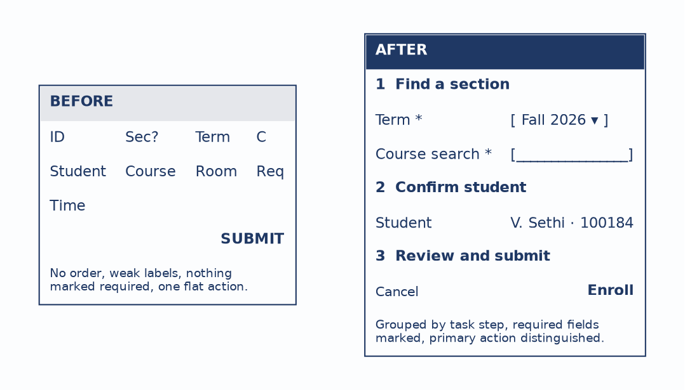
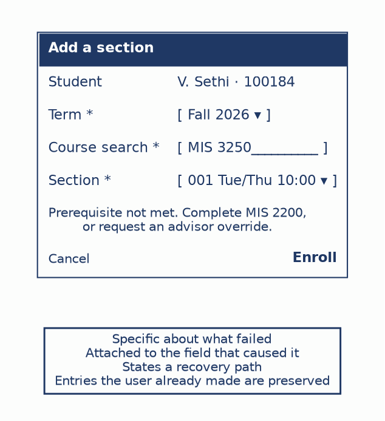
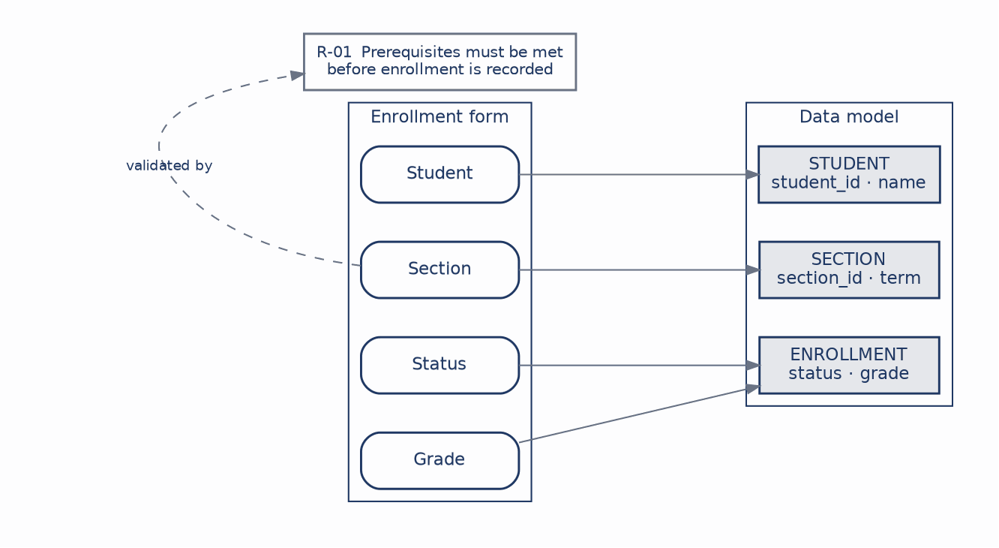
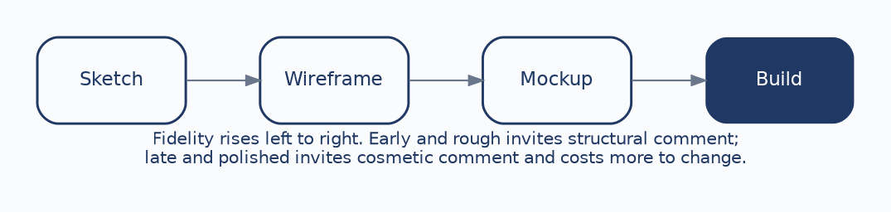

# CHAPTER 6: User Interface & Report Design

The previous five chapters produced models. This one arrives at the place where a user actually meets the system: the screens they fill in and the reports they read.

It would be easy to treat this as the moment analysis ends and decoration begins, and that would be a mistake. Interface design sits downstream from everything that came before it. The data model determines what facts the system can represent. The business rules determine which combinations of those facts are valid. The interface exposes both, in a sequence a person can follow. A polished screen cannot rescue an unclear model underneath it, which is precisely why screen design belongs in a systems analysis course rather than in a graphics one.

The wireframes in this chapter are deliberately rough. That is a pedagogical choice with a practical justification you will meet again at the end of the chapter: rough drawings invite comment about structure, and polished ones invite comment about color. We continue with course registration. By the end of this chapter you should be able to:

- **Apply screen-design principles:** Work from clarity, consistency, feedback, forgiveness, and workflow.
- **Lay out and group a form:** Order and group fields by the user’s task rather than by the database’s column order.
- **Design validation and errors:** Prevent what can be prevented, and explain the rest where the user can act on it.
- **Design a readable report:** Group, summarize, and lead with the question the report answers.
- **Trace fields to the model:** Map every screen and report field back to an attribute, and every validation back to a rule.

------------------------------------------------------------------------

### 1. Five Habits of a Usable Screen

Five principles carry most of the practical weight, and each one is a claim about the user rather than about aesthetics.

| Principle       | What It Requires                                    | Why It Matters                                 |
|:----------------|:----------------------------------------------------|:-----------------------------------------------|
| **Clarity**     | Labels and actions mean one thing.                  | Reduces the interpretation the user has to do. |
| **Consistency** | Similar things behave similarly.                    | Reduces relearning across screens.             |
| **Feedback**    | The system shows what happened.                     | Removes uncertainty after an action.           |
| **Forgiveness** | Users can recover from mistakes.                    | Supports recovery rather than punishment.      |
| **Workflow**    | Screen order matches how the task is actually done. | Follows the user’s sequence, not the schema’s. |

The last one is the one analysts get wrong most often, because the database is sitting right there and its column order is a tempting default. A table lists its columns in whatever order the design settled on. A person enrolling in a section does something quite different: they decide on a term, look for a course, choose among sections, and confirm. Those are not the same order and there is no reason they should be.

------------------------------------------------------------------------

### 2. The Same Task, Organized Two Ways

Here is one enrollment screen drawn badly and then well:

Figure 6.1: The same enrollment task before and after reorganization

The left version is cramped and ambiguous on purpose. Fields appear in no discernible order, labels are abbreviated to the point of guesswork, nothing indicates which entries are required, and a single flat SUBMIT gives no sense of what will happen. A user faced with this has to reconstruct the task from the layout, and different users will reconstruct it differently.

The right version follows the task: find a section, confirm the student, review and submit. Related fields are grouped under numbered steps, required fields carry a marker, the student is prefilled because the system already knows who is logged in, and the primary action is visually distinct from the escape hatch beside it.

Notice what the improved version is not. It has no color scheme, no typography, and no visual polish whatsoever. Every improvement is structural, which is the point: the difference between these two screens is analysis, not design taste.

------------------------------------------------------------------------

### 3. Grouping and Prefilling

Two smaller decisions in that figure deserve to be named, because both come from the analysis rather than from the interface.

**Grouping** reflects the user’s mental sequence. Term and course search belong together because they are both part of finding a section; putting the student’s identity between them would break a single mental step into two. The grouping is a claim about how the task decomposes, and it is a claim that can be checked against the activity diagram from Chapter 3.

**Prefilling** reflects what the system already knows. The student’s identity is not asked for because the session already establishes it, and asking a user to supply information the system holds is a small insult repeated on every use. The general test is worth carrying: for each field on a form, ask whether the system could have known this already. Where the answer is yes, the field should be prefilled or removed.

------------------------------------------------------------------------

### 4. Validation and Error Recovery

Error handling has four stages, and a design that skips any of them pushes work onto the user that the system should have absorbed.

| Stage       | What it does                                                                                                                           |
|:------------|:---------------------------------------------------------------------------------------------------------------------------------------|
| **Prevent** | Make the invalid action impossible. Disable enroll before the registration window opens; offer a term picker rather than a text field. |
| **Catch**   | Check as the user works, not after they submit. A prerequisite failure found on section selection is cheaper than one found on submit. |
| **Explain** | Say what failed, specifically, in language the user can act on.                                                                        |
| **Recover** | Give a route forward, and keep the work already done.                                                                                  |

Prevention is the stage most often skipped, and it is the cheapest. A field that cannot hold an invalid value needs no error message at all. The explaining is where most systems fail:

Figure 6.2: A validation message attached to the field that caused it

A generic banner reading “Invalid input” forces the user into a search: which field, what about it, and what would count as valid instead? The message in the figure does none of that. It is attached to the Section field that produced it, states the specific problem, and offers a recovery path in the form of two concrete options. The rest of the form remains filled in, because discarding a user’s work as punishment for one bad field is the opposite of forgiveness.

There is an analysis point hiding inside that error message. “Complete MIS 2200, or request an advisor override” is only writable if the analyst knows that overrides exist and who grants them. An interface designer without that knowledge writes “Prerequisite not met” and stops, which is accurate and useless. Good error messages are downstream of good elicitation.

------------------------------------------------------------------------

### 5. Reports Answer Questions

Reports are outputs rather than interactions, but the same discipline applies. A report should begin from the question it answers, and organize everything else around making that question easy to answer.

**Who is enrolled in each section, and what is their status?**

| MIS 3250 — Section 001 |        |                            |           |
|:-----------------------|:-------|:---------------------------|:----------|
| **Student**            | **ID** | **Status**                 | **Grade** |
| A. Patel               | 1001   | Enrolled                   | —         |
| M. Chen                | 1002   | Enrolled                   | —         |
| J. Smith               | 1003   | Waitlist                   | —         |
| *Section subtotal*     |        | *2 enrolled, 1 waitlisted* |           |

A raw export could contain exactly the same data and still fail. What makes this a report rather than a dump is that the rows are grouped by section, the essential columns are labeled, the section is summarized at the level where someone makes a decision, and a footer would carry the generation date and page information so the reader knows what they are holding.

Four layout decisions follow from the question rather than from the data:

| Decision              | Guidance                                                           |
|:----------------------|:-------------------------------------------------------------------|
| **Grouping**          | Put related rows together, at the level the reader thinks in.      |
| **Subtotals**         | Summarize where decisions get made, not at every possible level.   |
| **Header and footer** | Preserve context: what this is, when it was generated, which page. |
| **Chart or table**    | A chart when the pattern matters; a table when exact values do.    |

That last one is worth stating plainly because it is frequently decided by habit. If the reader needs to see that waitlists spiked in one department, a chart shows it instantly and a table buries it. If the reader needs to confirm that a particular student is enrolled, a chart is useless.

------------------------------------------------------------------------

### 6. Traceability: Where Fields Come From

This is the point where interface design connects back to everything preceding it:

Figure 6.3: Fields trace to attributes; validations trace to rules

Every field on a screen or report should map to an attribute in the data model, and every validation should map to a business rule. The Section field draws on SECTION, status and grade draw on ENROLLMENT, and the prerequisite check on the Section field is R-01 from the requirements catalogue in Chapter 2, the same rule that has now appeared in a use case, an activity diagram, a decision table, and an interface.

The diagnostic value runs in both directions. If a field has no source in the model, then either the model is incomplete or the field is unjustified, and both are worth knowing. If a validation rule has no requirement behind it, the design is inventing policy, which is a more serious problem than it sounds: somebody will be denied enrollment by a rule no stakeholder ever approved.

------------------------------------------------------------------------

### 7. Designing for the Real User

Accessibility is not a polish step applied at the end. Real users differ along at least four dimensions, and each has design consequences.

**Device** varies from phone to laptop to kiosk to assistive technology, and a layout that assumes a wide screen fails on the one a student actually registers from. **Ability** requires keyboard access, sufficient contrast, meaningful labels that a screen reader can announce, and text that scales. It also requires that **status is never carried by color alone**. A field outlined in red says nothing to a student who cannot distinguish red from grey, and nothing at all to a screen reader. The red outline is fine; it just cannot be the only signal. Pair it with text, an icon, or both — which is what Figure 6.2 does, since its message would still work in black and white. **Environment** covers the conditions the system is used in, which for registration includes a crowded advising office during add/drop week. **Cognition** favors plain language and visible recovery paths over cleverness.

Designing for these improves the system for everyone, which is the practical argument rather than only the ethical one. Keyboard access helps a power user. High contrast helps anyone outdoors. Plain language helps a first-year student who does not yet know what a prerequisite override is.

------------------------------------------------------------------------

### 8. Fidelity and When to Raise It

Figure 6.4: Fidelity should rise as uncertainty falls

A rough sketch invites structural feedback because it plainly is not finished, and a reviewer feels licensed to say the whole sequence is wrong. A polished mockup invites comment on the shade of blue, because it looks decided, and questioning the structure would feel like asking for the work to be thrown away.

The rule that follows is to let fidelity rise as uncertainty falls. Sketch while the task sequence is still in question. Move to wireframes once the structure is agreed and the fields need working out. Build a detailed mockup when the remaining questions are genuinely about presentation. The cheapest moment to discover a bad assumption is before the interface looks finished, and each step up the ladder makes discovery more expensive.

------------------------------------------------------------------------

### 9. Choosing Between an Interface and a Report

|                  | User interface                            | Report                                     |
|:-----------------|:------------------------------------------|:-------------------------------------------|
| **Purpose**      | Interaction.                              | Information output.                        |
| **The user**     | Enters, chooses, and acts.                | Reads, compares, and decides.              |
| **Design focus** | Workflow, validation, feedback, recovery. | Grouping, hierarchy, summary, readability. |
| **Example**      | Enroll in a section.                      | Class roster.                              |

An interface supports doing; a report supports interpreting. The distinction is worth keeping because the design questions genuinely differ, and a report designed like a form tends to collect controls nobody needs while a form designed like a report tends to display data nobody can act on.

This chapter also closes the first arc of the course. Requirements were discovered and catalogued, expressed as behavior in use cases and activity diagrams, as movement in data flow diagrams, as structure in entity-relationship diagrams, and now as something a person can see and use. R-01 has appeared in every one of those forms. That is what traceability looks like when it works.

------------------------------------------------------------------------

## Case Study: Designing the Enrollment Screen and Roster

**Case Focus:** *Campus Course Registration System — designing a screen and a report that trace cleanly back to the data model and the requirements catalogue.*

**Pedagogical Target:** *Students receive the normalized data model from Chapter 5, the requirements catalogue from Chapter 2, and a description of two user contexts: a student registering from a phone during a midnight enrollment window, and an advisor resolving holds at a desk during add/drop week. Students produce a wireframe for each context and a roster report specification, then build a traceability table mapping every field to a model attribute and every validation to a catalogued requirement. The exercise plants two problems: one field the students will want that has no attribute behind it, and one validation the current catalogue does not authorize. Students must identify both and decide whether to extend the model, extend the catalogue, or drop the element, justifying the choice.*

------------------------------------------------------------------------

## Review Questions & Exercises

1.  Explain why ordering form fields by the database’s column order is a design error, and describe what should determine the order instead.
2.  Figure 6.1 improves a screen without using any color, typography, or visual styling. List four structural changes it makes and state which design principle each one serves.
3.  A system displays “Invalid input” at the top of a form and clears the fields the user had filled in. Identify the two distinct failures and the principle each violates.
4.  The error message in Figure 6.2 names a specific recovery path. Explain why an interface designer who was not involved in elicitation would be unable to write that message.
5.  What is the difference between a class roster report and a raw export of the same rows? Answer in terms of the reader’s question rather than the data.
6.  A screen field has no corresponding attribute anywhere in the data model. Give two different explanations for how this could happen, and describe what the analyst should do in each case.
7.  A stakeholder reviews a polished mockup and comments only on fonts and colors, though the workflow is wrong. Explain what went wrong in the process, and what should have been shown instead.
