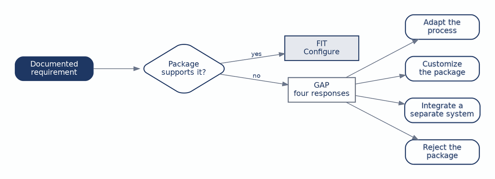
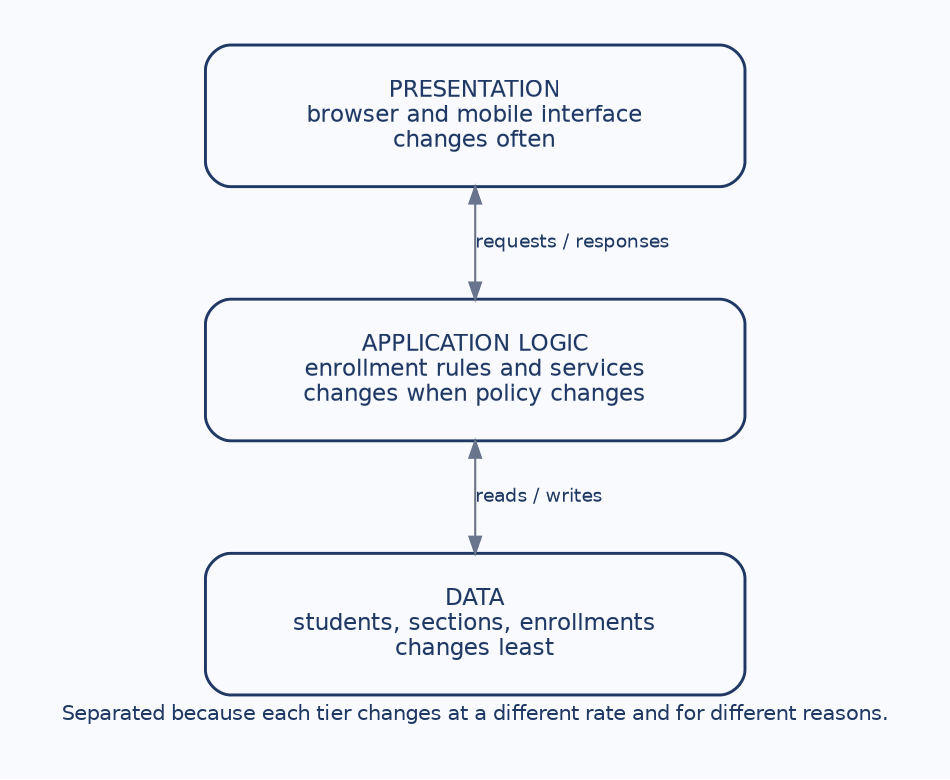
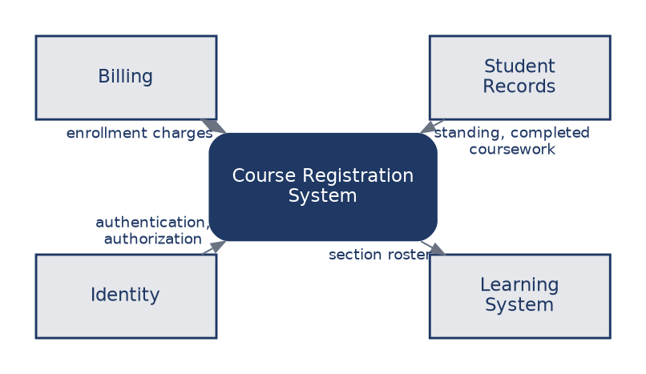
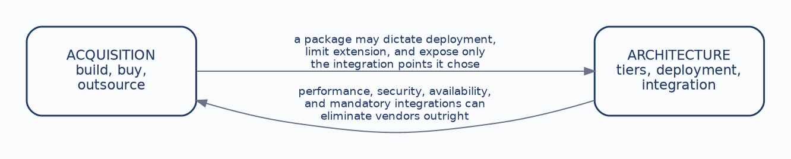

# CHAPTER 7: System Acquisition & Architecture

The first six chapters produced a designed system: requirements discovered and catalogued, behavior and data modelled, screens and reports specified. This chapter asks two questions that design alone does not answer. Where does the system actually come from, and how is it structured and deployed?

These look like separate questions and they are not. An institution that buys a commercial registration package has already made architectural decisions it may not realize it made, because the package brings its own deployment model and exposes only the integration points its vendor chose to build. An institution with a hard availability requirement during peak registration has already eliminated some vendors before anyone convenes an evaluation. The two decisions constrain each other, which is why they belong in one chapter.

The course-registration example is particularly useful here, because every acquisition path is genuinely plausible for it. Universities build registration systems, buy them, and outsource them, and all three choices are defensible under different circumstances. The discipline this chapter teaches is reasoning explicitly from requirements and constraints rather than reaching for a technology preference and justifying it afterward. By the end of it you should be able to:

- **Compare acquisition paths:** Weigh building, buying, and outsourcing against one another.
- **Name the trade-offs:** Reason about cost, control, speed, fit, and risk rather than price alone.
- **Apply fit-gap analysis:** Compare documented requirements against what a package actually does.
- **Separate architectural responsibilities:** Distinguish presentation, application logic, and data.
- **Justify a recommendation:** Support a decision with explicit criteria and agreed weights.

------------------------------------------------------------------------

### 1. Three Paths, Three Kinds of Responsibility

Students often arrive assuming that an information systems project means writing software. Frequently it does not. There are three paths, and none of them is the mature or professional choice in general, because nothing is correct in general.

|                         | Custom build                                       | Commercial package                               | Outsource                                  |
|:------------------------|:---------------------------------------------------|:-------------------------------------------------|:-------------------------------------------|
| **What you get**        | High fit and full control of the roadmap.          | Software that already exists, so a faster start. | External capacity and expertise.           |
| **What you take on**    | Time, specialized staff, and years of maintenance. | Configuration limits and vendor dependence.      | Contract, communication, and handoff risk. |
| **Where the risk sits** | Delivery and long-term ownership.                  | Fit between the package and your rules.          | The relationship and its ending.           |

Each path relocates responsibility rather than removing it. The custom build gives the university everything it wants and hands it every defect and every future change. The package starts faster because the software exists, and what it embodies is somebody else’s assumptions about how registration works. Outsourcing supplies capacity the institution lacks and moves the risk into contract terms and the quality of the handoff at the end.

The useful question is therefore not which path carries the least risk. It is which kind of risk this institution is best equipped to carry.

------------------------------------------------------------------------

### 2. Comparing on More Than Price

Four dimensions separate the paths more usefully than cost does.

**Speed** to a first working system favors buying. **Control** over the roadmap favors building, since nobody else’s priorities intervene. **Fit** is highest for a custom build by definition, and for the other two depends entirely on how closely the package or the contract matches the institution’s actual rules. **Dependency** rises with both buying and outsourcing.

Dependency is the dimension students underweight most, and the reason is structural rather than careless: its costs arrive years after the decision, when a vendor discontinues a product, raises renewal pricing, or is acquired by a competitor. Nothing in the evaluation meeting makes that visible.

Cost belongs in the comparison but not at the front of it. A cheap system that cannot express the university’s prerequisite rules has not saved anyone anything, and the money it appeared to save will be spent again on workarounds, manual processes, and eventually a replacement.

------------------------------------------------------------------------

### 3. Fit-Gap: What Changes When You Buy

When an institution buys rather than builds, the analyst’s work does not disappear. It changes shape. Instead of specifying what to build, the analyst compares documented requirements against what the package actually does:

Figure 7.1: Fit-gap analysis and the four responses to a gap

For course registration the requirements are concrete: prerequisite enforcement, waitlists, advisor overrides, and billing integration. Each one resolves to a fit or a gap. A fit means the package supports the behavior and the remaining work is configuration. A gap forces one of four responses, and choosing among them is the substance of the analysis.

The institution can **adapt its process** to match the package. It can **customize the package**, which is possible to the extent the vendor allows and which tends to complicate every future upgrade. It can **integrate a separate system** to cover the shortfall, adding an interface and its failure modes. Or it can **reject the package** on the strength of the gap.

The first of these deserves particular attention, because students tend to treat it as capitulation. Adapting the process is a legitimate response and frequently the right one, since the package may well encode a better practice than the one the institution has drifted into. What matters is that it is an organizational change decision rather than a technical one, and it belongs to the people who own the process. An analyst who quietly assumes the registrar will change how overrides work has made a decision that was not theirs to make.

------------------------------------------------------------------------

### 4. Making the Recommendation Explicit

A recommendation should be reconstructable by someone who disagrees with it. Weighted criteria make that possible:

| Criterion          | Weight | Question it answers                                    |
|:-------------------|:-------|:-------------------------------------------------------|
| **Functional fit** | 30%    | Does it support the behavior the institution requires? |
| **Speed**          | 20%    | How quickly can value be delivered?                    |
| **Control**        | 20%    | How much can the university shape it?                  |
| **Five-year cost** | 20%    | What will it cost to acquire, operate, and change?     |
| **Risk**           | 10%    | Delivery, vendor viability, security, continuity.      |

Functional fit carries the largest weight because a system that cannot express the institution’s rules fails regardless of its other virtues. Cost is deliberately framed across five years rather than as a purchase price, which is what allows an expensive package with low change costs to compete with a cheap one that will be modified constantly.

The weights themselves are a judgment, and the discipline that matters is agreeing them with stakeholders **before** scoring rather than after. Weights chosen once the scores are known are simply the conclusion wearing a method, and everyone in the room will eventually work that out.

What the structure buys is a disagreement that can be located. A dissenter cannot easily argue with a conclusion, but they can say the weighting is wrong, and that is a conversation worth having because it is really a conversation about institutional priorities.

------------------------------------------------------------------------

### 5. Separating Architectural Responsibilities

Architecture asks a different question from acquisition. Not where the system comes from, but how its responsibilities are separated and where it runs. The basic move is to divide it into tiers:

Figure 7.2: The three architectural tiers

Presentation is what the user encounters and is responsible for display and interaction. Application logic holds the enrollment rules and the services that enforce them, including the prerequisite check that has followed us since Chapter 2. Data holds students, sections, and enrollments, the structures modelled in Chapter 5.

The reason for separating them is on the figure and is easy to state: these three change at different rates and for different reasons. Interfaces are redesigned often, rules change when policy changes, and the data model changes least of all. Binding them together means that a change to any one forces changes to the others.

The concrete failure is worth naming. Putting the prerequisite rule in the presentation tier means the rule exists once per screen. There is a copy on the student enrollment page, another on the advisor override page, another in the batch registration tool. They agree on the day they are written and they drift immediately, because the next policy change will find two of the three and not the third. Some student will then be denied enrollment by a screen that has not been updated, or granted it by one that has.

------------------------------------------------------------------------

### 6. Cloud and On-Premise

Cloud deployment places the system on a provider’s infrastructure, with capacity that expands and contracts and a responsibility model shared between provider and institution. On-premise deployment places it on university infrastructure, with direct control and a corresponding obligation to staff, secure, and capacity-plan it.

For course registration the deciding factor is usually the load shape. Registration is extraordinarily peaked: a large share of the year’s transactions arrive in the few hours when enrollment opens for a term, and the system is comparatively idle the rest of the time. Provisioning owned hardware for a peak that occurs twice a year means paying for capacity that sits unused for months.

That argument favors cloud, and it is an argument rather than a rule. Institutions with data residency requirements, existing infrastructure investment, or integration constraints that assume a campus network reasonably decide otherwise. The point for an analyst is that the decision should be traceable to the load shape and the constraints, not to a general preference for one deployment model.

------------------------------------------------------------------------

### 7. Systems Rarely Stand Alone

A registration system is never the only system involved in registering a student:

Figure 7.3: The integration landscape around course registration

Billing must be notified when enrollment changes, since charges follow enrolled credit hours. Student records supply academic standing and completed coursework, which is what makes a prerequisite check possible at all. Identity services authenticate the user and establish what they may do, which is what distinguishes a student from an advisor acting on that student’s behalf. The learning system needs the roster so enrolled students gain course access.

Each of these is an interface with its own failure modes, and each is a place where the enrollment confirmation on a student’s screen can be true while a downstream system disagrees. A student can be enrolled in registration, absent from the learning system, and billed for a section they cannot access.

Integration is architectural work, decided during design, and not an implementation detail deferred to whoever writes the code.

------------------------------------------------------------------------

### 8. Architecture Serves the Workload

Architecture should follow from what the system is actually asked to do, and two workloads define this one.

**Peak registration** means thousands of students attempting to enroll in the same minutes, competing for the same finite seats. That drives capacity, concurrency control, and resilience. Concurrency is the subtle one and worth separating from the others: two students claiming the last seat simultaneously is a correctness problem rather than a performance problem, and adding capacity does not solve it.

**Billing integration** drives a different set of needs: a reliable interface, a defined recovery path for when it is unavailable, and an audit trail adequate to reconstruct what was charged and why.

Neither requirement is visible in a use case or a data flow diagram. Those models describe what the system does and how data moves, not how much, how fast, how often, or what happens when something fails. Those questions have to be asked separately, and the answers are non-functional requirements:

| Non-functional requirement | What it drives                                               |
|:---------------------------|:-------------------------------------------------------------|
| **Performance**            | Response time under peak load.                               |
| **Availability**           | Registration remains usable during enrollment windows.       |
| **Security**               | Identity, authorization, and protection of academic records. |
| **Scale**                  | Capacity grows with demand rather than requiring redesign.   |

These belong in the requirements catalogue from Chapter 2, with sources and owners, exactly like functional requirements. An availability target with no owner is an aspiration, and nobody can be held to it when it is missed.

------------------------------------------------------------------------

### 9. The Two Decisions Constrain Each Other

Figure 7.4: Acquisition and architecture as mutual constraints

Acquisition constrains architecture. A commercial package may dictate its own deployment model, limit how it can be extended, and expose only the integration points its vendor chose to build, which can settle the cloud question before anyone deliberates it.

Architecture constrains acquisition. A performance target, a security requirement, or a mandatory integration can eliminate vendors before the evaluation begins, which is useful information to have before the evaluation rather than during it.

The practical consequence is that these decisions should be made together rather than sequentially. An institution that selects a vendor first and discovers its architectural requirements afterward has not sequenced the work; it has committed to whatever architecture the vendor happened to have, and it will spend the next several years describing that architecture as a deliberate choice.

------------------------------------------------------------------------

## Case Study: Recommending an Acquisition Path

**Case Focus:** *Campus Course Registration System — evaluating three acquisition paths against documented requirements and defending a recommendation.*

**Pedagogical Target:** *Students receive the requirements catalogue from Chapter 2 extended with four non-functional requirements, along with summaries of three options: a custom build with an in-house team, a commercial student information system with a registration module, and an outsourced development engagement. The package summary contains two planted gaps, one where adapting the process is clearly the sensible response and one where it clearly is not because the rule is set by state reporting requirements. Students perform fit-gap analysis on each requirement, propose criterion weights and justify them before scoring, score the three options, and write a recommendation. They must also identify which architectural options each acquisition path forecloses, and state at least one requirement that would reverse their recommendation if it changed.*

------------------------------------------------------------------------

## Review Questions & Exercises

1.  Explain why the question “which acquisition path carries the least risk” is the wrong question, and state the better one.
2.  Why is dependency the trade-off dimension that decision-makers most often underweight? Give a specific way it could surface five years after a registration package is purchased.
3.  A gap is identified between a package and the university’s override policy. Describe all four possible responses and identify who owns the decision in each case.
4.  Weights for an evaluation are proposed after the options have been scored. Explain precisely what is wrong with this, even if the weights are individually reasonable.
5.  Explain the concrete consequence of placing the prerequisite rule in the presentation tier rather than the application logic tier. Your answer should describe a specific failure a student could experience.
6.  Distinguish the concurrency problem in peak registration from the capacity problem. Why does adding servers solve one and not the other?
7.  An institution selects a vendor and then convenes its architecture team. Explain what has already been decided, and what the architecture team is now actually doing.
