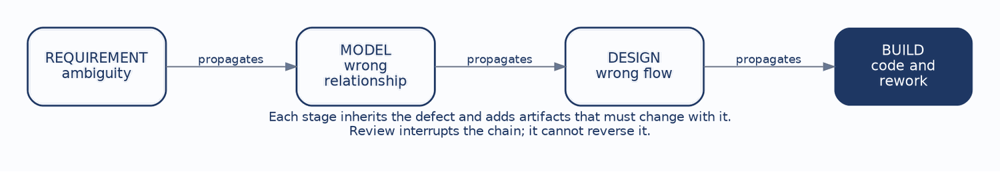
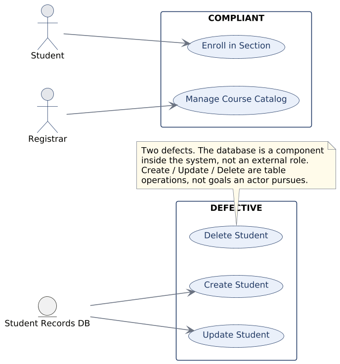
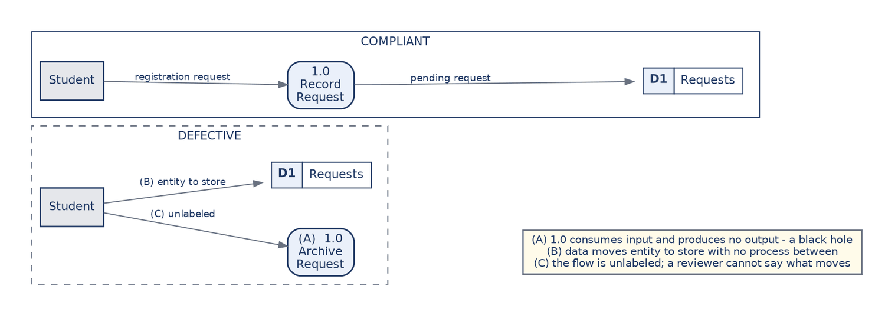
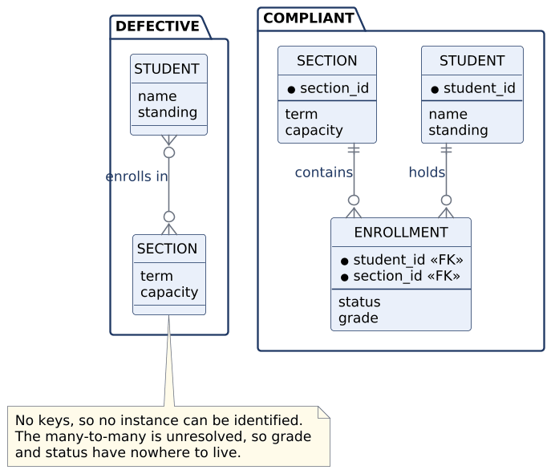

# CHAPTER 8: Design Reviews — Critiquing a Model

This chapter introduces no new notation. Everything it needs was established in Chapters 3 through 6, and the work here is a conversion: turning those standards from rules you follow while producing a model into criteria you apply while judging one.

That reframing is a genuine shift and a harder one than it sounds. Producing a model and evaluating a model are different cognitive acts. When you draw a data flow diagram you are trying to represent something; when you review one you are trying to find where the representation fails. The second requires holding the standard in mind independently of the artifact in front of you, which is why reviewers who have not internalized the standards tend to fall back on taste.

The skill is professionally central, because analysts spend a great deal of their working lives reviewing models they did not draw. It is also immediately practical for a student, because the same checklist that finds defects in a classmate’s diagram finds them in your own before it is submitted. By the end of this chapter you should be able to:

- **Review against standards:** Ground every finding in a stated rule rather than a preference.
- **Spot the classic errors:** Recognize the recurring defects in each artifact type on sight.
- **Give usable critique:** Make feedback specific, standards-based, actionable, and neutral.
- **Apply one checklist:** Run a single consistent review pass across all six artifact types.
- **Self-review:** Find and fix your own defects before anyone else reads the work.

------------------------------------------------------------------------

### 1. Why Review at All

The economic argument from Chapter 1 returns here in a specific form. A defect does not sit still in the artifact where it originates:

Figure 8.1: How a single defect propagates through the artifacts

An ambiguity in a requirement becomes a wrong relationship in a model. The wrong relationship becomes a wrong flow in a design. The wrong flow becomes code, and then rework. Each step multiplies the cost of correction and increases the number of artifacts that must change alongside it, which is the same escalation Chapter 1 described in terms of relative cost.

Review is the mechanism for interrupting that chain as early as possible. It cannot reverse propagation that has already happened, which is why the value of a review falls sharply the later it is performed.

This also explains why review must be conducted against an explicit standard rather than personal taste. A defect is something that violates a stated rule and can be shown to do so. A preference is something a reasonable person can decline to act on. If your finding is a preference, the author is entitled to ignore it, and they will.

------------------------------------------------------------------------

### 2. Reviewing Use Cases

A sound use case model shows external actors pursuing goals. Both halves of that sentence carry weight, and the two characteristic defects are failures of one half each:

Figure 8.2: Use case review, compliant and defective

The **database as actor** mistakes a component inside the system for a role outside it. It is not a careless slip; it usually means the modeller was thinking about where data lives rather than about who wants something. Naming that underlying confusion is more useful in a review than naming the symbol.

**CRUD soup**, where the diagram lists create, read, update, and delete against each entity, mistakes table operations for goals. A registrar cares about managing the course catalog. No registrar has ever wanted to update a row, and no stakeholder reading such a diagram would recognize their own work in it.

One review question catches both. Is this bubble something an external actor would recognize as an outcome they care about? A database cannot care about anything, and nobody cares about an update.

------------------------------------------------------------------------

### 3. Reviewing Data Flow Diagrams

A sound data flow diagram is balanced, its flows are labelled with the data they carry, and every process turns meaningful input into meaningful output:

Figure 8.3: DFD review, compliant and defective

The three defects marked in the figure are the ones that recur. A **black hole** is a process consuming input and producing nothing, which is a claim about causation that cannot be true. A flow running from an external entity **straight into a data store** skips the process that should mediate it, and it is illegal for the reason established in Chapter 4: stores are passive and cannot act.

The **unlabelled flow** is the quiet one and the easiest to overlook, because the arrow looks perfectly fine. Its significance is diagnostic. A reviewer who cannot say what data travels along an arrow has found a gap in the modeller’s understanding rather than a cosmetic omission, and asking the question usually produces either a quick answer or a long pause.

Balancing is the fourth check and the one a reviewer should run first, because it is mechanical. Line up the flows crossing a process’s boundary against those crossing the boundary of the diagram that explodes it, and count.

------------------------------------------------------------------------

### 4. Reviewing Activity Diagrams

A sound activity diagram makes its decisions explicit and follows every branch to a defined ending. The characteristic defect is the **happy path drawn alone**: a process that proceeds as though nothing ever goes wrong, prerequisites are always met, and seats are always available.

This is the most common weakness in student work and among the most consequential, because exceptions are where systems become complicated and where requirements gaps hide.

The review move is mechanical and effective. Find every decision node, then check that each outgoing branch terminates somewhere defined rather than trailing off the edge of the diagram. A branch with no destination is not a drafting error. It is a question nobody has asked the stakeholder yet, which makes it a finding rather than a tidiness issue, and it should be reported as one.

------------------------------------------------------------------------

### 5. Reviewing Data Models

A sound entity-relationship diagram gives every entity a key and resolves its many-to-many relationships:

Figure 8.4: ERD review, compliant and defective

The **keyless entity** means the model cannot identify an instance. That sounds abstract and is not: it surfaces later as duplicate records nobody can distinguish, and as a system that cannot tell whether two rows describe the same student.

The **unresolved many-to-many** is the more instructive defect, because the correct critique goes past the notation. It is not merely untidy. The model has nowhere to put the facts that belong to the pairing, so a reviewer should not say the relationship needs resolving. They should ask what the design intends to do with grade and status, which is the question that makes the problem visible to the author.

------------------------------------------------------------------------

### 6. Reviewing Decision Tables and Interfaces

**Decision tables** are reviewed on two properties that can be checked rather than judged. Completeness asks whether every combination of conditions is covered, which is countable, since N conditions produce two-to-the-N combinations. Consistency asks whether any combination maps to two different action sets.

The characteristic defects are exactly these two failing. A missing combination means the system’s behavior in some circumstance is undefined, and a developer will invent it. Contradictory actions mean two rules disagree, and whichever is evaluated first will silently win. This is the one review in the chapter that can be performed mechanically rather than by judgment, which is precisely why decision tables are worth the trouble for rules governing eligibility or money.

**Interfaces and reports** are reviewed on grouping and traceability. Ungrouped fields usually indicate a form built from the database’s column order rather than the user’s task sequence, which is the Chapter 6 failure.

The **orphan field**, a field with no source in the data model, is the more interesting finding because it has two possible causes with different remedies. Either the data model is incomplete and needs extending, or the field is unjustified and should be removed. A reviewer should not guess between them. The correct critique names the orphan and asks which of the two it is.

------------------------------------------------------------------------

### 7. One Checklist, Six Artifacts

| Artifact                         | What to check                                                                  |
|:---------------------------------|:-------------------------------------------------------------------------------|
| **Use cases**                    | Are the actors external? Are the use cases goals rather than operations?       |
| **Data flow diagrams**           | Are flows legal, labelled, and balanced across levels?                         |
| **Activity diagrams**            | Are decisions explicit, and does every branch end somewhere defined?           |
| **Entity-relationship diagrams** | Are keys present, cardinality stated, and many-to-many relationships resolved? |
| **Decision tables**              | Complete and consistent?                                                       |
| **Interfaces and reports**       | Grouped by task, and traceable to model and rules?                             |

Six lines covering six artifact types, and the value is in running it every time rather than in memorizing it. A checklist consulted only when a reviewer already suspects a problem is not doing the work a checklist exists to do, which is catching the problems nobody suspected.

------------------------------------------------------------------------

### 8. How to Say It

How a defect is reported determines whether it gets fixed. Four properties make critique usable, and they are worth practising deliberately.

| Property            | What it means                                    | Instead of                        |
|:--------------------|:-------------------------------------------------|:----------------------------------|
| **Specific**        | Name the defect and where it is.                 | “The DFD is confusing.”           |
| **Standards-based** | Tie it to the rule it violates.                  | “I’d have done this differently.” |
| **Actionable**      | State a correction, preferably the smallest one. | “This needs rethinking.”          |
| **Neutral**         | Describe the artifact, not the author.           | “You forgot to balance it.”       |

The specificity requirement has a hidden benefit. Vague feedback usually signals that the reviewer has not actually identified the defect precisely, so forcing yourself to name it is a check on your own understanding as much as a courtesy to the author.

Neutrality is not politeness for its own sake. A critique aimed at the author invites a defence of the author, and the conversation stops being about the diagram. A critique aimed at the artifact leaves the author free to agree with it, which is the outcome you wanted.

------------------------------------------------------------------------

### 9. Self-Review

Self-review has the highest return of any review, because the author can fix what it finds before anyone else reads the work. Four steps make it reliable.

**Read it as a user would**, asking whether the artifact makes sense to someone who was not inside your head while you drew it. **Run the checklist**, which is deliberately mechanical because the point is to catch what judgment misses when you are close to your own work. **Trace one requirement end to end** and see whether it survives the journey intact. **Fix what you found**, because submitting a known defect is a choice rather than an oversight.

Most points lost on modelling assignments are lost to defects the author could have caught in ten minutes. That is a claim about coursework and it generalizes: most defects found in a professional design review were available to the person who drew the diagram, had they looked with the standard in mind rather than with the satisfaction of having finished.

------------------------------------------------------------------------

## Case Study: Reviewing a Model Set

**Case Focus:** *Campus Course Registration System — conducting a full review pass across an artifact set and reporting the findings.*

**Pedagogical Target:** *Students receive a complete but defective model set for registration: a use case diagram, a Level-0 DFD with a Level-1 explosion, an activity diagram, an ERD, a decision table, and an enrollment screen. The set contains seven planted defects distributed across the artifact types, including one balancing failure that is only visible by comparing two diagrams, one decision-table gap that requires counting combinations, and one orphan field that is genuinely ambiguous between an incomplete model and an unjustified field. Students produce a review report naming each defect, citing the violated standard, and proposing the smallest correction. They are graded on the critique’s specificity and on correctly identifying the ambiguous case as ambiguous rather than resolving it by assumption.*

------------------------------------------------------------------------

## Review Questions & Exercises

1.  Explain why a review finding grounded in a standard obliges the author in a way that a finding grounded in preference does not.
2.  A reviewer identifies a database drawn as an actor. Beyond naming the rule, what underlying confusion should the critique address?
3.  Why is an unlabelled data flow a substantive finding rather than a cosmetic one? What should the reviewer ask?
4.  A decision node has a branch that trails off the diagram with no ending. Explain why this should be reported as a requirements finding rather than a drafting error.
5.  Rewrite the following as usable critique: “This ERD is a mess and the interface doesn’t make sense.”
6.  An orphan field appears on a screen design. Describe both possible causes and explain why the reviewer should not choose between them.
7.  Self-review is described as the highest-return review. Give the argument for this claim, then identify the reason authors are nonetheless bad at reviewing their own work.
