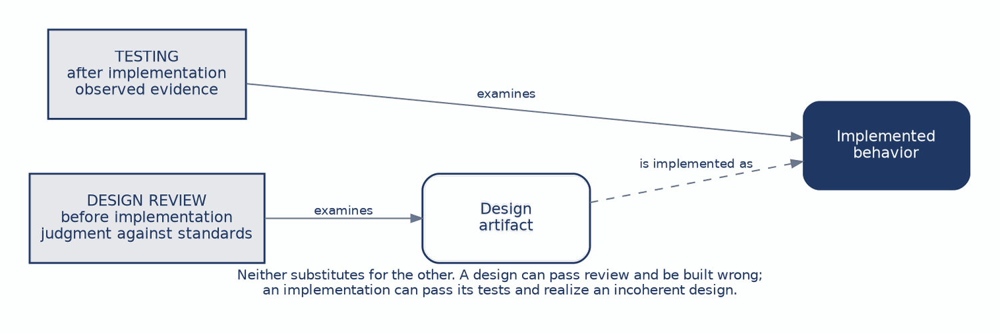
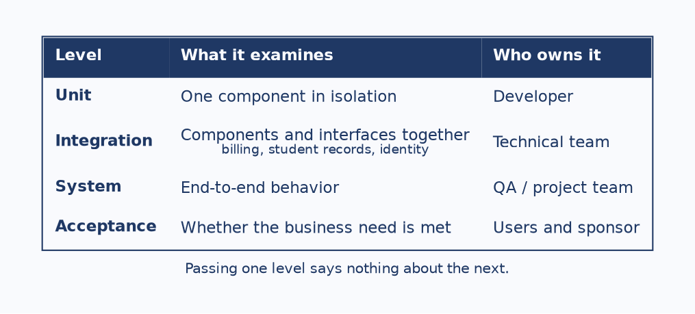
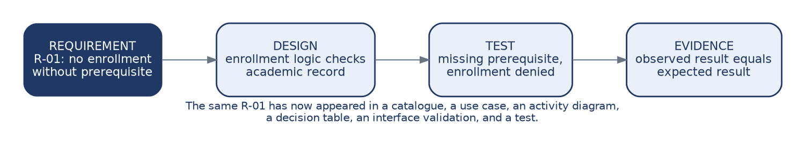
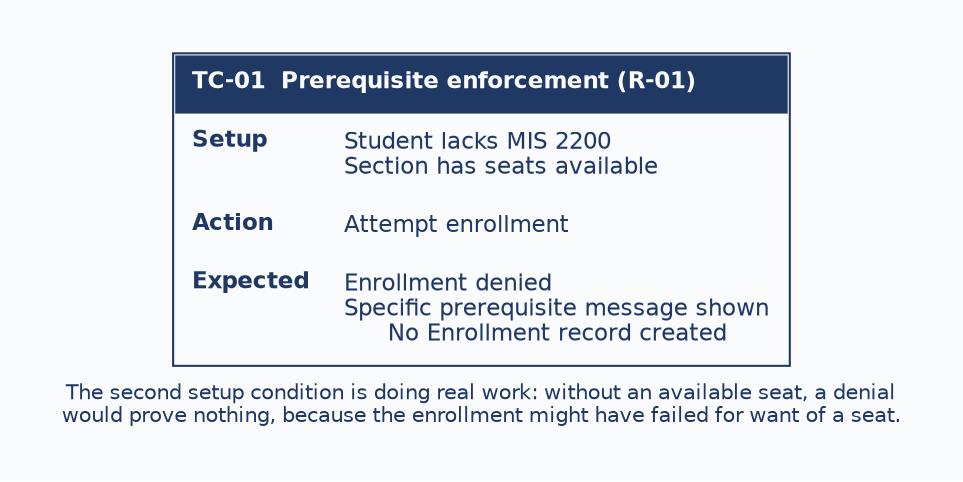

# CHAPTER 10: Design Review & Testing

This chapter does two things. It finishes the design-review thread begun in Chapter 8 by extending it to interfaces and reports, and it introduces testing as planned evidence that requirements have been met.

Pairing them is not an accident of arrangement. Review and testing are the two mechanisms by which a team discovers whether it has built the right thing, and they operate on different objects at different times. A team that does only one of them is either trusting a design nobody checked, or discovering design problems at the most expensive possible moment.

The running example remains course registration, and R-01 makes its final appearance in this chapter, arriving at the test that verifies it. By the end you should be able to:

- **Review interfaces and reports:** Apply the Chapter 6 standards as review criteria, with traceability as the check that catches the most.
- **Distinguish the testing levels:** Know what unit, integration, system, and acceptance testing each demonstrate.
- **Derive tests from requirements:** Define the evidence that will prove each important requirement was delivered.
- **Explain what acceptance proves:** Understand why it is a decision rather than a final defect hunt.
- **Plan tests early:** Use test writing to expose ambiguity while it is still cheap to resolve.

------------------------------------------------------------------------

### 1. Two Jobs, Two Objects

Figure 10.1: Review and testing examine different objects at different times

Design review evaluates the artifact. Is the proposed interface or report coherent, internally consistent, and traceable to the model and the requirements? It happens before implementation, and its currency is judgment against standards.

Testing evaluates implemented behavior against requirements. Does the thing that was built do what was asked? It happens after implementation, and its currency is observed evidence.

Students often treat testing as a stronger form of review, on the reasoning that a running system is more real than a diagram. The two are not ranked, and neither substitutes for the other. A design can pass review and be implemented incorrectly. An implementation can pass every test it has while realizing a design that was incoherent from the start, because the tests were written against the same misunderstanding the design encoded.

------------------------------------------------------------------------

### 2. Reviewing Interfaces

A sound interface groups fields by the user’s task, marks required fields clearly, and connects every field to an attribute and every validation to a rule. The defects are the Chapter 6 failures seen from the reviewer’s side.

A **database-order layout** means the form follows the schema rather than the user’s sequence. **Orphan fields** have no source in the data model. **Generic error messages** tell the user something went wrong without saying what or how to recover. Absent traceability means none of it can be checked against anything.

The governing principle is that structural correctness comes before cosmetic preference, and it is worth dwelling on because of what it implies about reviewer behavior. A reviewer who opens with the colour scheme has spent their credibility on the least important finding, and the author will weight everything that follows accordingly.

------------------------------------------------------------------------

### 3. Reviewing Reports

A sound report leads with the question it answers, groups and summarizes its rows, and defines every column in terms of an attribute or a stated derivation. The defective version is the raw dump: rows exported with no hierarchy, no evident purpose, and columns whose meaning the reader must infer.

The derived-column point is the one students miss, and it deserves its own attention. A column labelled “seats remaining” is not an attribute. It is a calculation, and the review question is whether the derivation is stated anywhere. If it is not, two developers will compute it two different ways, both will believe they are correct, and the discrepancy will surface as a report that disagrees with the enrollment screen.

------------------------------------------------------------------------

### 4. Traceability, the Review That Catches the Most

This is the highest-yield review technique in the course, and it is mechanical enough that anyone can perform it without judgment.

| Take each…        | And find…                                         |
|:------------------|:--------------------------------------------------|
| **Screen field**  | Its attribute in the entity-relationship diagram. |
| **Report column** | Its attribute, or its stated derivation.          |
| **Validation**    | The business rule behind it.                      |
| **Action**        | The use case or process it belongs to.            |

What the exercise exposes is two categories of defect. **Invented fields** are things the design displays that the model cannot supply. **Missing data** is what the design needs and nobody has modelled.

Both are serious, and both are nearly invisible to a reviewer reading the screen as a user would. A screen can look entirely sensible, group its fields well, and display three things the database has no way to produce.

------------------------------------------------------------------------

### 5. Four Levels, Four Kinds of Evidence

Figure 10.2: The four testing levels and what each demonstrates

The levels are not four degrees of thoroughness applied in sequence. They are four different kinds of evidence, each answering a question the others cannot, which is why keeping them distinct matters.

Unit testing examines one component in isolation. Integration testing examines components and interfaces working together, which for registration is where the billing interface and the student records lookup get exercised, and where the failure modes from Chapter 7 actually appear. System testing examines end-to-end behavior across the whole application. Acceptance testing examines whether the business need is met.

The progression matters because passing one level says nothing about the next. A system whose units all pass can fail integration completely, because unit tests deliberately isolate components from exactly the interfaces that break. A system that passes every technical level can still be rejected at acceptance, because technical correctness and business fitness are different claims.

------------------------------------------------------------------------

### 6. Tests Come From Requirements

Figure 10.3: R-01 from requirement through to evidence

Tests are derived from requirements rather than invented from the implementation. That ordering is what makes the evidence meaningful: a test written by reading the code proves the code does what the code does.

The chain is worth following once more. The requirement states that a student cannot enroll without the prerequisite. The design responds by having enrollment logic check the academic record. The test presents a student with a missing prerequisite and expects denial. The evidence is that the observed result matches the expected one.

This is the same R-01 that appeared in the requirements catalogue in Chapter 2, in a use case and an activity branch in Chapter 3, in a decision table rule in Chapter 4, and in an interface validation in Chapter 6. Following one requirement across eight chapters is what traceability looks like when it works.

The claim to take literally is that a requirement with no verification path is not ready to be called done. Nobody can say whether it was delivered, which means in practice that nobody will ask.

------------------------------------------------------------------------

### 7. Writing a Test Case

Figure 10.4: A test case for prerequisite enforcement

Three parts, and each one is load-bearing.

**Setup** establishes the preconditions. Notice that the second condition, that the section has seats available, is doing real work rather than adding detail. Without it, a denial proves nothing, because the enrollment might have failed for want of a seat rather than for the missing prerequisite. A test that cannot distinguish between two causes of the same outcome has not tested either.

**Action** is the single thing being exercised.

**Expected result** must be specific enough to check, and the third clause is the one that matters most. A system that displays a denial message while quietly writing an Enrollment record has failed, and only an expected result that names the data outcome will catch it. Testing what the user sees is not the same as testing what the system did.

------------------------------------------------------------------------

### 8. What Acceptance Testing Actually Proves

Acceptance testing is frequently misunderstood as a final round of defect-hunting conducted by users. It is not. It supports a decision by the user that the system solves the agreed problem, and every part of its structure follows from that purpose.

**Representative people perform realistic work**, because a demonstration driven by the project team proves only that the project team can operate the system. **Scenarios are agreed business situations** rather than a tour of features. **Criteria are expected outcomes defined in advance**, since criteria written once the results are known can always be made to fit them. The output is **a decision supported by evidence**: accept, reject, or fix.

Defining the criteria in advance is the safeguard that makes the whole exercise meaningful rather than ceremonial. Without it, acceptance becomes a meeting where a system is shown to people who have no stated basis for objecting, and their agreement records nothing.

------------------------------------------------------------------------

### 9. Test Planning as Design Work

Writing tests early is a requirements-quality technique, and the three ways it fails are diagnostic rather than inconvenient.

If a **requirement is ambiguous**, the expected result cannot be written. The inability to write it is the discovery, and it has arrived while the requirement is still a sentence rather than a system.

If an **exception has been missed**, there is no test for the unhappy path. This surfaces the same gap that a decision node with an undefined branch surfaces in an activity diagram, approached from the other direction.

If the **data is unclear**, the setup cannot be reproduced, which means nobody actually knows what state the system must be in for the rule to apply.

Each failure points at a defect in the requirement rather than in the test. That is the argument for treating test planning as part of design rather than as something scheduled after it, and it is the same argument Chapter 4 made for decision tables: a technique that can prove something is missing is worth more than one that can only describe what is present.

------------------------------------------------------------------------

### 10. The Bridge From Design to Build

The two halves of this chapter combine into a disciplined bridge. On one side is a reviewed design, coherent and traceable and usable, which is evidence that the team is about to build the right thing. On the other is a test plan, defining in advance what evidence will be required once the thing exists.

Having both before implementation begins means the team knows what it intends and how it will know whether it succeeded. Having neither means implementation proceeds on faith.

Having only one is the common case, and it explains a familiar ending: a project arrives at go-live with a working system and an unresolved argument about whether it does what was asked, which nobody can settle because the criteria were never written down.

------------------------------------------------------------------------

## Case Study: Reviewing a Design and Planning Its Verification

**Case Focus:** *Campus Course Registration System — reviewing an interface and report set, then producing the test plan that would verify the requirements behind them.*

**Pedagogical Target:** *Students receive an enrollment screen, a class roster report, the requirements catalogue, and the data model. Three defects are planted: a screen field with no attribute behind it, a report column (“seats remaining”) whose derivation is stated nowhere, and a validation with no corresponding requirement. Students perform the traceability review, report each finding with the violated standard, then write test cases for three requirements including one non-functional target drawn from Chapter 9. One catalogued requirement is deliberately ambiguous and cannot have an expected result written for it; students are expected to report that as a requirements defect rather than resolving the ambiguity themselves, and to state what they would ask and of whom.*

------------------------------------------------------------------------

## Review Questions & Exercises

1.  Explain why testing is not a stronger form of review. Give one failure that review catches and testing cannot, and one that testing catches and review cannot.
2.  A reviewer’s first comment on a wireframe concerns the colour of the submit button. Beyond being a minor point, what has this cost the reviewer?
3.  Why is a derived report column a traceability problem rather than a formatting one? Describe a specific inconsistency that could result.
4.  A team reports that all unit tests pass. What does this establish, and what does it specifically fail to establish?
5.  In the test case in Figure 10.4, explain why the setup specifies that seats are available. What would the test prove without that condition?
6.  The expected result includes “no Enrollment record created.” Describe a system failure that this clause catches and that the other two clauses would miss.
7.  Acceptance criteria are defined after the acceptance session, based on what the users observed. Explain what this makes the acceptance decision, and why the resulting agreement records nothing.
8.  A team cannot write an expected result for one of its requirements. Explain why this is a finding about the requirement rather than about the team’s testing skill.
