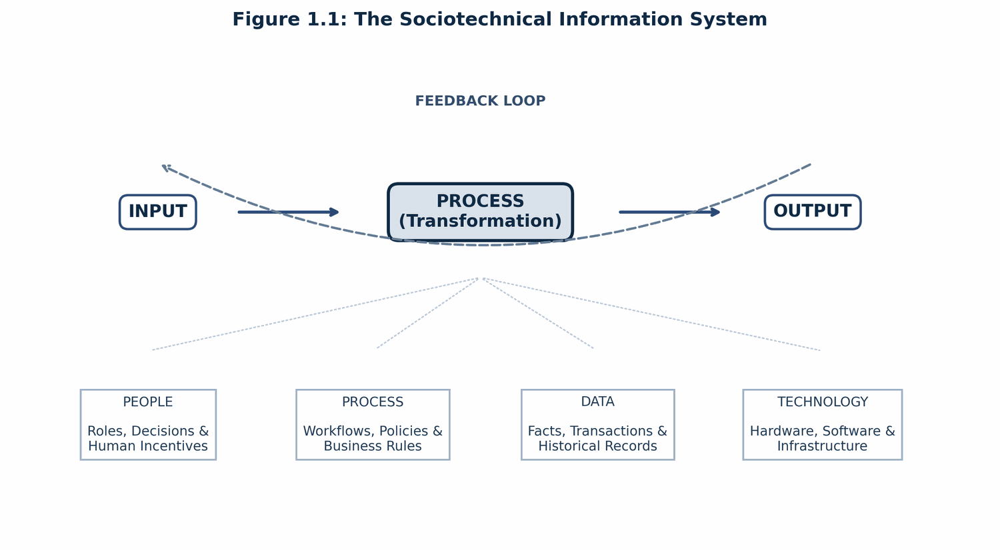
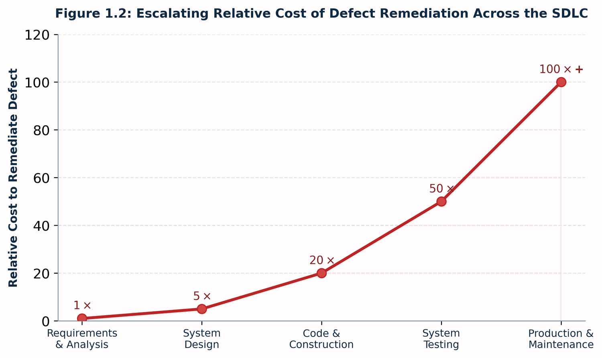
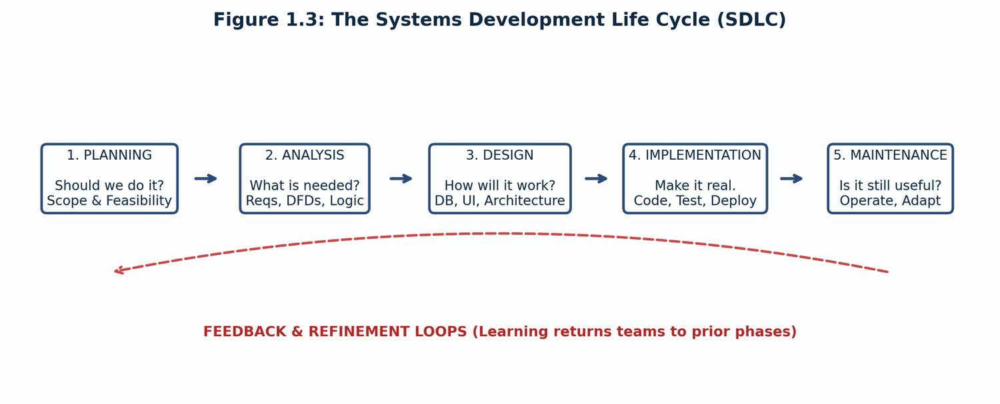
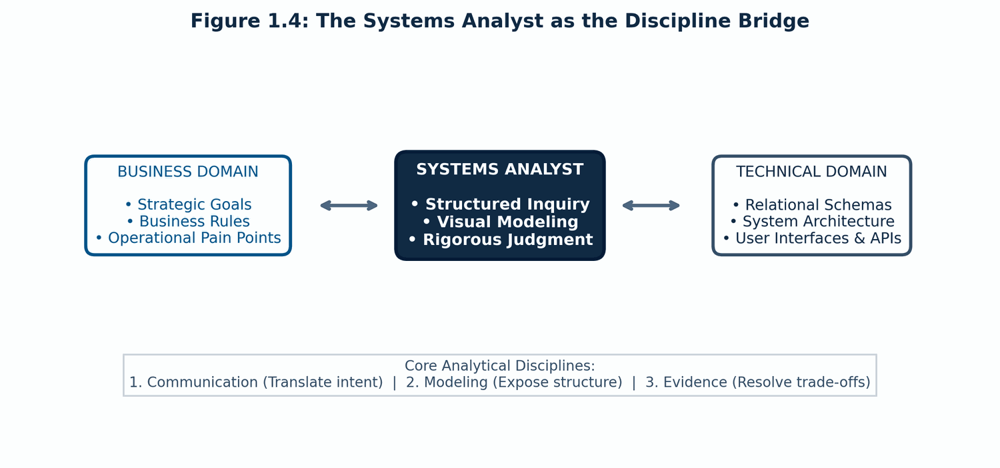

# CHAPTER 1: Systems, the SDLC & the Analyst's Role

Information technology projects rarely fail because software engineers do not know how to write code. They fail because teams build the wrong system, solve the wrong problem, or misjudge the human and organizational environment in which the software must live. 

Systems Analysis and Design (SAD) provides the discipline, modeling tools, and investigative rigor required to bridge the divide between human organizations and formal technical execution. This chapter introduces the foundational concepts: what constitutes an information system, the lifecycle that governs its development, the contrasting methodologies teams use to build software, and the central role played by the systems analyst.

By the end of this chapter you should be able to:

* **Think in Systems:** Define an information system as an integrated configuration of people, processes, data, and technology operating toward an organizational purpose.
* **Trace the SDLC:** Explain the five phases of the Systems Development Life Cycle (Planning, Analysis, Design, Implementation, Maintenance) and understand why learning forces feedback loops across phases.
* **Understand Economic Leverage:** Explain why the cost of resolving errors escalates exponentially across the lifecycle and how early analysis prevents compounding downstream rework.
* **Compare Development Methodologies:** Contrast structured (plan-driven), object-oriented (model-centered), and agile (feedback-driven) approaches, identifying the organizational contexts suited for each.
* **Define the Analyst's Bridge:** Describe how analysts translate vague business problems into unambiguous technical specifications using communication, modeling, and evidence-based judgment.

---

### 1. Systems Thinking: What is an Information System?

An **information system (IS)** is an organized sociotechnical system combining four distinct pillars that accept inputs, execute transformations, and generate valuable outputs governed by feedback loops:

* **People:** The actors who interact with the system—students, faculty advisors, registrars, and department chairs—carrying specific roles, expectations, and decision-making responsibilities.
* **Process:** The operational workflows, prerequisites, registration windows, graduation audit rules, and grading policies that dictate how work is accomplished.
* **Data:** The raw facts, historical records, and transactional events—such as student IDs, course catalogs, section capacities, and grade histories.
* **Technology:** The physical and virtual servers, client portals, relational database engines, authentication networks, and mobile interfaces supporting the operations.

A failure in any one pillar compromises the whole. Implementing a scalable cloud registration portal (technology) will fail if academic advisors (people) bypass the system, course capacity override rules (process) remain contradictory, or prerequisite course histories (data) are corrupted.

---

### 2. The Economic Case for Analysis: The Cost of Change Curve

The primary economic justification for rigorous systems analysis is the **Cost of Change Curve**. A vague requirement or misunderstood business rule is cheap to fix when it is just words on a whiteboard, but becomes exponentially more expensive as it progresses through the project lifecycle:

When an unverified assumption slips past the analysis phase, it forces rework across every subsequent layer:
1. **At Need / Analysis (1x):** Clarifying a registration hold policy requires modifying an interview note or updating a requirements statement.
2. **At Design (5x):** Re-architecting database schemas, updating data flow diagrams, and rewriting API contracts.
3. **At Build (20x):** Refactoring compiled code, re-architecting data models, and discarding obsolete development work.
4. **At Test (50x):** Writing new regression test suites, triaging defects, and resolving integration breaks across components.
5. **At Production / Maintenance (100x+):** Emergency hotfixes, data corruption cleanups during registration rush, student lockouts, negative publicity, and academic appeals.

The systems analyst’s leverage lies in **exposing contradictions, challenging assumptions, and formalizing constraints before they freeze into software architecture.**

---

### 3. The Systems Development Life Cycle (SDLC)

The SDLC provides a disciplined, structured framework for shepherding an idea from initial business concept to long-term operational health:

The SDLC is not a linear promise that insight happens only once; it is a conceptual map. In practice, discovery at any stage triggers feedback loops that send teams back to refine earlier assumptions:

* **Planning (*Should we do it?*):** Evaluates university business needs, project scope, enrollment growth, and technical, economic, and organizational feasibility.
* **Analysis (*What is needed?*):** Engages registrars, academic departments, and students to discover functional requirements, map enrollment workflows, and define system boundaries.
* **Design (*How will it work?*):** Converts logical models into physical architectures, portal wireframes, relational database schemas, and interface specifications.
* **Implementation (*Can we make it real?*):** Software construction, automated unit testing, data migration from legacy student ledgers, and advisor training.
* **Maintenance (*Is it still useful?*):** Ongoing support, security patches, performance scaling during peak add/drop weeks, and adapting to updated degree requirements.

#### Where This Course Focuses
Courses in systems analysis and design spend the vast majority of their time in the **Analysis and Design** phases:
* **Discover:** Stakeholder identification, requirement elicitation, structured interviews.
* **Model:** Use case specifications, Data Flow Diagrams (DFDs), Entity-Relationship Diagrams (ERDs).
* **Design:** User experience, relational database designs, system architecture.
* **Integrate:** Ensuring end-to-end traceability across all models.

---

### 4. Comparing Development Methodologies

While all software development must resolve the core questions of the SDLC, teams organize the work differently depending on project risk, requirement stability, and organizational context:

| Dimension | Structured Development | Object-Oriented & Iterative | Agile Development |
| :--- | :--- | :--- | :--- |
| **Primary Philosophy** | Plan-driven; formal stage gates. | Model-centered; system viewed as interacting objects. | Feedback-driven; rapid, value-focused iteration. |
| **Pacing / Cycle** | Linear, sequential phases. | Cycles of discovery, refinement, and integration. | Short sprints (1–4 weeks); continuous delivery. |
| **Requirements** | Fixed upfront; formal change control. | Deepen and mature through iterative modeling. | Emergent; refined continuously via product backlog. |
| **Best Fit** | Stable requirements, regulated reporting, fixed vendor contracts. | Complex enterprise domains with rich entity behaviors. | Volatile environments, exploratory features, rapid feedback needs. |
| **Primary Risk** | Late learning makes changes costly and contentious. | Excessive modeling detached from tangible user value. | Lack of structural discipline devolving into chaotic hacking. |

*Note on Terminology:* **Object-Oriented** describes *how we model* the system (identifying objects like `Student`, `Course`, `Section`, and their encapsulations). **Iterative** describes *how we cycle* through the work (repeated loops of discovery and refinement).

Real-world enterprise projects rarely follow textbook extremes; they blend elements into hybrid frameworks (e.g., plan-driven compliance governance coupled with agile user-interface prototyping).

---

### 5. The Analyst's Role: Translation, Modeling, and Judgment

The systems analyst is not merely a stenographer taking down meeting notes, nor a developer writing backend code. The analyst serves as an active **translator and bridge** between organizational problem spaces and technical solution architectures:

To function as an effective bridge, an analyst relies on three core competencies:
1. **Communicate:** Listening beyond literal statements to understand what stakeholders actually mean, uncovering hidden assumptions and unstated operational incentives.
2. **Model:** Translating ambiguous business realities into rigorous, visual specifications (use cases, process flows, data schemas) that make hidden complexity visible.
3. **Judge:** Resolving conflicting stakeholder requirements using evidence, system boundaries, and architectural trade-offs rather than political deference.

#### The Analyst's Work Products
Different analysis artifacts answer fundamentally different questions about the target system:

| Artifact | Core Question Answered |
| :--- | :--- |
| **Requirements Specifications** | What must the system do, and what operational rules must be true? |
| **Use Cases & Scenarios** | What specific goals does the system accomplish on behalf of its actors? |
| **Data Flow Diagrams (DFDs)** | How does information move through the system, and where is it transformed? |
| **Entity-Relationship Diagrams (ERDs)** | How are the fundamental business data concepts structured and related? |
| **UI Wireframes & Report Mockups** | How will human users interact with the system and inspect operational results? |
| **Traceability Matrices** | Do all technical models align to verified business needs without gaps or gold-plating? |

---

## Case Study: Uncovering Hidden Registration Rules

* **Case Focus:** *Campus Course Registration System (University Enrollment Modernization) — Uncovering Hidden Registration Rules and System Boundaries.*
* **Pedagogical Target:** *Students analyze an ambiguous administrative mandate ("Fix the registration bottleneck during drop/add week"), identify conflicting needs across students, academic departments, and the registrar's office, and contrast how a structured vs. agile discovery approach addresses enrollment priority rules.*

---

## Review Questions & Exercises

1. Why is an information system defined as a sociotechnical combination rather than just software and servers?
2. Explain how a defect caught during the maintenance phase can cost 100 times more to remediate than one caught during the analysis phase.
3. What is the fundamental difference between an object-oriented approach and an iterative development cycle?
4. An enterprise team adopts a pure Agile approach for a medical device firmware project with rigid FDA validation requirements. What risks arise if the team fails to apply structured analysis discipline?
5. Why must a systems analyst begin with business problems and empirical evidence rather than a preferred technology platform?
