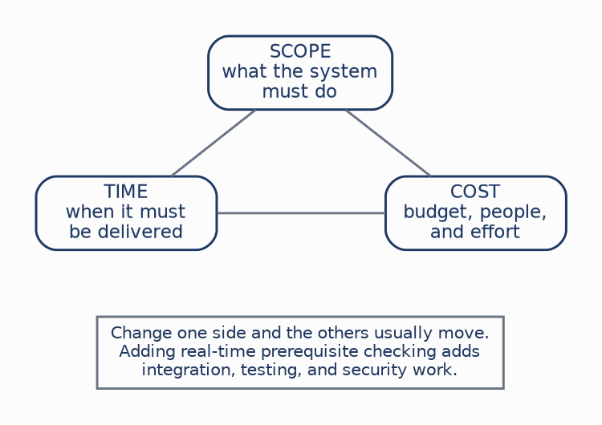
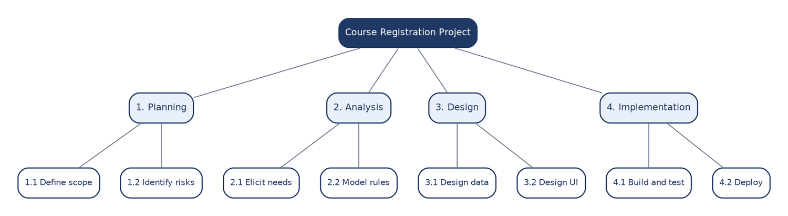
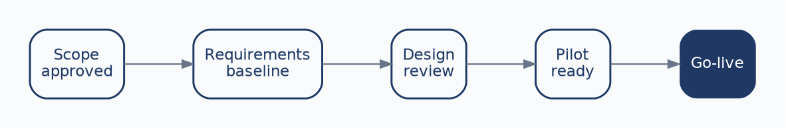
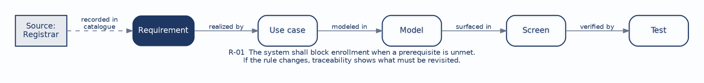

# CHAPTER 2: Project Management & Requirements Elicitation

A project can be run with perfect discipline and still deliver the wrong system. A team can also understand a business problem beautifully and still run out of money before anything ships. Systems analysis sits between those two failures, and Week 2 develops the two responsibilities that guard against them: controlling the project, and discovering what the project is actually for.

These responsibilities are usually taught apart, which obscures how tightly they depend on each other. Project management keeps the work bounded enough to finish. Elicitation makes sure the team is solving the right problem in the first place. The **requirements catalog** is the bridge between them, turning scattered evidence from interviews, observations, and documents into explicit statements that can be prioritized, modeled, tested, and changed on purpose rather than by accident.

This chapter continues with the university course-registration system introduced in Chapter 1. By the end of it you should be able to:

* **Plan and manage a project:** Define scope, decompose work into a structure that can be estimated and assigned, set observable milestones, and track risk.
* **Use elicitation techniques:** Select among interviews, observation, joint workshops, and document review according to the kind of evidence each one reveals.
* **Ask good questions:** Move deliberately from open discovery to closed confirmation without embedding your own preferred answer in the question.
* **Build a requirements catalog:** Record each requirement with its description, priority, source, owner, and downstream links.
* **Recognize a good requirement:** Judge whether a statement is clear, testable, traceable, and prioritized.

---

### 1. Project Control and the Triple Constraint

Every project operates under three interlocking constraints. **Scope** is what the system must do, **time** is when it must be delivered, and **cost** is the budget, people, and effort available to do it. The three are not independent variables that a team can set separately; they form a system in which moving one side exerts pressure on the others:

Consider what happens when a university decides, midway through a registration project, that prerequisite validation must happen in real time rather than in an overnight batch. This is not a small clarification. It may require a new interface to the student records system, exception logic for coursework in progress, additional security review because the interface exposes academic history, and a testing effort proportional to all of it. If the go-live date is fixed by the academic calendar and the budget was approved by a board that does not meet again for a semester, then something else has to give, and the only remaining variable is scope.

The purpose of project management is not to prevent that situation. Requirements legitimately change, and a team that refuses all change delivers a system nobody wants. The purpose is to make the trade-off **visible and deliberate** rather than absorbed silently by an overworked team and discovered at go-live.

---

### 2. Breaking Down and Tracking the Work

Before a team can schedule work, it has to know what the work is. This ordering sounds obvious and is routinely violated by projects that open with a Gantt chart and reason backward from a deadline.

#### The Work Breakdown Structure

A **work breakdown structure (WBS)** decomposes a project into manageable pieces. It answers *what work must be done* before the schedule answers *when*:

The critical property of a WBS is that it describes work, not calendar. There are no dates in the figure above, and that is deliberate. The right level of decomposition is the level at which a piece of work can be estimated with some confidence, assigned to someone specific, and tracked to completion. Decompose too little and "Analysis" becomes a four-month block nobody can report on honestly. Decompose too much and maintaining the plan becomes a second project competing with the first.

#### Milestones and Observable Progress

Once the work is decomposed, progress must be tracked against something a reasonable observer could verify:

The distinction that matters here is between results and activity. "Requirements baseline approved" is a milestone because someone can inspect the baseline and confirm it exists. "Worked on requirements for two weeks" reports effort, and effort is a poor proxy for progress precisely on the projects where the difference matters most. Milestones defined as observable results expose slippage early, while there is still time to respond, and they change the character of status meetings from reassurance to evidence.

---

### 3. Managing Risk and Change

Risk and change are related, frequently confused, and handled differently. A **risk** is something uncertain that could affect the project; a **change** is an actual proposed alteration to work that has already been agreed. The legacy student records interface *may not* support real-time prerequisite checks: that is a risk, and it is managed by investigating it early, identifying who would know, and planning a fallback. Advisors *have asked* for waitlist priority rules after the requirements baseline was set: that is a change, and it is managed by assessing its effect on scope, time, and cost and then deciding explicitly.

Change control has a reputation for bureaucracy that is sometimes earned, but its underlying purpose is straightforward. Without it, scope grows one reasonable-sounding request at a time until the project is late for reasons nobody can reconstruct. With it, every alteration has a decision behind it and a record of who made that decision and why. The record matters as much as the decision, because it is what allows the team to answer, six months later, why the system behaves the way it does.

---

### 4. Requirements Elicitation

A project plan is only as good as the understanding beneath it, and that understanding does not arrive on its own. **Requirements elicitation** is the structured effort to discover goals, tasks, rules, exceptions, information needs, constraints, and disagreements before they are built into software.

Elicitation moves from broad goals toward specific, testable facts. "Students need an easier portal" is a legitimate starting point and an impossible thing to design from. The analyst's job is to push it toward statements that can be verified: What is difficult about registration today, and for whom? How does enrollment actually happen, step by step? What makes an enrollment valid or invalid? What happens when the normal path breaks, and who resolves it? Each answer narrows the space until the requirement can be written down and tested.

No single technique is sufficient, because each one reveals a different kind of evidence:

| Technique | What It Reveals | Registration Example |
| :--- | :--- | :--- |
| **Interview** | Depth, reasoning, and the exceptions people carry in their heads. | The registrar explains when a prerequisite override is granted and who may authorize it. |
| **Observation** | Actual work, including the workarounds nobody describes in an interview. | Watching an advisor resolve a registration hold during add/drop week. |
| **JAD / Workshop** | Shared understanding, and disagreement surfaced in the room. | The registrar, advisors, and IT reconcile a waitlist priority rule together. |
| **Document Review** | Existing rules, terminology, and evidence of recurring problems. | The course catalog, override forms, academic policy, and help-desk tickets. |

Strong analysts **triangulate**. When a rule matters, or when two sources disagree, the evidence from one technique is checked against another. The gap between what an interview describes and what observation shows is usually not a lie; it is the difference between the official process and the one that actually copes with reality.

#### The Craft of Questioning

Within any technique, the form of the question shapes the answer. **Open questions** are valuable early because they let the stakeholder describe the process in their own language, revealing sequence, vocabulary, pain points, and surprises the analyst did not know to ask about. "Walk me through how you register today" invites all of that. **Closed questions** are useful later, once the analyst knows what needs confirming. "Do you use the portal for overrides?" resolves a specific fact.

**Leading questions** are the ones to guard against, because they embed the analyst's preferred answer in the question itself. "Wouldn't automatic approval be easier?" will usually produce agreement, and that agreement is worthless as evidence: it documents the analyst's assumption wearing the stakeholder's voice. A good interview moves from broad to specific, and listens for what was not said as carefully as for what was.

#### When Stakeholders Disagree

Disagreement between stakeholders is frequently the most valuable thing elicitation produces. The registrar's position, that prerequisite and hold rules must be enforced consistently, and the student's position, that registration should be fast and allow recovery from mistakes, are both legitimate and genuinely in tension.

The analyst does not average these positions or defer to whoever has more authority. The work is to identify the underlying goal, rule, constraint, and decision authority behind each position, and then to make the trade-off explicit so that someone with the standing to decide can decide it. A conflict that is resolved quietly by an analyst has not been resolved; it has been hidden inside a specification where it will surface again during acceptance testing.

---

### 5. The Requirements Catalog

Elicitation produces evidence. The **requirements catalog** turns that evidence into a controlled set of statements the rest of the project can use. Each requirement gets one record and an identity:

| ID | Description | Priority | Source | Owner | Related |
| :--- | :--- | :--- | :--- | :--- | :--- |
| R-01 | The system shall block enrollment when a prerequisite is unmet. | High | Registrar | Registrar | UC-03 |
| R-02 | The student shall see their waitlist position for a full section. | Medium | Student | Registrar | UC-05 |
| R-03 | An advisor may submit an enrollment override with a recorded reason. | High | Advisor | Registrar | UC-04 |

Each column earns its place. The **description** states what is needed. **Priority** allows the team to sequence work and to know what can be deferred under pressure. **Source** preserves provenance, and it is the field most often omitted and most often missed later: a requirement without a source cannot be validated, challenged, or responsibly changed, because nobody knows who to ask. **Owner** identifies who is accountable for clarifying and accepting it, which is not always the same person as the source. **Related** links the requirement to the use cases and models where it will reappear.

#### What Makes a Requirement Good

Four properties distinguish a requirement that can carry a project from a sentence that merely sounds like one:

| Property | Test | Example |
| :--- | :--- | :--- |
| **Clear** | Could two careful readers interpret this differently? | "The system shall display the student's waitlist position for the section." |
| **Testable** | Is there a practical way to determine whether the system satisfies it? | "Given a full section, the position is displayed after the student waitlists." |
| **Traceable** | Can the source and the downstream artifacts be followed? | Registrar → R-01 → enrollment use case → prerequisite check. |
| **Prioritized** | Does the team know whether this is essential or desirable? | A prerequisite rule is critical; a saved-search convenience is not. |

Clarity and testability tend to travel together. A requirement that resists being written as a test usually resists it because it is still ambiguous, which makes the attempt to write the test a useful diagnostic rather than a clerical step.

---

### 6. Traceability: A Requirement's Downstream Life

A requirement should not disappear once it is written down. It reappears in the behavior model that describes how the system meets it, in the data and process models that support it, in the interface where a user actually experiences the rule, and in the tests that prove it works:

**Traceability** is the property that lets a team answer two questions that otherwise become guesswork. Looking backward: where did this design decision come from, and who asked for it? Looking forward: if this rule changes, what else must be revisited? When the university revises its prerequisite policy, traceability is what turns a vague and anxious search through the system into a bounded list of the use case, the validation logic, the enrollment screen, and the three tests that have to change with it.

This is also why the chapters that follow are ordered the way they are. Use cases, data flow diagrams, entity-relationship diagrams, interface designs, and test plans are not separate modeling exercises collected in one course. They are the downstream life of the requirements discovered here, and traceability is the thread that holds them together.

---

## Case Study: Establishing the Requirements Baseline

**Case Focus:** *Campus Course Registration System — planning the discovery effort and producing a defensible requirements baseline for enrollment and prerequisite handling.*

**Pedagogical Target:** *Students receive a project charter with a fixed go-live date tied to the academic calendar, an incomplete stakeholder list, and a conflict already visible in the background material: the registrar requires consistent enforcement of prerequisite and hold rules, while advisors describe a routine override practice that the current system does not record. Students construct a work breakdown structure and milestone set for the analysis phase, select and justify an elicitation technique for each stakeholder group, draft the questions they would ask, and produce a requirements catalog with sources and priorities. They then assess how the discovered override practice affects the triple constraint and recommend whether it is handled as a change to the baseline or as an accepted risk.*

---

## Review Questions & Exercises

1. A work breakdown structure contains no dates. Why is this a feature of the technique rather than an omission, and what goes wrong when a team schedules before decomposing?
2. Distinguish a risk from a change using an example from the registration project other than the ones given in this chapter. How does the appropriate management response differ?
3. An analyst interviews the registrar, who describes a strict prerequisite enforcement policy. Observation during add/drop week shows advisors routinely granting informal exceptions by email. Which source should the requirements catalog record, and what should the analyst do next?
4. Rewrite the following as a requirement that is clear, testable, and traceable: "The registration system should be more user-friendly for students during peak periods."
5. R-02 in the catalog records the student as the source and the registrar as the owner. Explain why the source and owner of a requirement are frequently different people, and what is lost if only one of the two is recorded.
6. The university revises its prerequisite policy eighteen months after go-live. Using Figure 2.4, list the artifacts a team would need to revisit, and explain what makes that list short and knowable rather than a search of the entire system.
