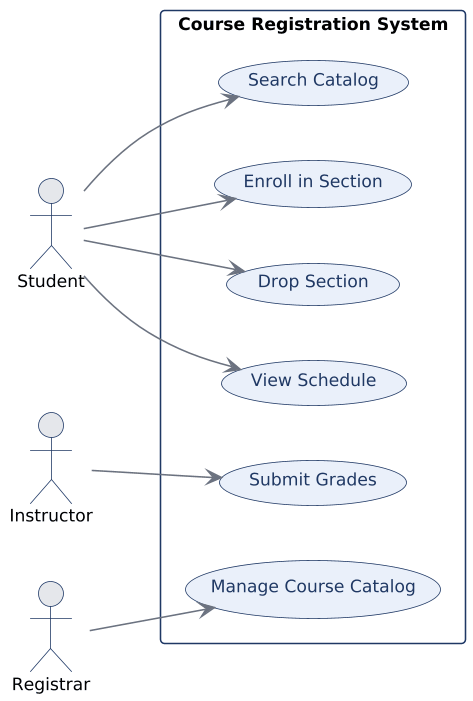
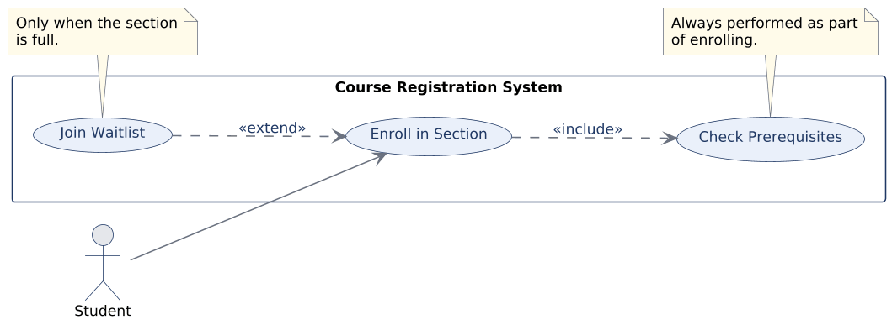
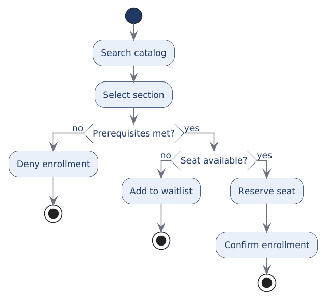
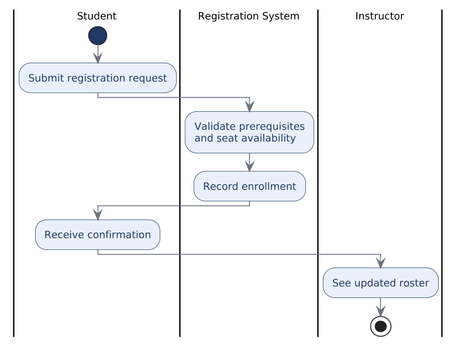

# CHAPTER 3: Use Cases & Activity Diagrams

Chapter 2 ended with a requirement written down, sourced, prioritized, and traceable. That is a considerable achievement and it is not yet a model. A requirement is a statement of need expressed in a sentence, and a sentence can hide an enormous amount of unexamined structure: who exactly is trying to do this, what has to be true before they can, and what happens when the attempt fails.

This chapter introduces the two behavioral models that force that structure into the open. **Use cases** view the system from outside, organizing behavior around external actors and the goals they pursue. **Activity diagrams** view a process from inside, organizing behavior around flow, decisions, and the paths taken when things do not go smoothly. The two answer different questions, and a great deal of confused modeling comes from asking one of them to do the other's job.

The aim here is not to memorize symbols. The notation in both cases is deliberately small. The aim is to choose the model that makes a particular question easier to answer, and to keep the model faithful to the requirements it came from. We continue with the university course-registration system. By the end of this chapter you should be able to:

* **Identify actors and use cases:** Derive external roles and meaningful goals from requirements rather than from screens or database tables.
* **Draw a use case diagram:** Apply the system boundary, associations, and the include and extend relationships correctly.
* **Write a use case description:** Specify the primary actor, preconditions, main flow, and the alternate flows that carry most of a system's real complexity.
* **Model a process as an activity:** Show actions, decisions, alternate paths, and defined endpoints.
* **Place BPMN in context:** Recognize when a richer business-process notation becomes worth its additional cost.

---

### 1. From Requirements to Models

A requirement states a need. A model imposes structure on that need, and the act of imposing structure is what exposes the gaps.

Take R-01 from the previous chapter: the student must be able to enroll in an eligible section. As a use case, this becomes **Enroll in Section**, which immediately raises the question of who else has a stake in enrollment and what other goals they pursue. As an activity, it becomes a flow — validate eligibility, check seat availability, then enroll or waitlist — which immediately raises the question of what happens on each branch. Neither question was visible in the sentence. Both are now unavoidable.

This is the economic argument from Chapter 1 applied at a smaller scale. Modeling surfaces missing actors, unclear rules, and unhandled exceptions while they are still cheap to resolve, which is to say before design and code make them expensive.

---

### 2. Actors, Goals, and the System Boundary

Three ideas carry most of the weight in a use case diagram, and each one is defined by what it excludes.

An **actor** is an external role that exchanges information with the system. It is a role, not a person: Sofia Ramirez is not an actor, but Student is, and the same human being may act as both Student and Instructor without becoming two actors. An actor is also external, which is what disqualifies the student records database from being one. A **use case** is a goal the system helps an actor achieve, which is why its name should be a meaningful verb phrase such as Enroll in Section. The **system boundary** separates the behavior being modeled from the roles that interact with it from outside:

This diagram is a survey of externally visible goals. Student, Instructor, and Registrar sit outside the boundary because they are roles the system serves. The bubbles inside are goals, not screens and not database operations.

Notice what the diagram does not show. There is no sequence here, no indication that searching the catalog precedes enrolling, and no suggestion that these six behaviors happen in any particular order. A use case diagram answers one question: who depends on which system behavior? Reading it as a workflow is the most common way to misuse it.

---

### 3. Include and Extend

Two relationships connect use cases to one another, and they are easy to reverse if you memorize the arrows without holding onto the meaning.

**Include** represents behavior the base use case always invokes. Enrolling in a section always checks prerequisites, so Check Prerequisites is included. **Extend** represents optional or conditional behavior added to the base under a specific circumstance. Joining a waitlist happens only when the section is full, so Join Waitlist extends enrollment:

The arrow directions follow from the meaning rather than the other way around. Include points from the base toward the behavior it always invokes, because the base is the one doing the invoking. Extend points from the optional behavior toward the base it attaches to, because the base does not know about the extension; the extension knows where it inserts itself.

Both relationships should be used sparingly. A diagram dense with include and extend arrows is usually one where an analyst has begun decomposing functions rather than surveying goals, and the decomposition belongs in the description instead.

---

### 4. The Use Case Description

The diagram names a use case. The description specifies it, and it is the description rather than the bubble that later analysis actually consumes.

| Element | Enroll in a Section |
| :--- | :--- |
| **Primary actor** | Student |
| **Preconditions** | Student is authenticated; the registration window is open. |
| **Main flow** | 1. Student searches for and selects a section. 2. System checks eligibility against prerequisites and holds. 3. System reserves a seat. 4. System confirms enrollment. |
| **Alternate flows** | Prerequisite unmet → enrollment denied with the reason given. Section full → student offered a place on the waitlist. Time conflict with an existing enrollment → the overlapping section is named, and the student chooses another section or drops the conflict. |

The alternate flows are the part that repays attention. Systems spend a large share of their complexity handling exceptions, and a description that lists only the main flow has documented the easy half of the problem. Every alternate flow in the table above corresponds to a decision someone had to make: whether a denied student sees the specific unmet prerequisite, whether waitlisting is automatic or offered, whether an advisor can intervene. Those decisions get made either deliberately here or accidentally by a developer later.

The time conflict is worth singling out, because it is the flow students most often omit. It is not an eligibility failure at all: the student may meet every prerequisite, the section may have seats, and the enrollment still cannot proceed because it collides with something the student already has. Missing it produces a system that will cheerfully enroll someone in two courses meeting at the same hour, and nobody discovers that until a term is underway.

A description should also stay at the level of business interaction. "System checks eligibility" belongs here; the query that performs the check, and the screen that displays the result, do not.

#### Common Use-Case Mistakes

Three errors account for most weak use case models, and all three share a root cause: modeling the implementation instead of the goal.

| Mistake | Why It Is Wrong | Correction |
| :--- | :--- | :--- |
| **Database as actor** | A database is a component inside the system, not an external role that pursues a goal. | Name the human or organizational role: Registrar, Student, Instructor. |
| **CRUD soup** | "Create Student, Read Student, Update Student" describes table operations, not anything an actor recognizes as an outcome. | Name goals: Enroll in Section, Drop Section, View Schedule. |
| **Too fine-grained** | "Click submit, type student ID, choose a row" are interface steps, not goals. | Keep interface detail in the description and in interface design. |

The test that catches all three is the same: does this bubble represent a meaningful outcome that an external actor would recognize and care about? A registrar cares about managing the course catalog. No registrar has ever wanted to update a row.

---

### 5. Activity Diagrams and the Unhappy Path

Activity diagrams change the question. Instead of asking what goals actors achieve, they ask how the work proceeds: what happens first, where the process branches, what alternate paths exist, and where each path ends:

The two alternate paths in this figure are the behavior. If prerequisites fail, the process denies enrollment. If prerequisites pass but no seat is available, the student is waitlisted. Only when both checks succeed does the process reserve a seat and confirm.

Analysts gravitate toward the happy path because it is the version that tells cleanly as a story, and because it is the version stakeholders describe when asked how something works. Real systems become complicated precisely at decisions and exceptions. A useful discipline is to treat every decision node as a question addressed to the stakeholder rather than a shape in a diagram: what exactly should happen when prerequisites are not met? Does the student see which prerequisite failed? That question often has no agreed answer, which is exactly the discovery worth making now rather than during acceptance testing.

A process model that describes only success is incomplete, and every branch leaving a decision must lead somewhere defined.

#### Swimlanes and Responsibility

Adding **swimlanes** partitions the same flow by role, which turns a process diagram into a statement about responsibility:

The value of swimlanes is in the crossings. Each time the flow moves from one lane to another, information passes across an organizational or system boundary, and boundaries are where work is dropped, delayed, or duplicated. The figure shows the student submitting, the system validating and recording, and the instructor eventually seeing an updated roster. That final crossing is worth a question: how does the roster reach the instructor, how quickly, and what happens during add/drop week when it changes several times a day?

Swimlanes are worth adding when handoffs matter and worth omitting when they do not. A single-lane process gains nothing from being drawn in one lane.

---

### 6. Choosing a Model

Use cases and activity diagrams are complementary, not competing, and the choice between them follows from the question being asked:

| Question | Use Case | Activity Diagram |
| :--- | :--- | :--- |
| **Focus** | An actor's goal. | The flow of work. |
| **Shows** | Who depends on which system behavior. | Actions, decisions, and alternate paths. |
| **Best for** | Establishing system scope and functional behavior. | Working out process logic and exceptions. |
| **Does not show well** | Sequence inside a goal. | The overall inventory of actor goals. |

A thorough analysis often uses both, though not because more diagrams are automatically better. Each model should clarify something the other leaves dark. Drawing an activity diagram for every use case in Figure 3.1 would produce six diagrams, most of which restate their descriptions without adding anything; drawing one for enrollment is worthwhile because enrollment is where the branching lives.

It is also worth knowing what sits beyond these two notations. **Business Process Model and Notation (BPMN)** is a richer standard that distinguishes event types, gateways, message flows, and participants far more precisely than activity notation does. That precision earns its cost in business-process management and workflow automation, where the model may drive an execution engine. It costs more to learn and more to read, and for teaching process flow, decisions, and responsibility, activity diagrams are sufficient. The general principle holds beyond this particular choice: notation should be as rich as the question requires and no richer.

---

## Case Study: Modeling Enrollment Behavior

**Case Focus:** *Campus Course Registration System — turning a requirements catalog into a defensible set of behavioral models.*

**Pedagogical Target:** *Students receive a short requirements catalog for registration, including the prerequisite rule, the waitlist requirement, and an advisor override requirement, along with interview excerpts in which stakeholders describe the process inconsistently. Students identify the actors and produce a use case diagram, justify each include and extend relationship they use, write a full description for one use case including alternate flows, and model the same behavior as an activity diagram with swimlanes. They then explain what each model revealed that the other did not, and identify at least one requirement gap that only became visible once a decision node forced a branch to have a defined outcome.*

---

## Review Questions & Exercises

1. A student team models the student records database as an actor on their use case diagram. Explain why this is incorrect using the definition of an actor, and describe what they were probably trying to represent.
2. Distinguish include from extend, then explain why the arrow for extend points toward the base use case rather than away from it.
3. A use case diagram shows six bubbles and no sequence. Why is the absence of sequence a property of the notation rather than an omission by the modeler?
4. Rewrite the following as proper use cases: "Create Enrollment Record," "Update Enrollment Record," "Delete Enrollment Record."
5. Figure 3.3 shows two alternate paths. Propose a third that the model does not currently handle, and explain what requirement would have to exist for it to be included.
6. Under what circumstances would you add swimlanes to an activity diagram, and what specific analytical question do the lane crossings help you ask?
7. A colleague argues that every use case in the system should have an accompanying activity diagram. Give the strongest argument for this position, then explain why restraint is usually the better practice.
