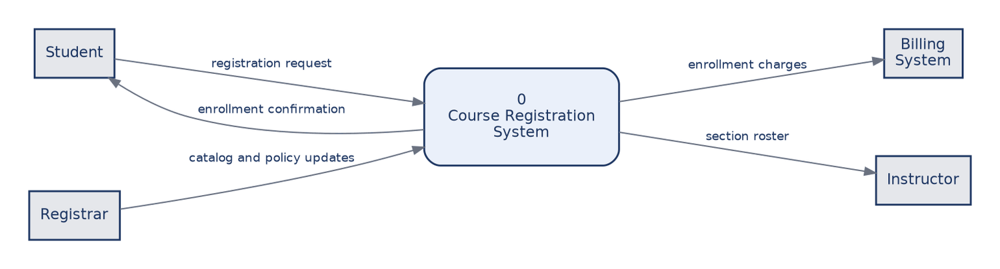
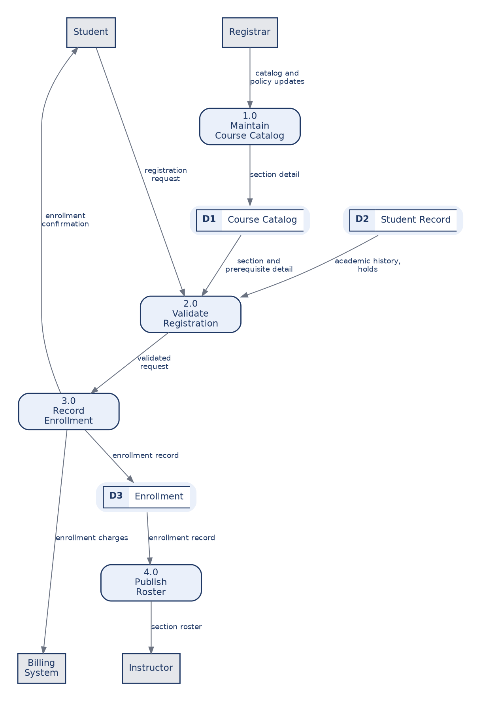
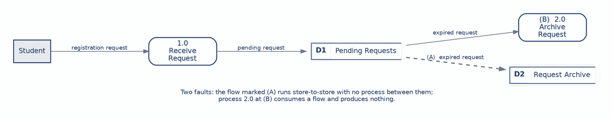
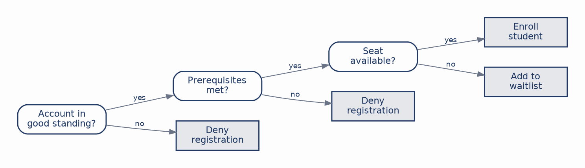
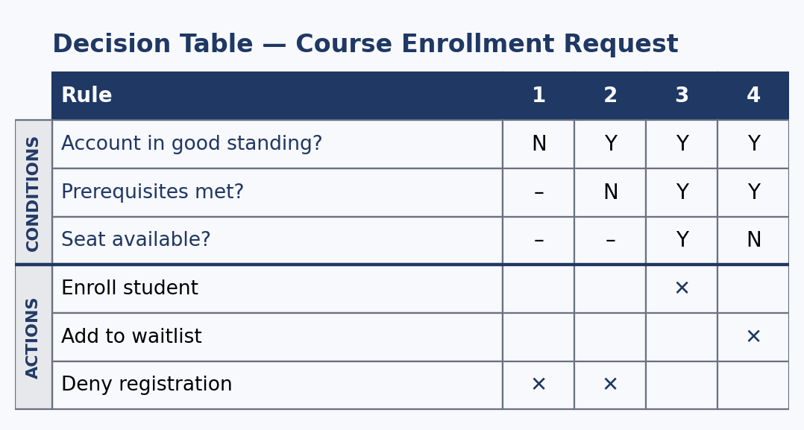

# CHAPTER 4: Data Flow Diagrams & Process Specification

Chapter 3 modeled what the system does for the people who use it. This chapter shifts the question to how data moves through the system and what logic sits inside each process once the data arrives.

These are two halves of one problem, and the split runs right through the chapter. The first half covers the **data flow diagram**, which gives the process view of a system: where data comes from, which processes transform it, where it rests, and where it goes. The second half covers **process specification**, the techniques for stating the rules a diagram deliberately leaves out. A DFD tells you that a process called Validate Registration exists. It says nothing whatever about what makes a registration valid, and that silence is by design rather than an oversight in the notation.

Keeping the views distinct matters more than it might appear. Use cases capture what the system does for its actors, data flow diagrams capture movement and transformation, and entity-relationship diagrams, which the next chapter takes up, capture structure. Students regularly try to make a DFD show sequence or structure, and it does neither well. If you want to show that one thing happens before another, you want the activity diagram from Chapter 3. We continue with the course-registration system. By the end of this chapter you should be able to:

* **Read and draw a DFD:** Apply Gane-Sarson notation for external entities, processes, data stores, and data flows.
* **Level a diagram:** Move from a context diagram to Level-0 and below while keeping the levels balanced.
* **Tell physical from logical:** Separate how a system is run today from what it must do.
* **Catch the classic errors:** Spot black holes, miracles, grey holes, and illegal flows before a reviewer does.
* **Specify process logic:** Express a rule as structured English, a decision tree, or a decision table, and know which to reach for.

---

### 1. Four Symbols, Used Precisely

The entire notation is four symbols, and the discipline lies in using each one for exactly what it means.

An **external entity** is a source or destination of data sitting outside the system boundary: a person, an organization, or another system. For a registration system, the student and the billing system are external entities. It is drawn as a plain rectangle. A **process** is work that transforms incoming data into outgoing data. It carries a number and a verb-phrase name, which is why "Student data" is not a process and "Validate registration" is. It is drawn as a rounded rectangle. A **data store** is data at rest, drawn as an open two-part rectangle with an identifier such as D1. A **data flow** is a labeled arrow carrying a named packet of data.

The naming rule for flows deserves emphasis because it is the one most often broken. Label the data that moves, never the action that moves it. "Confirmed registration" is a flow. "Sends registration" is not, because the arrow already conveys that something is being sent; what the reader needs to know is what is inside it. Get the four symbols right and most of a good diagram follows from them.

---

### 2. Leveling: The Context Diagram

The context diagram is the top of the tree and the simplest thing you will draw. A single process numbered 0 stands for the entire system, surrounded by every external entity and the data flowing to and from each one:



It shows scope and nothing else. There are no data stores and no internal processes, because its only job is to fix the boundary. This is the diagram to put in front of a client to settle one specific, high-stakes question: what is inside the system we are building, and what is outside it?

Drawing it forces decisions that are easy to defer and expensive to get wrong. Is the billing system inside or outside? Outside, because the registration system sends it charges but does not maintain it. Is the registrar external? Yes, as a role that supplies catalog and policy updates from outside. Is an enrollment clerk external? No, because that role works inside the system rather than exchanging data with it from outside. Each of those answers is a scope commitment, and the context diagram is where they get made explicitly rather than assumed differently by different people.

---

### 3. Leveling: Level-0 and Below

Level-0 is the context diagram's single process pulled open to reveal the major processes inside, together with the data stores they read and write:



Notice what stayed the same. Every flow that crossed the boundary of the context diagram still crosses the boundary here: the registration request still arrives from the student, the confirmation still returns, charges still go to billing, and the roster still goes to the instructor. We have not changed what the system exchanges with the outside world, only shown more of its insides.

Notice also that the processes remain coarse. Record Enrollment stands for a dozen steps that are not shown, because Level-0 is a survey. Detail arrives by exploding any single process into its own Level-1 diagram, whose processes are numbered from their parent: the children of 2.0 are 2.1, 2.2, and so on.

The guiding number is five to seven processes per diagram. Fewer usually means the decomposition has not gone far enough; more means the diagram has become too busy to read, which is the signal to push some of it down a level. Each explosion is a zoom rather than a rewrite, which is what makes the next rule enforceable.

#### Balancing, the Rule Reviewers Check First

**Balancing** requires that the data flows crossing a process's boundary match the flows crossing the boundary of the diagram that explodes it. If the parent diagram shows an enrollment confirmation flowing out of process 3.0, then the Level-1 diagram detailing 3.0 must produce one.

An unbalanced diagram means data appears or disappears between levels, which is really a statement that the two levels disagree about what the process does. It is the most common structural error and among the easiest to catch: line up the boundary flows and count them. That is why a reviewer checks it first, and why a balanced set of diagrams is the difference between a model that hangs together and a collection of pictures that happen to share vocabulary.

---

### 4. Physical and Logical Models

The same system can be drawn two ways, and knowing which one you are drawing keeps the analysis honest.

| | Physical DFD | Logical DFD |
| :--- | :--- | :--- |
| **Question answered** | How is the work done today? | What must the system accomplish? |
| **Names** | The technology and the people: "Clerk keys add/drop form into the terminal," "Registrations2026.xlsx." | The work and the data: "Record registration," "Enrollment." |
| **Good for** | Documenting the as-is and finding waste. | Designing the to-be without prejudging tools. |

The analyst's move is to model the physical as-is first, in order to understand and critique how things actually run, then derive the logical model as the basis for the new design. Doing it in that order means designing around what the institution needs rather than around the accidents of whatever system it happens to be running. Skipping the physical model risks designing for a process nobody actually follows; stopping at the physical model risks rebuilding the current system's quirks in a new technology.

---

### 5. Four Ways to Break a DFD

Four errors account for most of what goes wrong, and naming them makes them easy to see.

A **black hole** is a process with input and no output: data goes in and nothing comes out, which cannot happen. A **miracle** is the reverse, a process producing output from no input. A **grey hole** is subtler, a process whose output could not possibly be produced from the input it receives, which usually means a flow is missing. An **illegal flow** is data moving where it may not, most often store to store or external entity straight to a store, with no process in between:



Being able to point at both faults on sight is exactly the skill a design review demands. The underlying principle behind all four is that a DFD makes a claim about causation, not just about arrangement. Data stores are passive; they never reach out and do anything, and only a process can move data into or out of one.

#### The Well-Formed DFD Checklist

Run this over any diagram before calling it done. It is essentially the inverse of the four errors plus the leveling discipline.

| Rule | What It Requires |
| :--- | :--- |
| **Every process transforms** | At least one input and one output, and the output follows from the input. |
| **Name data, not actions** | Flows carry named data packets; processes carry verb phrases. |
| **Route through a process** | No store-to-store, entity-to-entity, or entity-to-store flows. |
| **Balance the levels** | Boundary flows match between a process and its explosion. |
| **Keep it to five to seven** | Too many processes on one diagram means it is time to level. |
| **Stores do not act** | A data store is passive; only a process moves data in or out. |

---

### 6. Specifying the Logic Inside a Process

A data flow diagram is intentionally silent about how a process makes its decisions. Process specification fills that gap, and three standard techniques do it, each suited to a different shape of logic.

**Structured English** is ordinary English narrowed to the constructs of structured programming: sequence, IF/THEN/ELSE, and REPEAT, with indentation carrying the structure. The enrollment rule reads:

```
IF account is not in good standing
    DENY registration
ELSE
    IF prerequisites are not met
        DENY registration
    ELSE
        IF a seat is available
            ENROLL the student
        ELSE
            ADD the student to the waitlist
```

There is no notation to learn, which makes it easy for a stakeholder to read and confirm, and it fits logic that is fundamentally procedural. Its weakness appears exactly where the decision table's strength lies: once several conditions combine, the nested conditionals pile up and it becomes hard to see whether every case has been covered.

A **decision tree** draws the same logic as a branching diagram read from left to right, where each internal node tests a condition, each branch is an answer, and each leaf is an action:



Its virtue is visibility. With a handful of conditions, a stakeholder can follow every path and confirm the rule, which makes it an excellent communication tool. Its limits mirror that virtue: as conditions multiply the tree fans out and becomes unreadable, and, more importantly, it offers no systematic way to confirm that every combination has been accounted for. Nothing about a tree tells you that you forgot to draw a branch.

A **decision table** lays the same logic out as a grid, with conditions above, actions below, and each column reading down as one rule:



Each condition is marked Y, N, or a dash meaning "don't care," and the dash is what lets one column stand for several cases at once. Rule 1 denies registration whenever the account is not in good standing, regardless of prerequisites or seats, which is why both of those rows carry dashes.

The reason this form matters more than the other two is countability. With N conditions there are exactly 2^N possible combinations, so it is possible to check mechanically that every one is handled and that none is handled two different ways. The table above covers all eight combinations of its three conditions in four rules, and it passes both the completeness and the contradiction check. Neither the structured English nor the tree can offer that guarantee, and for a rule governing eligibility or money, the guarantee is worth the slightly less intuitive layout.

#### Choosing Among the Three

| Technique | Best When | Watch Out |
| :--- | :--- | :--- |
| **Structured English** | Logic is sequential and procedural; a non-technical reader must confirm it. | Nested conditions become hard to verify. |
| **Decision tree** | A few conditions, and the value lies in showing someone the paths. | Fans out quickly; no completeness check. |
| **Decision table** | Many conditions combine, and the logic must be provably complete. | Less intuitive to read at a glance. |

These are tools for different jobs rather than rivals. A capable analyst is fluent in all three and chooses by the shape of the logic in front of them, reaching for the table when it matters that the rule can be proven correct rather than merely reviewed and believed.

---

## Case Study: Modeling the Registration Process

**Case Focus:** *Campus Course Registration System — producing a balanced set of data flow diagrams and a provably complete specification of the enrollment rule.*

**Pedagogical Target:** *Students receive a description of how registration runs today, including a paper override form that an advisor emails to the registrar's office and a nightly batch job that reconciles enrollments against billing. Students draw the physical as-is DFD, derive the logical model from it, and explain each element they dropped in the derivation. They then explode one Level-0 process into Level-1 and demonstrate that the levels balance. Finally, they specify the override approval rule in all three forms and use the decision table to identify at least one combination of conditions the current policy does not actually address, reporting the gap rather than inventing an action to fill it.*

---

## Review Questions & Exercises

1. Why does the context diagram contain no data stores? What would including one imply about the diagram's purpose?
2. A student labels a data flow "submits registration." Explain what is wrong with the label and rewrite it correctly.
3. Explain the balancing rule in your own words, then describe what an unbalanced pair of diagrams actually tells you about the analyst's understanding of the process.
4. Distinguish a grey hole from a black hole. Why is a grey hole harder to catch in review?
5. An analyst draws only a logical DFD, skipping the physical model entirely, on the grounds that the current system is being replaced anyway. Give the strongest case for this position, then explain what the analyst risks missing.
6. Using Figure 4.5, explain why rule 1 carries dashes in two rows, and state how many of the eight possible condition combinations that single rule covers.
7. A colleague argues that structured English is always preferable because clients can read it without training. Under what circumstances is this argument strongest, and where does it break down?
