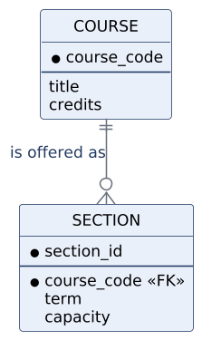
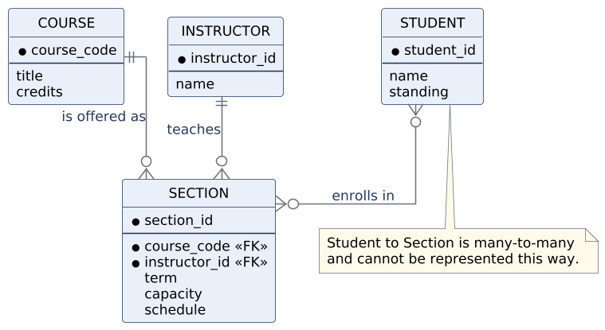
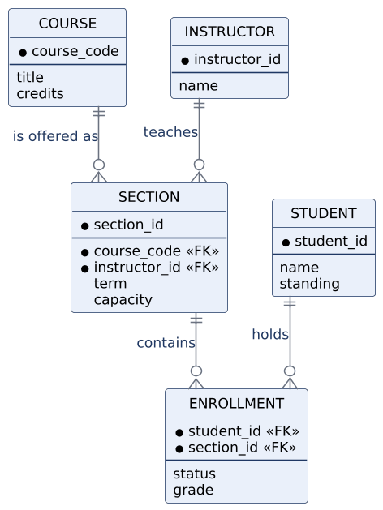
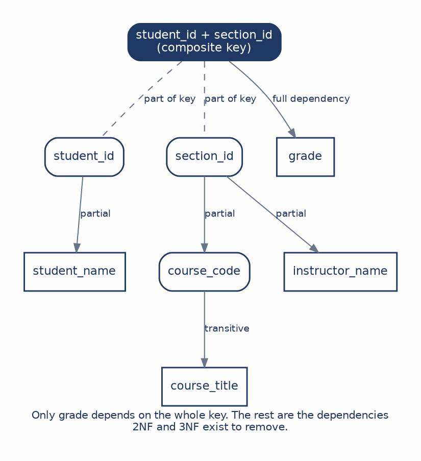

# CHAPTER 5: Entity-Relationship Diagrams & Normalization

This chapter completes the trio of views. Use cases describe what the system does for its actors, data flow diagrams describe how data moves and is transformed, and the **entity-relationship diagram** describes how data is structured and related. For course registration, the ERD is where we finally distinguish students, courses, sections, instructors, and enrollments as separate things with separate identities.

The chapter approaches data design twice, from opposite directions, and that is deliberate. The ERD route starts with business concepts and asks what the institution must remember. **Normalization** starts with a table full of data and asks what each attribute actually depends on. If the design is sound, both routes arrive at the same structure, and the convergence is the point. A model that looks plausible as a diagram can still hide a dependency problem, and a technically clean set of tables can still be named and organized in a way nobody can understand.

Data design decides where facts belong, which facts identify a thing, and how business rules constrain the way things relate. By the end of this chapter you should be able to:

* **Read and draw an ERD:** Use crow's-foot notation to represent entities, attributes, keys, and relationships.
* **Identify entities, attributes, and keys:** Determine what the system stores and how each instance is identified.
* **Set cardinality and optionality:** State how many instances may participate in a relationship and whether participation is required.
* **Resolve many-to-many relationships:** Introduce an associative entity when a relationship carries facts of its own.
* **Normalize to third normal form:** Remove repeating groups, partial dependencies, and transitive dependencies.

---

### 1. Entities, Attributes, and Keys

An **entity** is a category of thing the system must distinguish, such as Student. An **attribute** is a fact describing one instance of that entity, such as a student's name or academic standing. A **key** is the attribute or combination of attributes that uniquely identifies an instance.

The key deserves more thought than it usually gets, because a key is about identity rather than convenience. A student's name is not a key: two students can share a name, and a student can change a name without becoming a different student. Anything that can change or repeat is disqualified, which is why most systems use a generated identifier such as `student_id`. It carries no meaning, which is precisely its virtue, since a key that means something is a key that can be invalidated when the meaning changes.

Conventionally, entity names are uppercase and singular, attributes are lowercase, and key attributes sit above a dividing line inside the entity box.

---

### 2. Cardinality and Optionality

A relationship between two entities is constrained in two independent ways. **Cardinality** states the maximum participation: at most one, or many. **Optionality** states the minimum: zero, or at least one. Crow's-foot notation encodes both in a pair of marks at each end of the line.

| Symbol | Reading |
| :--- | :--- |
| `‖` | Exactly one. Mandatory, and at most one. |
| `|o` | Zero or one. Optional, and at most one. |
| `}|` | One or many. Mandatory, with no upper limit. |
| `}o` | Zero or many. Optional, with no upper limit. |

Each end is read independently, which is the part students most often get backwards:

Reading this from left to right: one course may be offered as zero or more sections, and each section belongs to exactly one course. The zero on the section end is a substantive claim, not a default. It says the catalog may contain an approved course with no sections currently scheduled, which is true of most universities and would be false at an institution that purges unoffered courses.

That is the general lesson. Optionality is usually an analytical question rather than a notation question, and answering it requires going back to a stakeholder rather than looking at a symbol chart. Every mark on an ERD line is a business rule someone has to confirm.

---

### 3. A First Model, and What It Cannot Say

Here is a first pass at the registration domain, covering course, section, instructor, and student:

Course to section and instructor to section are straightforward. Each is one-to-many, and each section points back to exactly one course and one instructor.

Student to section is the interesting one, and it is deliberately left unresolved. A student takes many sections, and a section holds many students. Drawn as a direct many-to-many relationship, the model has nowhere to put the facts that belong to the pairing itself. Where does a grade live? A grade is not a fact about the student, since the same student has different grades in different sections, and it is not a fact about the section, since the same section awards different grades to different students. It is a fact about the combination.

That gap is the diagram telling you that something is missing.

---

### 4. The Associative Entity

The resolution is to make the relationship itself into an entity:

**Enrollment** is an **associative entity**. It represents the relationship between a student and a section, and it holds the attributes that belong to that pairing: status and grade. One student has many enrollment records, and one section has many enrollment records, so the original many-to-many has become two one-to-many relationships with a new entity in the middle.

Calling Enrollment a bridge undersells it. A pure bridge would carry nothing but the two foreign keys, and plenty of associative entities are like that. This one stores facts, and once it exists, a whole category of future requirements becomes easy to express. Dropping, waitlisting, grading, and auditing all attach naturally to Enrollment. Without it, each of those rules would have to be forced awkwardly onto Student or Section, where it does not belong and where it would eventually cause trouble.

The signal to watch for is a many-to-many relationship where you find yourself wanting to record something about the pairing. That wanting is the associative entity announcing itself.

---

### 5. Why Normalization Exists

Normalization approaches the same problem from the opposite end. Instead of starting with business concepts, it starts with a table and asks what each attribute depends on. The motivation is that badly placed facts produce operational errors, and those errors have names.

An **update anomaly** occurs when a fact is stored in many rows: a course title repeated across every enrollment row means changing it requires finding every copy, and missing one leaves the database contradicting itself. An **insertion anomaly** occurs when a fact cannot be recorded because unrelated data is missing: if course details live only in enrollment rows, a newly approved course cannot be recorded until some student enrolls in it. A **deletion anomaly** is the reverse: removing the last enrollment for a course may erase the only record that the course exists. Picture a seminar that runs once a year with four students in it. The last of them drops during add/drop week, the row is deleted, and with it goes the course code, the title, and the fact that the university ever offered the thing. Nobody deleted a course. Somebody deleted an enrollment, and the course was only ever stored as a side effect of enrollments existing.

All three are symptoms of the same underlying disease, which is a fact stored somewhere other than its proper home.

---

### 6. Normalizing the Grades Table

The worked example carries one table through the whole process, so that the decomposition is visible rather than definitional. Here is the starting point, a single wide table recording grades:

| student_id | student_name | section_id | course_code | course_title | instructor_name | grade |
| :--- | :--- | :--- | :--- | :--- | :--- | :--- |
| 1001 | A. Patel | S101 | MIS3250 | Systems Analysis | V. Sethi | A |
| 1001 | A. Patel | S205 | MIS3100 | Database | J. Lee | B |
| 1002 | M. Chen | S101 | MIS3250 | Systems Analysis | V. Sethi | A- |

The repetition is visible without any theory. A student's name reappears every time that student enrolls in something, and a course title reappears every time anyone enrolls in any of its sections. The goal of what follows is not to lose information but to decompose the structure so each fact has a single responsible home.

#### First Normal Form: Atomic Values

**First normal form** requires that every value be atomic and that each row represent exactly one thing. The table above already satisfies this if we treat each row as one enrollment, and the natural key is the composite of `student_id` and `section_id`, because a student enrolls in many sections and a section holds many students.

What 1NF fixes is repeating groups, meaning a cell that holds a list. It does not remove all repetition, and the table above proves it: the structure is now regular and the redundancy is entirely intact.

#### Seeing the Dependencies

Before applying the next two forms, it helps to look at what actually depends on what:

Only `grade` depends on the whole composite key, which is the sense in which it is genuinely a fact about the enrollment. Everything else depends on part of the key, or on something that is not the key at all. Those two categories of problem are exactly what the next two normal forms remove.

#### Second Normal Form: Remove Partial Dependencies

A **partial dependency** exists when a non-key attribute depends on only part of a composite key. `student_name` depends on `student_id` alone, not on the combination of student and section, so storing it in the enrollment table repeats it once per enrollment for no reason. The same applies to the section-related facts, which depend on `section_id` alone.

Removing them produces three tables:

| Table | Key | Other attributes |
| :--- | :--- | :--- |
| **STUDENT** | student_id | student_name |
| **SECTION** | section_id | course_code, course_title, instructor_name |
| **ENROLLMENT** | student_id + section_id | grade |

Every non-key attribute now depends on the whole key of its own table. One problem remains, and Figure 5.4 already showed it: `course_title` sits in SECTION but does not depend on `section_id`. It depends on `course_code`, which is itself a non-key attribute.

#### Third Normal Form: Remove Transitive Dependencies

A **transitive dependency** exists when a non-key attribute depends on another non-key attribute rather than directly on the key. Course title depends on course code, so course code and title belong together in a table of their own, and SECTION keeps `course_code` as a foreign key pointing to it:

| Table | Key | Other attributes |
| :--- | :--- | :--- |
| **STUDENT** | student_id | student_name |
| **COURSE** | course_code | course_title |
| **SECTION** | section_id | course_code (FK), instructor_name |
| **ENROLLMENT** | student_id + section_id | grade |

Now look back at Figure 5.3. The four tables are Student, Course, Section, and Enrollment, connected exactly as the ERD connects them. Normalization and conceptual modeling started from different places and arrived at the same design, which is the strongest evidence available that the design is right.

---

### 7. Two Routes to One Model

| | ERD | Normalization |
| :--- | :--- | :--- |
| **Starts with** | Things in the business. | Data as it currently exists. |
| **Best question** | What must we remember? | Where should each fact live? |
| **Failure mode** | A plausible-looking model that hides a dependency problem. | A technically clean design that has lost business meaning. |

The two are complementary rather than alternative. An ERD carries meaning, because its entity names come from the language the institution already uses, and that is what makes the model reviewable by people who do not read database theory. Normalization carries discipline, because its rules are mechanical and catch problems that meaning alone will not reveal.

Either route on its own can mislead. A sound design should survive both, which is a practical test rather than a philosophical one: draw the model, normalize the data, and see whether they agree. Where they disagree, one of them has found something.

---

## Case Study: Building the Registration Data Model

**Case Focus:** *Campus Course Registration System — deriving a data model from business concepts and validating it against a normalization pass over existing data.*

**Pedagogical Target:** *Students receive an export from the current system: one wide spreadsheet holding enrollment records, along with notes indicating that some courses are cross-listed under two departments and that a section may occasionally be co-taught by two instructors. Students build a conceptual ERD from the business description, then independently normalize the spreadsheet to third normal form and compare the results. The planted complications are designed to diverge: co-teaching creates a second many-to-many the first-pass ERD will miss, and cross-listing creates a dependency that normalization surfaces before the diagram does. Students document each disagreement between the two routes and decide which model is correct, justifying the decision from the business rules rather than from the notation.*

---

## Review Questions & Exercises

1. Explain why a student's name is a poor choice of key, using both of the properties a key must have.
2. An analyst draws a relationship as one-to-many but cannot decide whether the "many" end is optional. What would they need to find out, and who would they ask?
3. Figure 5.2 leaves the student-to-section relationship unresolved. Explain what specific fact the model has nowhere to store, and why that fact belongs to neither entity.
4. Distinguish an associative entity that carries attributes from one that carries only foreign keys. Give an example of each from a university context.
5. Using Figure 5.4, explain in your own words why `grade` survives in the ENROLLMENT table while `student_name` does not.
6. A colleague proposes skipping the ERD and going straight to normalization, arguing that the rules are mechanical and therefore more reliable than judgment. Give the strongest version of this argument, then explain what it risks producing.
7. A section's `capacity` was omitted from the normalized tables in this chapter. Which table should hold it, and what dependency argument supports your answer?
