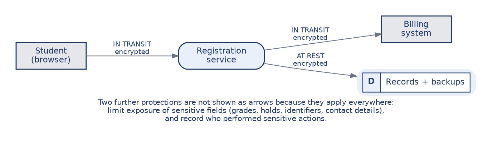
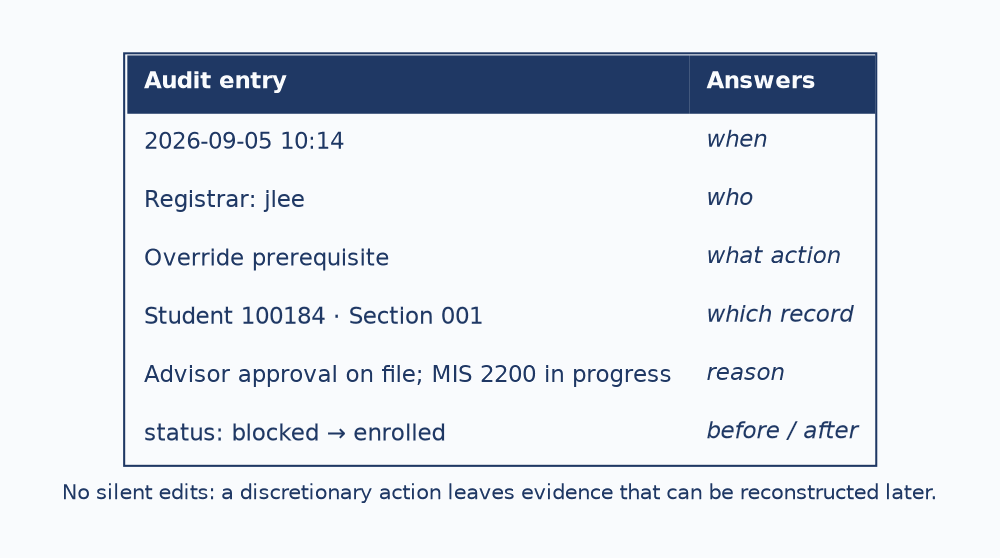
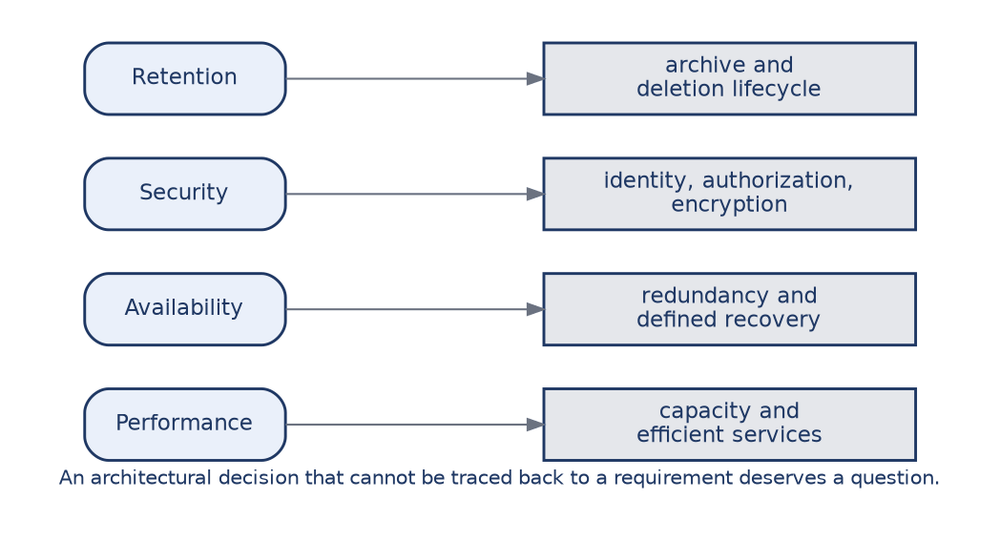
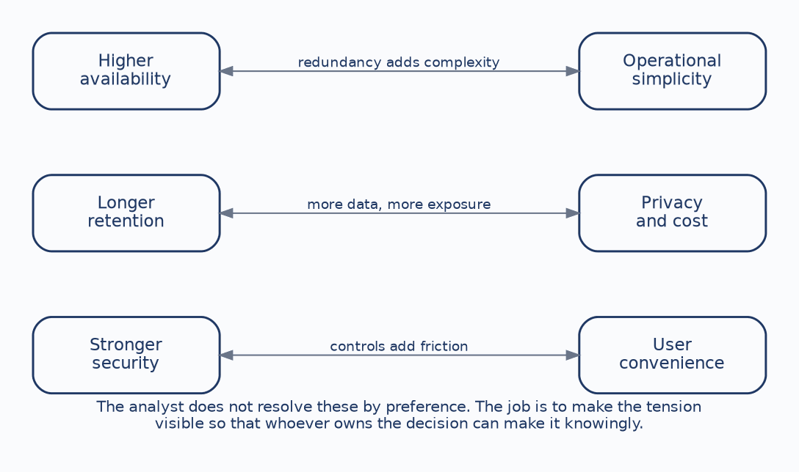

# CHAPTER 9: Non-Functional Design — Security, Access & Retention

Chapter 7 closed by observing that non-functional requirements drive architecture. This chapter takes that class of requirement seriously in its own right, covering access, security, privacy, retention, audit, performance, and availability.

These are the requirements most often left as adjectives in a specification, and most often discovered to matter at the worst possible moment. A specification that promises a fast, secure, reliable system has promised nothing, because none of those words can be built to, tested against, or failed. The purpose of this chapter is to make such qualities explicit, measurable, and traceable to specific design decisions.

Course registration is a good system to learn this on. It holds academic records, enforces rules that affect whether people graduate, and faces its heaviest load in a handful of concentrated hours each term. By the end of this chapter you should be able to:

* **Distinguish functional from non-functional:** Separate what the system does from how well and under what constraints it must do it.
* **Design role-based access:** Assign permissions by role and apply least privilege.
* **Reason about security and privacy:** Protect data across its life and recognize that the two are not the same concern.
* **Set retention and audit expectations:** Decide how long records live and what evidence sensitive actions must leave.
* **Write a testable requirement:** Convert a weak adjective into something someone could verify.

---

### 1. The Requirements That Aren't Features

Functional requirements describe behaviors. Non-functional requirements describe qualities, constraints, and operating expectations. Built from one system, the contrast is sharp:

| Type | Example from course registration |
| :--- | :--- |
| **Functional** | A student can enroll in an eligible section. |
| **Performance** | Enrollment responds within a measurable target under peak load. |
| **Security** | Only authorized roles can change enrollment records. |
| **Privacy** | Students see their own protected records, not everyone else's. |

The essential point is that a system can perform every function correctly and still fail the organization. A registration system that enrolls students accurately, but collapses during registration week, or exposes grades to the wrong people, or cannot recover when the billing interface goes down, has not succeeded in any sense the university would recognize.

This is why these belong in the requirements catalog from Chapter 2, with sources and owners, exactly like functional requirements. An availability target with no owner is an aspiration, and nobody can be held to it when it is missed.

---

### 2. Access as a Governance Decision

Access control is a business-rule and governance decision about who may view, change, approve, and audit information, and those questions belong to policy owners rather than to developers. Treating access as a technical concern is how systems end up with permission structures nobody in the institution ever approved.

**Role-based access** assigns permissions to roles rather than to individuals. The practical reason is maintenance, since an institution with thirty thousand students cannot manage thirty thousand permission sets and can manage three roles. The deeper reason is reviewability: a role structure can be examined and approved, while an accumulated pile of individual exceptions cannot.

**Least privilege** means giving each role only what its job requires, which limits both honest mistakes and deliberate misuse.

| Action | Student | Instructor | Registrar |
| :--- | :---: | :---: | :---: |
| View own schedule | ✓ | — | ✓ |
| View class roster | — | ✓ | ✓ |
| Submit grades | — | ✓ | ✓ |
| Override hold | — | — | ✓ |
| Manage catalog | — | — | ✓ |

A grid like this makes permission decisions visible in a form both policy owners and technical staff can review, which is the whole reason for drawing it. Reading across the rows shows the shape of each role: students see their own record and nothing else, instructors see rosters and submit grades but cannot override a hold, registrars can do all of it.

The design discipline is that the matrix should reflect job responsibilities rather than convenience, and convenience is the pressure that erodes it. It is always easier to grant a role slightly more access than to handle an exception properly. Each such concession is invisible on its own and significant in aggregate.

---

### 3. Security and Privacy Are Different Questions

Security protects confidentiality, integrity, and availability. Privacy asks whether the right person is seeing the right data for the right purpose. A system can be perfectly secure against outsiders and still violate privacy, by showing an instructor a student's full academic history when only the current roster is needed.

Data must be protected across its whole life:

Connections are encrypted in transit, between the user and the service and between the service and its integrations. Records are protected at rest, and that protection must extend to backups and exported files, which are the copies people forget. Sensitive fields such as grades, holds, identifiers, and contact details have their exposure limited even to users who are legitimately in the system. And sensitive actions are recorded.

The governing principle for registration is worth stating plainly. Academic records should not be exposed merely because the system is technically capable of displaying them. Capability is not authorization.

---

### 4. Retention: How Long Should Records Live?

Retention periods differ by data type, and the differences follow from purpose:

| Data | Period | Why |
| :--- | :--- | :--- |
| **Enrollment history** | Long-term | It is the academic record and supports operations for years. |
| **Registration attempts** | Shorter | Useful for troubleshooting and analytics, not permanent. |
| **Audit events** | Defined policy | Accountability and investigation; set deliberately. |
| **Temporary search data** | Minimal | No lasting purpose once the search is done. |

Both failure modes here are real and common. Keeping everything forever is not a design decision but the absence of one, and it accumulates cost, storage, and exposure. Deleting too soon is equally not a design, and it destroys the record somebody will later need.

Setting these periods means balancing institutional policy, legal obligation, operational need, privacy, storage cost, and risk. It is a conversation with the registrar and with counsel rather than a technical judgment, and an analyst who sets retention periods alone has assumed an authority they do not have.

---

### 5. Audit: No Silent Edits

An audit trail records who did what, when, to which record, and often why, sometimes capturing the values before and after:

In course registration, the actions that most need auditing are the discretionary ones: overrides, changes to catalog rules, grade submission, and record correction. What these share is that a human exercised judgment, and judgment is what later gets questioned.

The principle is that sensitive changes leave evidence. Without it, an institution facing a grade dispute or an improper override has no way to reconstruct what happened. The characteristic pattern is that the absence of evidence gets discovered precisely when the evidence was needed, which is too late to add it.

---

### 6. Writing a Requirement Someone Could Test

This is the practical heart of the chapter, because the weak form is what most people write by default and what most real specifications contain.

> The registration system should be fast and secure.

That is not a requirement. Nobody can build to it, nobody can test it, and nobody can be shown to have failed it, which means it will never be enforced.

> Ninety-five percent of enrollment requests complete within two seconds at four thousand concurrent sessions.

That states a quality, a target, and an operating condition. It names the operation being measured, the threshold, the load under which the threshold applies, and the proportion of cases that must meet it. Someone can now build to it and someone can demonstrate whether it was met.

The conversion is mechanical once the habit forms. Take the weak adjective and ask: how much, for what operation, under what conditions, and how often? Four adjectives are worth hunting for specifically, because they hide more vagueness than any others: **fast**, **easy**, **secure**, and **reliable**.

Availability and recovery deserve the same treatment. "The system should be available" becomes availability of 99.9 percent during published registration windows, which scopes the promise to the period that actually matters rather than to the calendar year. "It should handle failures" becomes a statement that a failed billing integration retries safely without producing duplicate enrollments, which names both the failure and the unacceptable outcome.

---

### 7. From Requirement to Design Decision

This is where Chapter 7's architecture becomes necessary rather than merely available. A performance target drives capacity and efficient service design. An availability target drives redundancy and a defined recovery path. A security requirement drives identity management, authorization, and encryption. A retention policy drives an archive and deletion lifecycle, which is real engineering work that has to be built rather than assumed into existence.

The relationship is worth stating plainly, because it reframes how students should read any architecture. Architecture is not chosen from preference or fashion. Each significant structural decision should be traceable to a requirement that made it necessary, and one that cannot be traced deserves a question.

---

### 8. Quality Attributes Compete

Non-functional design is largely the management of trade-offs, because these qualities pull against one another. Stronger security controls add friction, and a login process that is genuinely rigorous is genuinely annoying. Longer retention increases both storage cost and the volume of data exposed if something goes wrong, so keeping more is not automatically safer. Higher availability usually requires redundancy and a level of operational maturity the institution may not possess, which converts a technical target into a staffing question.

The analyst's role is to make these tensions explicit so that whoever owns the decision can make it knowingly. This matters more than it appears, because a trade-off decided silently has still been decided. It has simply been decided by whoever wrote the code, on the basis of whatever was convenient that afternoon.

---

### 9. The Non-Functional Review

| Check | Question |
| :--- | :--- |
| **Access** | Are roles and permissions defined and approved? |
| **Sensitive data** | Is it identified, and is its exposure limited? |
| **Retention** | Are periods explicit rather than assumed? |
| **Audit** | Are audit events defined, and do they cover discretionary actions? |
| **Performance** | Is the target measurable? |
| **Availability** | Are availability and recovery targets measurable? |
| **Architecture** | Does it actually support these targets? |

This extends the Chapter 8 review habit to the non-functional side of a design, and its diagnostic value lies in what it reveals by absence. A design with a complete set of features but no access matrix, no audit expectations, vague performance language, and no retention decisions is not a complete design, however finished the functional side may look.

---

## Case Study: Specifying the Non-Functional Requirements

**Case Focus:** *Campus Course Registration System — turning quality expectations into requirements that can be owned, tested, and traced to design.*

**Pedagogical Target:** *Students receive stakeholder statements expressed as adjectives: the registrar wants the system to be secure, the CIO wants it reliable during registration week, an advisor wants overrides to be quick, and general counsel wants records kept "as long as necessary." Students convert each into a testable requirement with a target, an operating condition, a source, and an owner, then build a role-access matrix and define the audit events the override process requires. The counsel statement is deliberately unresolvable as written, and students are expected to identify that it cannot be converted without a conversation rather than inventing a retention period. They then identify which trade-off each requirement creates and name who in the institution should decide it.*

---

## Review Questions & Exercises

1. A registration system enrolls every student correctly and exposes grades to anyone with a valid login. Which category of requirement has it failed, and why is the functional correctness irrelevant to that judgment?
2. Explain why role-based access is preferable to individual permissions, giving both the maintenance argument and the reviewability argument.
3. Distinguish security from privacy using an example in which a system is secure and simultaneously violates privacy.
4. Retention has two opposite failure modes. Name both and explain why neither counts as a design decision.
5. Why are discretionary actions the ones that most require auditing? Answer in terms of what gets questioned later.
6. Rewrite "advisor overrides should be quick" as a testable requirement. State what additional information you would need and who you would ask for it.
7. An architecture includes a redundant database cluster. What question should a reviewer ask, and what would a satisfactory answer look like?
