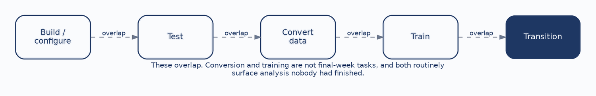
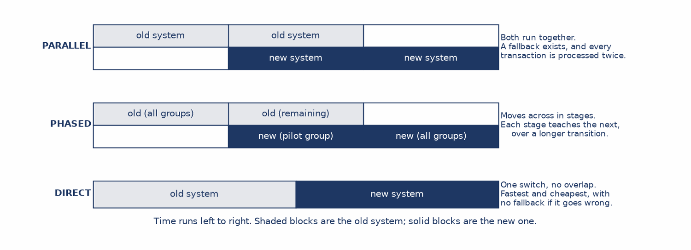
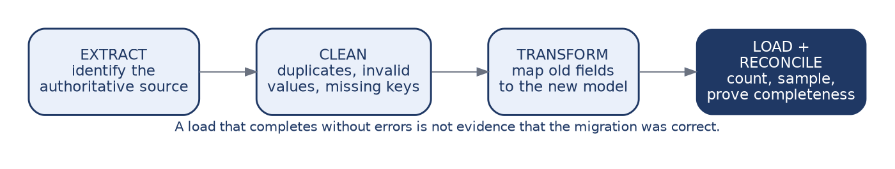
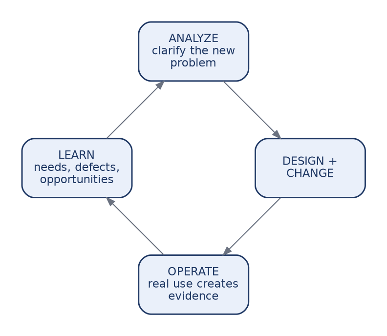

# CHAPTER 11: Implementation, Changeover & Maintenance

This chapter follows a designed system into operation, covering implementation, changeover, data conversion, training, adoption, maintenance, and phasing.

The organizing idea is life-cycle thinking, and the claim worth establishing at the outset is that go-live is not the end of a system's life but the beginning of its longest phase. Students arriving from a design-focused sequence tend to picture a project as a climb toward launch, after which the work is finished and the team disperses. The reality is closer to the opposite. Launch is where the system begins accumulating the changes, policy shifts, and integrations that will occupy it for years.

Course registration keeps that concrete, since it is a system an institution expects to run for a decade or more. By the end of this chapter you should be able to:

* **Describe implementation:** Coordinate build, test, conversion, training, and transition as overlapping work.
* **Choose a changeover strategy:** Weigh parallel, phased, and direct cutover, and recognize that timing may matter as much as strategy.
* **Plan conversion and adoption:** Treat data migration and training as design work rather than logistics.
* **Distinguish four kinds of maintenance:** Separate corrective, adaptive, perfective, and preventive change.
* **Take the lifetime view:** Explain why a design that is cheap to build but expensive to change is not cheap.

---

### 1. A Design Is Only a Plan

A design has no value until it becomes something people can rely on, and the distance between those two states is larger than it looks.

Design produces models, interfaces, rules, and architecture. Implementation turns those into working, verified capability. Adoption converts the data, trains the people, and moves real work onto the new system. Operation is the state in which people depend on it every day to do their jobs.

Each transition can fail independently of the others, and the later failures are the ones analysts underestimate. A registration system can be correctly designed, correctly built, and correctly tested, and still fail at adoption because advisors do not trust it during the one week when trust matters most. Nothing in the models predicts that, which is why this chapter exists.

---

### 2. Five Streams, Not Five Stages

Building or configuring turns the design into working capability, and it is the stream students imagine when they hear the word implementation. Testing verifies requirements and integrations using the structure from Chapter 10. Converting data moves trustworthy information out of the legacy system. Training prepares both users and the support staff who will field their questions. Transition moves real work onto the new system.

The critical property is that these overlap. Conversion and training must not be postponed until the week before go-live, and both routinely are, because both look like logistics and neither produces anything visible early.

The cost of postponing them is specific rather than general. Discovering during conversion that the legacy system stored two different kinds of enrollment hold in one field is a requirements problem, not a data problem, and it is a requirements problem discovered at the worst possible moment. Conversion work performed early surfaces that question while there is still time to answer it properly.

---

### 3. Three Changeover Strategies

**Parallel** changeover runs the old and new systems together for a period. It lowers transition risk, because the old system remains available if the new one fails, and it raises cost, because every transaction is processed twice by staff who were already busy.

**Phased** changeover moves capability or user groups across in stages, which lets the team learn from each stage before committing to the next, at the price of a longer period during which two systems are both live.

**Direct** cutover switches everything at once. It is fast and cheap, and it carries the highest disruption risk, because there is no fallback if something is wrong.

None of the three is the professional choice. The decision balances risk tolerance, cost, complexity, and how much operational disruption the institution can actually absorb, which is a question about the institution rather than about the software.

---

### 4. Timing May Matter More Than Strategy

For a registration system, when the changeover happens can matter more than which strategy is used.

Cutting over **between terms** provides a natural boundary with few active transactions in flight, which is why it is the default answer here. A **phased** approach might pilot with one college or one registration function, gaining real evidence before institution-wide commitment. **Parallel** operation makes sense when the ability to compare old and new output is worth the duplicated effort, which it sometimes is for anything touching billing.

A **mid-term direct cutover** is the reckless option. Active schedules, grades, and billing all depend on continuity, and a failure lands on students in the middle of a term with no way back. The point for students is not to memorize this conclusion but to see how it was reached: from the load shape and the consequences of failure, exactly as the deployment decision was reached in Chapter 7.

---

### 5. Data Conversion Is Analysis Work

Old data reflects old structures and old rules, which is what makes conversion analytical rather than mechanical. Each of the four steps carries judgment.

**Extracting** means identifying the authoritative source, which is harder than it sounds when three systems hold overlapping versions of the same record and none of them is formally designated as correct. **Cleaning** resolves duplicates, invalid values, and missing keys, and every resolution is a decision about what the institution considers true. **Transforming** maps old fields to the new model, and it is where the normalization work from Chapter 5 either pays off or does not.

**Loading** must be followed by reconciliation: count, sample, and prove completeness. The warning is worth repeating because it is the classic failure of this phase. A load that completes without errors is not evidence that the migration was correct. It is evidence that nothing crashed, and those are different claims.

---

### 6. Adoption

Training should be role-based and scenario-based, and both qualifiers are load-bearing.

**Role-based** means students, instructors, advisors, and registrar staff need different practice, because they do different jobs and meet different parts of the system. **Scenario-based** means teaching the work rather than the location of buttons. An advisor needs to practice resolving a hold during add/drop week, not to be shown where the holds screen lives.

Support matters as much as training: help material, job aids, a defined escalation path, and a route for feedback that someone actually reads.

The conclusion is the one to press hardest, because it is the summary of the whole chapter's first half. Technically correct software still fails if people cannot use it confidently. Adoption depends on confidence, support, communication, and fit with the work people actually do, and none of those appear in any model produced in the preceding ten chapters.

---

### 7. Four Kinds of Maintenance

Maintenance is considerably broader than fixing bugs, and the four types have different triggers and different owners.

| Type | Trigger | Registration example |
| :--- | :--- | :--- |
| **Corrective** | A defect. | Waitlist position displays incorrectly for cross-listed sections. |
| **Adaptive** | The environment or policy changed. | The university revises its prerequisite rules; a state reporting requirement changes. |
| **Perfective** | Operation revealed an improvement. | Enrollment search is too slow to use during peak week. |
| **Preventive** | Future failure is likely. | Replacing an integration that depends on a library reaching end of support. |

Recognizing all four matters for a practical reason. A maintenance budget sized only for corrective work will be entirely consumed by defects, leaving nothing for the adaptive changes that keep the system aligned with the institution. Preventive work is deferred first and most often, precisely because nothing is currently broken, which is also the only time it can be done cheaply.

---

### 8. The Lifetime View

Before go-live sits analysis, design, build, and test, typically measured in months. After go-live sit years of fixes, policy changes, enhancements, new integrations, and platform upgrades.

The exact proportion varies by system, and the specific percentage matters less than the shape, which is consistent: a substantial majority of total cost and effort occurs after the system is live.

The design implication reframes decisions students will actually face. **A design that is cheap to build but expensive to change is not cheap.** It has moved cost out of a phase that was measured and budgeted into one that is neither, where it will be paid by people who were not in the room when the decision was made. That is the ordinary condition of most systems in operation.

---

### 9. Designing for Maintainability

This is where the whole course pays off.

**Clear models** let a future team understand what the original team intended, which is the difference between a change that takes a day and one that takes a month of archaeology. **Traceability** means a changed requirement reveals which artifacts are affected, converting an anxious search of the whole system into a bounded list. **Documentation** keeps rules and interfaces out of individual memory, which matters because memory leaves the institution when people do. **Modularity** localizes change instead of letting it cascade.

Every one of these is produced by the modeling and traceability discipline taught across the preceding chapters. The return arrives years later, in the phase that consumes most of the money, and it is invisible at the moment the effort is spent. That is exactly why it gets skipped, and exactly why a course has to argue for it.

---

### 10. Phasing

Phasing sequences delivery so that a coherent foundation arrives first: core data, controls, and essential workflow in a first phase, further capability and integrations in a second, enhancements in a third once real evidence and genuine adoption exist.

The reasons to phase are budget, risk, learning, and organizational capacity, and any one of them can make a single large launch irresponsible.

The important qualification is that phasing is not merely cutting features to hit a date. A defensible phase delivers something coherent that supports what follows, which is a design judgment about what depends on what. Deferring the prerequisite rule to phase two is not phasing, because enrollment does not meaningfully work without it. Deferring waitlist analytics is, because nothing else depends on them.

---

### 11. The Loop Closes

This returns us to Chapter 1. Operation creates evidence about how the system is actually used. That evidence produces learning: new needs surface, defects appear, constraints emerge, and opportunities become visible that nobody could have seen before real use. Those become inputs to analysis, which clarifies the new problem and its requirements, which leads to design and change, and the cycle begins again.

The SDLC is a loop, and maintenance is the segment that feeds the next turn of it.

A student who leaves this course understanding that the analysis phase recurs, rather than happening once at the beginning, has understood the most durable thing the course teaches. Everything else is notation, and notation can be learned in an afternoon.

---

## Case Study: Planning the Transition

**Case Focus:** *Campus Course Registration System — planning changeover, conversion, and adoption for a replacement going live between terms.*

**Pedagogical Target:** *Students receive a go-live date fixed to the academic calendar, a legacy data profile, and staffing constraints. The data profile contains three planted problems: a hold field that legacy staff used for two different purposes, enrollment records referencing course codes that no longer exist in the catalog, and duplicate student records that differ only by name spelling. Students recommend and defend a changeover strategy, produce a conversion plan including the reconciliation evidence they would require, and design role-based training for four groups. They must classify each data problem as a conversion task or a requirements question, and identify which one cannot be resolved without a decision from the registrar about what the institution considers a single student.*

---

## Review Questions & Exercises

1. A registration system is correctly designed, built, and tested, and fails anyway. Give two distinct ways this can happen at adoption, and explain why no model produced earlier in the course would have predicted them.
2. Why is postponing data conversion until the week before go-live a risk to requirements rather than only to the schedule? Use a specific example.
3. Compare parallel and direct changeover in terms of what each buys and what each costs. Under what institutional conditions would you recommend direct cutover despite the risk?
4. Explain why a mid-term direct cutover is reckless for a registration system. Your answer should reason from consequences rather than citing the rule.
5. "The load completed without errors." Explain precisely what this establishes and what it does not, and state what evidence you would require instead.
6. Distinguish adaptive from perfective maintenance with a registration example of each. Why does a budget sized only for corrective work create a problem?
7. Explain the claim that a design cheap to build but expensive to change is not cheap. Who pays the difference, and why are they usually absent from the decision?
8. A team defers the prerequisite rule to phase two in order to hit a date. Explain why this is not phasing, using the criterion given in this chapter.
