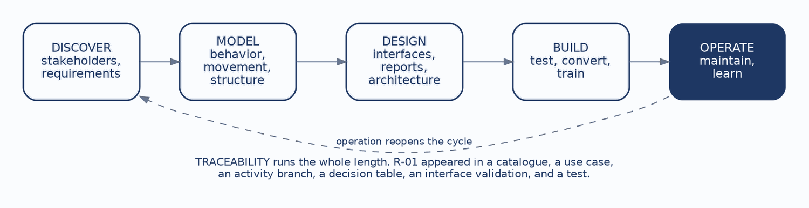
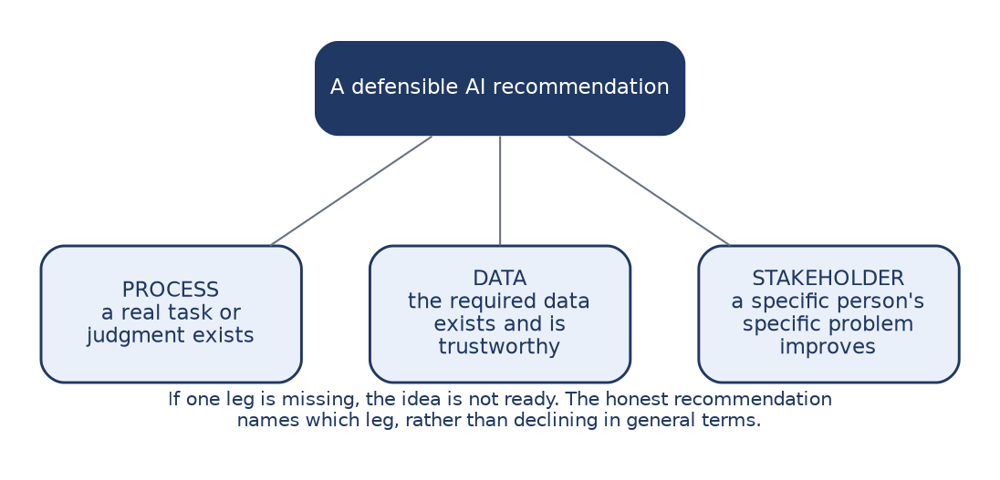
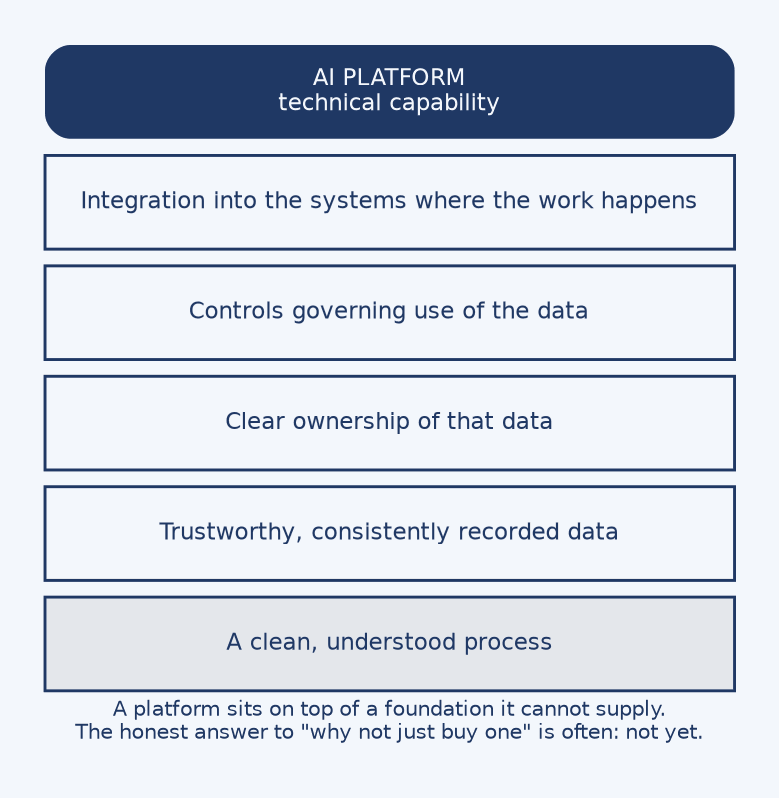

# CHAPTER 12: Where AI Fits

This chapter does something the preceding eleven deliberately avoided. It states a conclusion.

Every chapter until now taught a technique and left the judgment to you. That was a sequencing decision. A conclusion arrived at through your own investigation is held differently from one received as an assertion. You have now done the analysis: discovered requirements, modeled a system three ways, designed its interfaces, specified its architecture and its quality attributes, reviewed the artifacts, planned the verification, and followed it into operation. The conclusion this chapter states will land against that work rather than in place of it.

The question is where AI fits. It is worth asking now, and it is worth asking in a systems analysis course specifically, because the discipline of this course turns out to supply the answer. By the end of this chapter you should be able to:

* **See the whole arc:** Place any technique from the book on a single diagram, and explain what connects them.
* **Recognize the data-capture pattern:** Identify when a proposed capability is blocked by what was never recorded.
* **Apply a three-legged test:** Judge whether an AI recommendation is actually ready.
* **Answer the platform question:** Explain what a purchased capability can and cannot supply.
* **State what the analyst's role really is:** Describe it in terms of evidence, structure, decision, and judgment.

---

### 1. One Arc, Many Views

This is the spine of the book. Discovery identifies stakeholders and requirements. Modeling represents the same system three ways: behavior in use cases and activity diagrams, movement in data flow diagrams, structure in entity-relationship diagrams. Design produces interfaces, reports, and architecture. Build encompasses testing, conversion, and training. Operation maintains the system and learns from it, and that learning reopens the cycle.

Traceability runs the length of it, which is why one requirement was able to travel the whole distance. R-01, that a student cannot enroll without the prerequisite, appeared in the requirements catalog in Chapter 2, as a use case and an activity branch in Chapter 3, as a decision table rule in Chapter 4, as a validation attached to a form field in Chapter 6, and as a test case with an expected result in Chapter 10. It was never restated as a new idea. It was the same rule, seen from six positions.

A useful test of your own understanding is whether you can place any technique from the book on this diagram. The ones that resist placement are usually the ones learned as isolated notation rather than as part of the arc.

---

### 2. Most Problems Are Data-Capture Problems First

Here is a pattern consistent enough to be worth naming as a general finding.

Someone proposes a prediction or a recommendation that sounds genuinely useful. Predict which students are at risk of dropping. Recommend sections that fit a degree plan. Flag enrollment patterns that suggest a scheduling problem. The idea is attractive, and the underlying need is frequently real.

Then the analysis reveals that the foundation is missing. The events, dates, and outcomes required to support the prediction were never recorded. Or they were recorded inconsistently, because three offices used the same field for different purposes. Or the history exists but nobody can say which system holds the authoritative version.

The principle follows directly, and it is the most portable thing in this chapter: **you cannot predict what you do not record.**

The first move is therefore to fix the process and the data foundation. That is unglamorous work, and it is the work that makes everything after it possible. It is also, precisely, the work this book has been teaching. Modeling the process, normalizing the data, resolving what an entity actually is, deciding what gets audited and how long it is retained — that is what building a foundation consists of.

---

### 3. The Three-Legged Test

Three conditions must hold together, which is why the image is a stool rather than a checklist. A stool with two legs does not stand at all.

**Process** means a real task or judgment exists, that someone actually performs, and that could be improved. Not a general institutional aspiration to be more data-driven, but a specific thing a specific person does.

**Data** means the required information exists and is trustworthy. This is a stronger claim than the data merely existing. Data recorded inconsistently across three offices is not usable evidence, and neither is data whose meaning changed when a policy changed four years ago.

**Stakeholder** means a specific person's specific problem gets better. Not the institution generally, and not a hypothetical future user, but someone who could be named and asked.

If any one leg is missing, the idea is not ready, and the honest recommendation is to say so and name which leg. That specificity matters. "Not yet" on its own sounds like resistance; "not yet, because enrollment overrides are recorded as free text and cannot be analyzed" is a finding with a remedy attached.

Carry this test out of the course. It applies well beyond AI, to any technology proposal arriving with enthusiasm attached.

---

### 4. "Why Not Just Buy a Platform?"

This objection arrives in every organization, and it deserves a serious answer rather than a defensive one.

A platform supplies technical capability, and that capability is often genuinely impressive. What a platform cannot supply is a clean process, trustworthy data, clear ownership of that data, controls governing its use, or integration into the systems where the work actually happens. Those are the missing legs from the previous section, and they are organizational rather than technical. No vendor can sell them, because they are the accumulated result of decisions the institution has to make about itself.

So the honest answer to the platform question is frequently **not yet**. That is an uncomfortable thing to tell a sponsor who has already seen a demonstration and formed a picture of what the institution could do.

The constructive form of the answer names what has to exist first, proposes doing that work, and commits to re-evaluating when the foundation is there. That converts a refusal into a plan, which is a different conversation entirely.

This is also where Chapter 7 returns. Buying an AI capability is an acquisition decision, and it obeys the same logic: fit-gap against documented requirements, explicit criteria, and the recognition that acquisition and architecture constrain each other. Nothing about the technology being new suspends the analysis.

---

### 5. What the Analyst's Role Really Is

Chapter 1 opened with a definition of the analyst as a bridge between organizational problems and technical solutions. That definition can now be filled in with evidence, because you have done each part of it.

The analyst gathers **evidence**, by listening, observing, modeling, and cross-checking sources against one another. Chapter 2 established that the gap between what an interview describes and what observation shows is usually not a lie but the difference between the official process and the one that copes with reality.

The analyst imposes **structure**, turning messy organizational reality into explicit requirements and models that can be examined and argued with. A model's value is that it can be wrong in a way a conversation cannot.

The analyst makes decisions **buildable**, by surfacing trade-offs and forcing them to be decided by people with the standing to decide them. Chapter 9 put this most sharply: a trade-off decided silently has still been decided, just by whoever wrote the code.

And the analyst exercises **judgment**, separating a real opportunity from enthusiasm. This is the hardest of the four, the last to develop, and the one that distinguishes a professional from a note-taker.

Every artifact produced in this book was an instrument for one of those four activities. The use case diagram was structure. The decision table was structure that could be proven complete. The traceability check was evidence. The fit-gap analysis and the three-legged test were judgment.

---

### 6. Five Things to Carry

**Discover before you prescribe.** A solution chosen before the problem is understood is a guess wearing confidence, and it will be defended more fiercely than a guess admitted as one.

**Model the same system from multiple views.** Behavior, movement, and structure each reveal what the others hide. The unresolved many-to-many in Chapter 5 was invisible in the use case model and obvious in the data model.

**Trace requirements into design, tests, and operation.** A change to one thing can then be followed to everything it touches, which converts an anxious search of the whole system into a bounded list.

**Build foundations before intelligence.** This is the capstone conclusion, and it generalizes far past AI. Every capability an institution wants rests on a process it understands and data it can trust.

**Systems analysis is judgment, not tools.** The notations in this book can be learned in a few weeks. What takes longer, and what the profession actually pays for, is turning evidence into decisions that can be built, defended, tested, and changed.

That last sentence is the whole course compressed. Everything else was practice.

---

## Case Study: An AI Opportunity Assessment

**Case Focus:** *Campus Course Registration System — assessing a proposed AI capability against the three-legged test and recommending a course of action.*

**Pedagogical Target:** *Students receive a sponsor's proposal that the registration system should predict which students are at risk of dropping a course, so advisors can intervene early. They also receive the artifacts built across the book: the requirements catalog, the normalized data model, the audit and retention decisions, and notes from the implementation chapter recording that the legacy hold field carried two meanings. The proposal fails the data leg for a discoverable reason, since drop reasons were never captured and withdrawal dates are recorded inconsistently, and it passes the process and stakeholder legs cleanly, since advisors do perform this judgment and would benefit. Students must reach "not yet," name the specific missing leg, and produce a constructive plan for what would have to be recorded, for how long, under what retention and access rules, before the question could be revisited. Credit is given for the specificity of the diagnosis rather than for reaching the negative conclusion.*

---

## Review Questions & Exercises

1. Place the decision table, the swimlane activity diagram, and the role-access matrix on the arc in Figure 12.1. For each, state which stage it belongs to and what question it answers there.
2. R-01 appeared in six artifacts across this book without ever being restated as a new idea. Explain what this demonstrates about traceability that a definition of the term does not.
3. Explain the claim that you cannot predict what you do not record, using a registration example other than the one in this chapter.
4. Why is the three-legged test drawn as a stool rather than written as a checklist? What does the image assert that a list would not?
5. "The data exists" is described as a weaker claim than "the data is trustworthy." Give two distinct ways data can exist and still fail the data leg.
6. A sponsor asks why the institution cannot simply buy an AI platform. Draft an answer that is honest about the foundation and constructive about what happens next.
7. Chapter 9 argued that a trade-off decided silently has still been decided. Connect this to the analyst's role as described in section 5, and explain why surfacing a trade-off is a professional obligation rather than a courtesy.
8. Of the five things to carry, which do you expect to be hardest to apply in an organization that has already decided what it wants to build? Justify your answer.
