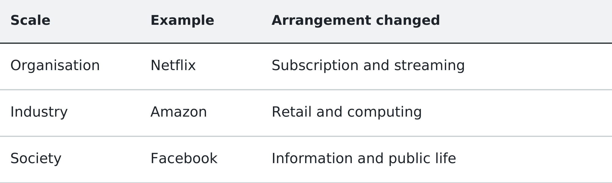
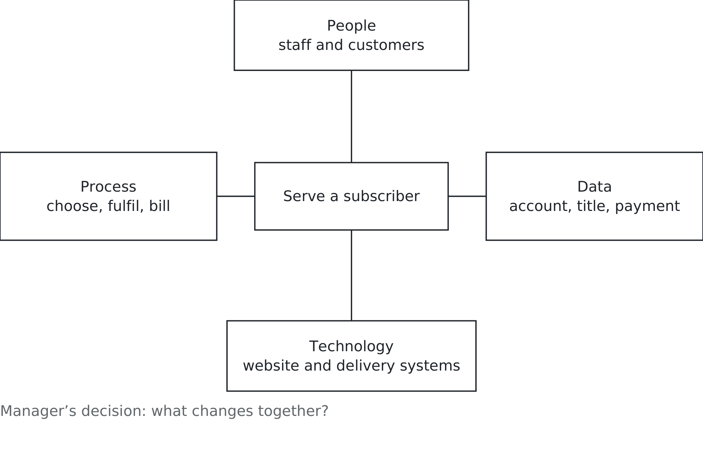

# Chapter 1. What does technology actually change?

## A question with a small answer and a large one

Ask a room of business students what management information systems is about
and you get a fairly consistent list. Hardware. Software. Networks. Databases.
Excel, usually, and someone will say cybersecurity. Nobody says anything wrong.
Every item on that list is genuinely part of the field.

It is also the smallest possible answer, in the way that saying medicine is
about scalpels and antibiotics is technically accurate and tells you nothing
about what a hospital is for. The interesting claim, and the one this book is
built on, is larger and harder to see: technology changes what organisations
are, what industries are, and eventually what societies are. The equipment is
the least durable part of that. The arrangements are the subject.

This chapter makes that claim three times, at three different scales, using
three companies you already know. Then it names what you watched. The order
matters — you will meet the ideas as things that happened to real people with
real money before you meet them as terms.

## One company, twice

Start small. Not an industry, not a society: a single firm reorganising itself
around something it could suddenly do.

For many customers in the early 2000s, watching a film at home on a Friday night
began with a trip to Blockbuster. Choose a film, take it home, bring it back by
the deadline. Other choices existed, but the store was a familiar arrangement.

The business model had a peculiar feature. Customers paid to rent a film, and
then paid again if they brought it back late. Blockbuster reported that these
extended viewing fees accounted for approximately 14 percent of its movie
rental revenue in 2004. A substantial part of the money came from something
customers resented. [Blockbuster’s 2005 annual report](https://www.sec.gov/Archives/edgar/data/1085734/000119312506055023/d10k.htm).

Read that again, because the relationship matters more than the percentage.
Making the experience better threatened an existing source of revenue. A
manager could understand the customer’s complaint perfectly and still have
strong reasons to preserve the arrangement causing it.

Reed Hastings has told the story that he started Netflix after being charged a
$40 late fee for *Apollo 13*. His co-founder Marc Randolph has suggested that
the story is tidier than the history. Treat it as a founding myth, not an
established account of how the company began. The customer’s frustration is a
useful starting point without making the anecdote carry the explanation.
[Randolph’s account of the founding story](https://marcrandolph.com/the-book/).

What Netflix’s DVD subscription did was not build a better late-fee experience.
It removed the due date. Pay a flat monthly subscription and keep a disc until
you were ready to return it. The work attached to charging for overdue days
stopped having a reason to exist. The business still needed to know which
customer had which disc, receive returns and send the next selection. Removing
one rule changed the work; it did not remove the need to organise it.
[Netflix’s 2002 prospectus](https://www.sec.gov/Archives/edgar/data/1065280/000101287002002403/ds1a.htm).

Watch what happened next, because it is the part people skip. Blockbuster
introduced subscriptions and online rental too. In 2005 it launched its
no-late-fees programme at participating stores, although conditions still
applied to unreturned rentals. It was attempting a transition, not simply
ignoring the internet. Its own report describes both the lost fee revenue and
the growth of replacement services. [Blockbuster’s account](https://www.sec.gov/Archives/edgar/data/1085734/000119312506055023/d10k.htm).

That makes the managerial problem harder and more useful. Recognising the
problem is one achievement. Building a replacement that customers want, staff
can operate and the business can afford is another. The late fee helps explain
the tension. It does not, by itself, explain Blockbuster’s eventual bankruptcy in 2010.
[SEC notice confirming the filing](https://www.sec.gov/news/press/2011/secinfo-bbliquidation.htm).

Meanwhile Netflix changed its delivery model. It began streaming in 2007,
allowing a film to reach a customer without a disc travelling through the post.
The postal operation did not disappear overnight: Netflix shipped its final
DVDs in September 2023. For years the company had to support both arrangements.
[Netflix’s timeline](https://www.netflix.com/tudum/articles/netflix-trivia-25th-anniversary)
and [final DVD shipment](https://about.netflix.com/en/news/thanks-for-watching).

There are two changes here worth separating: organising rental around a
subscription, then organising delivery around streaming. The second required
new capabilities while the older service still had customers to serve. A
manager had to decide what to build, what to maintain and when to let something
go. Buying the technology could not answer those questions.

That is the first scale. One organisation, reshaped around a capability.

## One industry, then another

Now go up a level. Amazon opened as an online bookseller in 1995, and for
several years the interesting question about it was whether bookselling could
work online. That question got answered, and then it stopped being the question
at all. [Amazon’s account of its beginnings](https://www.aboutamazon.com/news/workplace/first-amazon-office-jeff-bezos-garage).

What is worth noticing is not that Amazon got large. It is that the capability
it was building could be useful beyond books: connecting a catalogue, customer
orders, payments and delivery. Knowing about books mattered, but so did knowing
how to coordinate those things. Other product categories became possible,
although each brought its own suppliers, economics and practical difficulties.

Then the strangest turn. In 2006 Amazon launched computing and storage services
through Amazon Web Services. Experience running its own business helped it see
a need other organisations shared. It built services through which customers
could obtain computing resources over a network. This was a new business, not
merely a way to rent out spare machines behind the shop. [AWS’s account of its origins](https://aws.amazon.com/about-aws/our-origins/).

A bookshop became the landlord of the internet. The phrase exaggerates the
territory, but it catches the change in relationship. A firm could now be an
Amazon customer because it needed computing, without buying anything from the
retail store. Managers considering their own computer facilities had a different
choice to evaluate: which work should they perform themselves, and which should
they depend on a supplier to perform?

An honest footnote, because inevitability is a bad lesson. In 2018 Amazon,
Berkshire Hathaway and JPMorgan Chase formed the healthcare venture Haven. It
closed in 2021. [Reuters’s report of the closure](https://www.reuters.com/business/retail-consumer/amazon-berkshire-jpmorgan-healthcare-joint-venture-shut-business-next-month-2021-01-04/).
Being the company that rearranged retail and computing does not mean the next
industry falls over when you push it. Keep that in mind for the next three
chapters.

That is the second scale. Not just a company changing, but an industry finding
out that its boundaries were less solid than the firms inside it believed.

## One society

The third scale is the one that gets least attention in a business course and
may reach furthest beyond the business itself.

Facebook started in 2004 as a way for Harvard students to connect. [Contemporary campus reporting](https://www.thecrimson.com/article/2004/2/9/hundreds-register-for-new-facebook-website/)

In 2011,
Egyptian activist Wael Ghonim described how a Facebook page had helped people
organise during the uprising. That is an account of people using a tool, not
proof that a platform caused a revolution. [Ghonim’s firsthand account](https://www.ted.com/talks/wael_ghonim_inside_the_egyptian_revolution).

Seven years later, in April 2018, Mark Zuckerberg appeared before United States
senators to answer questions about privacy and the use and abuse of Facebook
users’ data. A service for connecting people had become an institution whose
decisions concerned people far beyond its own customers and shareholders.
[Senate hearing and testimony](https://www.judiciary.senate.gov/committee-activity/hearings/facebook-social-media-privacy-and-the-use-and-abuse-of-data).

Not every consequence was intended or anticipated. That does not mean nobody
made choices. What a platform collects, what it shows people and what it allows
others to do with information are decisions. So are the rules for challenging
those decisions. Users, advertisers, employees and governments act within and
against those arrangements.

The question at this scale cannot be settled by asking whether the company
became successful. A service may help people find one another while also making
it easier to expose or manipulate them. Who benefits? Who bears a cost? Who
gets a say when the two are different people?

That is the third scale, and it is why a business degree should include this
course rather than treating technology only as a technical elective.

*Figure 1.1 — Three scales of change. The question changes with the scale: how a firm works, where an industry ends, and what a society takes for granted.*

## What you just watched

Three stories, three scales. A firm remaking itself. An industry reconsidering
its boundaries. A society living with consequences that reach beyond the
organisation that supplies a product.

The scales overlap. Netflix also affected an industry; Facebook also had to
organise its own work. The point is to choose a useful scale for the question
you are asking. A firm’s revenue cannot tell you everything about its effect
on society. A large social effect cannot tell you whether the firm will survive.

Now look inside one of the arrangements. To serve a DVD subscriber, Netflix
needed people to choose films, handle discs and resolve problems. It needed a
process: the connected steps through which a request became a delivered film
and a returned disc. It needed data about accounts, selections, payments and
returns. Its technology stored and moved that data so the work could happen.

Those parts together form an **information system**: people, processes, data
and technology working together to support activities and decisions.
**Information technology**, or IT, is the equipment and software within that
system. Management information systems, or MIS, is concerned with how such
systems are organised and used to achieve purposes that matter to an
organisation. The distinction is practical. Installing software changes one
part; making a service work requires the parts to fit.

Suppose a returned disc is recorded against the wrong account. The equipment
might be functioning perfectly, yet one customer is waiting for a film that
will not be sent. Someone needs access to the record, a way to establish what
happened and authority to correct it. A manager must decide who that person is
and how unresolved cases reach them. This is a simplified illustration of the
system, not a description of Netflix’s internal procedures.

*Figure 1.2 — The whole system. A new capability works through people, processes and data as well as technology.*

The hardware-and-software answer is not wrong. It is a description of the
materials. But knowing the materials does not tell you who is responsible when
a customer pays and receives nothing. Keep asking where information comes
from, what work it changes and who can act on it. That is how the subject
becomes visible inside an ordinary business.

## Improvement is not the same as advantage

The stories invite an easy conclusion: change your arrangements and you win.
That would be a comforting lesson, and an unreliable one.

Start with **value creation**. A change creates value when it produces benefits
worth more than the resources it consumes. Saving a customer an unnecessary
trip can be valuable. So can preventing a wrong charge. Neither requires a
spectacular new invention.

**Value capture** asks who keeps the benefit. A customer might save time while
a business earns a subscription payment. Employees might spend less time on
arguments. A supplier might charge enough for the new service to absorb most
of the business’s savings. More useful service and more profit are different
claims; one does not establish the other.

**Competitive advantage** means a firm can create and capture value in a way
that gives it an edge over rivals, through lower costs, an offering customers
prefer, or both. An advantage is **sustainable** when rivals cannot readily
copy or overcome it. The time it lasts matters. A useful change may improve a
business without giving it any lasting edge at all.

Imagine two rental companies offering equally convenient subscriptions. Each
may serve its customers better than before. If both can reproduce the service
at similar cost, the improvement alone does not explain why one should outperform
the other. You would need to examine such things as their delivery performance,
customer relationships and costs. The website is only one part of that account.

First-mover advantage is the idea that arriving early can confer benefits.
Sometimes it does. Often those benefits are overcome, and you will meet
companies that were early, correct, celebrated, and gone. Treat it as a claim
to be tested rather than a law.

None of this makes ordinary improvement unimportant. A business may need a
reliable payment system simply to operate acceptably. A manager should be able
to say, “This will prevent errors,” without pretending it will defeat every
competitor. The decision still needs evidence that the improvement is worth
its cost.

## Try the question on a smaller business

Consider a hypothetical campus café. Students queue to order and pay, then
wait again while staff prepare drinks. The owner proposes an ordering app.
“It will make service faster” sounds plausible. It is not yet an explanation.

The app could remove time spent taking orders at the counter. It cannot make
one person prepare unlimited drinks. If preparation is already the slowest
step, admitting more orders may lengthen the wait. The queue has moved onto
a screen, where the customer can no longer see it.

A stronger proposal changes the arrangement. The café offers collection slots
that staff can actually meet. Customers choose from the available slots;
accepted orders reach the preparation queue; staff mark them ready. Someone
has authority to pause new orders when the café falls behind. The app needs
accurate availability data, and staff need a workable way to update it.

Suppose a promised order is late. Who tells the customer, and who may offer a
refund? If the owner keeps that authority but is unavailable during the lunch
rush, the app has exposed an organisational problem it cannot solve. Agreeing
on responsibility is part of introducing the service, not an administrative
detail to settle afterwards.

Here is a provisional managerial answer: test limited advance ordering during
one busy period, compare actual waiting times and incorrect orders with similar
periods, and include the app’s charges and staff time in the cost. Keep a way
for walk-in customers to order. Expand only if the evidence supports the claim.

That answer identifies people, process, data, technology and a decision. It also
leaves room to be wrong. If service improves, the café has created value. Whether
it captures enough to cover the cost, or gains an advantage another café cannot
quickly copy, requires separate evidence.

## Your turn

Choose an organisation you know: somewhere you work, a campus service or a
business you regularly use. Identify one repeated task, fee or rule that costs
customers time, money or irritation. Explain what purpose it serves for the
organisation. If you do not know, label your explanation as an assumption.

Propose one change. In a short paragraph, identify the people whose work would
change, the process they would follow, the data they would need and the
technology involved. Name the manager’s decision and one result you would check
before declaring the change successful. Include someone who might be worse off.
Do not assume that removing an irritating rule also removes its purpose.

Then answer the question this whole book is really asking. What is the next
technology changing business today? Not the one with the most headlines. The
one making something possible that was difficult before, and that some
organisation somewhere might reorganise itself around. Name the capability,
the arrangement it could change and one reason your prediction might fail.

Keep the answer so you can look at it again at the end of the course. In the
next chapter we go looking for where that kind of change is actually found
inside a company — and it turns out to be somewhere much less glamorous than
you would expect.

## Sources and example notes

Company histories are condensed to examine business changes, rather than establish a single cause of success or failure. The Netflix founding story remains explicitly disputed; no unconfirmed memoir quotation or page number is used. Facebook’s Harvard beginnings are supported by contemporary campus reporting. The café example is fictional; conclusions about advantage are managerial interpretations.

