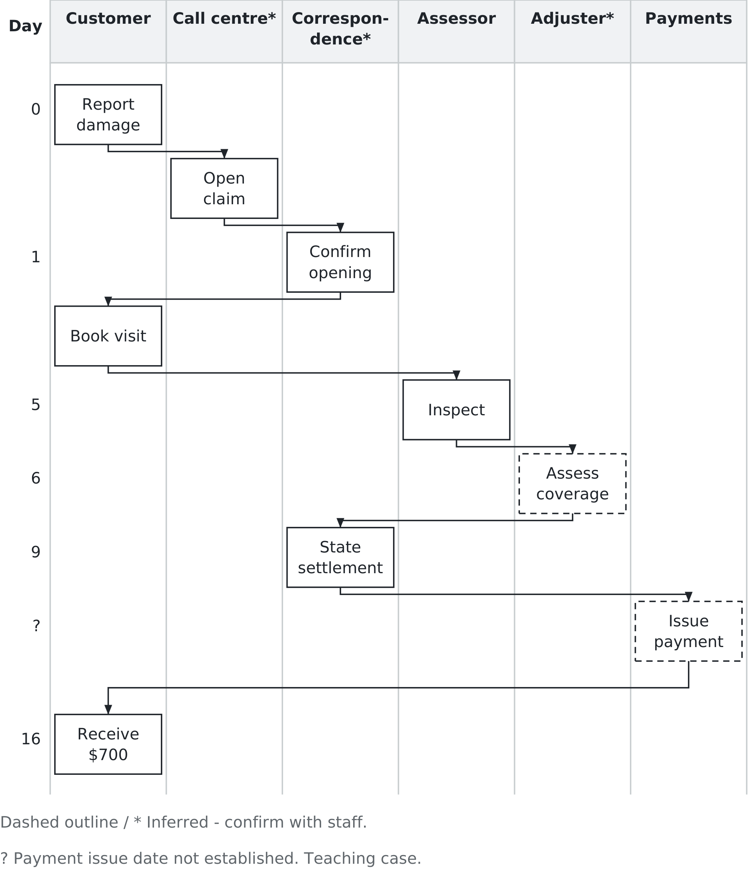
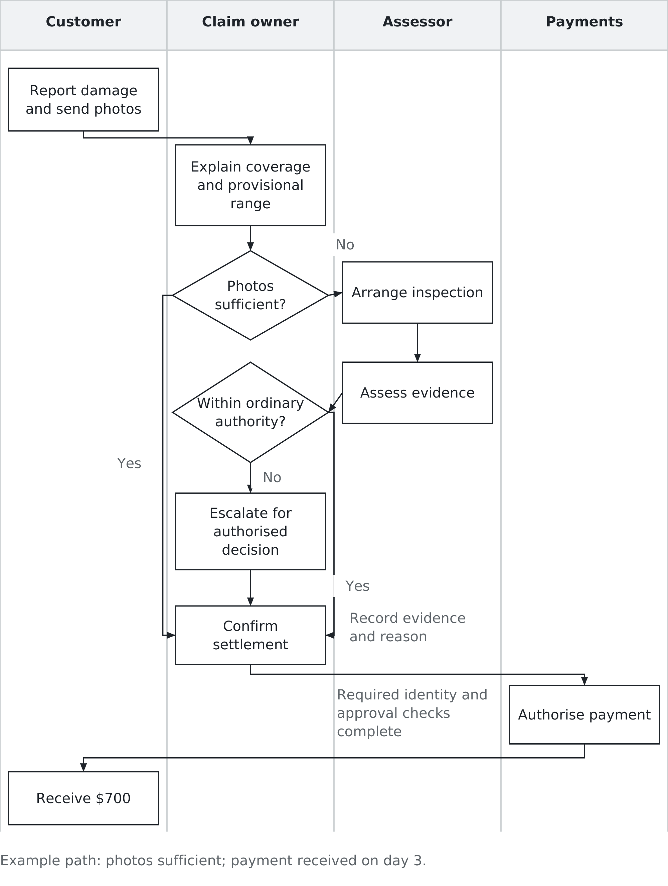

# Chapter 2. Where advantage lives, and how you find it

## A fence falls down

In this teaching case, a storm comes through on a Tuesday night and a family wakes up to find their
back fence lying in the yard. The house is barely a year old. They have
insurance, they know their deductible is $1,400, and by any reasonable reading
of the situation this is exactly the kind of ordinary trouble that insurance
exists to absorb. They call the company the next morning and a claim is opened.

Sixteen days after reporting the damage they have a cheque for $700 and they are asking their
neighbour whether he can recommend a real insurance company. Nobody at the
insurer broke a rule. The policy was applied correctly, the claim was
investigated, the payment was calculated properly and issued inside three
weeks. Every internal measure of that claim could show green.

That gap — a process that did nothing obviously wrong and produced a customer
who wants to leave — is what this chapter is about. You will meet a lot of
technology in this course. Almost none of it will matter unless you can see
what it sits on top of, and what it sits on top of is process: the sequence of
work, decisions and handoffs that turns a phone call into a payment. Learning
to see that sequence, and to ask which parts should exist at all, is the most
portable skill in this book.

## The question underneath the technology

Chapter 1 showed Netflix removing the due date rather than improving the late
fee. The point belongs here too, but the story does not need telling twice:
changing the rule changed the work attached to it.

Ford found the same shape of answer in accounts payable. Its North American
operation employed more than 500 people in work centred on matching a purchase
order, a receiving record and a supplier invoice. Ford first expected to
improve that process. It then asked why the invoice was needed. If an authorised
purchase order said what was ordered and the receiving record said what
arrived, the company already had the information needed to approve payment.
The redesigned process used those records instead of waiting for an invoice.

Michael Hammer described the Ford case in his 1990 *Harvard Business Review*
article, “Reengineering Work: Don't Automate, Obliterate.” He reported a 75
percent reduction in head count where the redesign had been implemented. The case is often
retold as if Ford simply deleted a document. It did more than that. It changed
when information was recorded, which record authorised payment and who was
responsible for accurate receipt data. The invoice disappeared because the
rest of the system changed with it. [Hammer’s article](https://folk.idi.ntnu.no/thomasos/paper/hammer_reengineering.pdf).

This gives us a useful test. When somebody proposes a technology fix, ask:

> Does it make an existing step faster, or remove the reason that step exists?

Call it the Hammer test. A proposal does not fail merely because it improves a
necessary step. Accurate controls and faster service can be valuable. The test
stops us from assuming that automating every box is the same as redesigning the
process.

## Start with what the customer experienced

You almost never receive a trustworthy diagram of how a company works. You get
a complaint, a policy manual, a system screen and several people describing
their part. The analyst's first job is to keep three things separate:

- An **observation** is something the customer or analyst directly saw, heard
  or recorded.
- An **inference** is a reasonable explanation of what must or may have happened
  behind the observation.
- A **question to verify** identifies the person, record or rule that could
  confirm or overturn the inference.

Here is the fence claim as the customer experienced it. Day 0 is the day the
customer reports the damage in both versions of the teaching case. The dates
do not describe an insurer's standard practice.

- **The previous night:** The storm damages the fence.
- **Day 0:** The customer reports the damage. A representative opens the claim,
  confirms the $1,400 deductible and says an assessor will need to visit.
- **Day 1:** A letter confirms that the claim has been opened. The customer is
  told to contact the assessor and books an appointment.
- **Day 5:** The customer takes the afternoon off. The assessor inspects the
  fence but does not state what will be covered or what the claim is worth.
- **Day 6:** The customer learns that coverage is limited to damaged sections,
  replaced like for like.
- **Day 9:** A second letter states a value of $2,100. After the deductible,
  the expected payment is $700.
- **Day 16:** The cheque arrives.

Now reason backwards carefully. “A letter arrived on day 1” is an observation.
“A separate correspondence department generated it” is an inference. A system
might have generated it automatically, or the claim handler might have queued
it. The question is: **Which role or system created this letter, and what event
triggered it?** A workflow log and the person who owns correspondence could
answer that.

“The customer had to call the assessor” is another observation. “The insurer
has no central scheduling capability” is too strong. The company may have that
capability but assign scheduling to customers for this type of claim. Ask:
**Who owns appointment scheduling, and under what rule is it passed to the
customer?**

That discipline matters. If you redesign an inference as though it were a
fact, you may solve a process the company does not actually have.

Figure 2.1 maps a plausible process behind the account. Its lanes are vertical,
and each lane represents a role or department. Every time an arrow crosses a
lane boundary, work or information has been handed to somebody else. The
dashed steps are hypotheses to check with staff.

*Figure 2.1 — The claim as experienced. Lane crossings expose handoffs; dashed steps are hypotheses to check, not established internal facts.*

Handoffs are worth inspecting because work may wait, information may lose
context and responsibility may become unclear. They are not automatically bad.
A specialist review can protect the customer and the insurer. The question is
what each handoff contributes, what information travels with it and who remains
responsible for the customer's result.

## Build a map that can be challenged

A process map is not an illustration made after the analysis. Making the map is
part of the analysis, because gaps and disagreements become visible on the
page. Use five passes.

**First, choose the result and boundaries.** For this exercise, the process
begins when the customer reports the damage and ends when the customer receives
the payment and explanation. A different question might begin with the storm or
end after a repair. State the boundaries so readers know what the map leaves
out.

**Second, put the customer's chronology in order.** Begin with what happened,
not with department names. Use verbs that describe work: report damage, open
claim, inspect fence, decide coverage, calculate payment. “Claims system” is a
thing, not a step. “Record the claim” is a step that can be examined.

**Third, add the responsible role.** A swimlane says who performs the work or
makes the decision. If nobody can name an owner, mark the uncertainty rather
than inventing one. If three people all claim ownership, that is useful evidence
too. The map has exposed a responsibility problem.

**Fourth, mark decisions, waiting and rework.** A box such as “review claim” may
hide several outcomes. What happens when the photographs are clear? What happens
when they conflict with the customer's account? Where does the work wait, and
where can it return to an earlier step? Draw those branches only when evidence
supports them. A map that shows no exceptions is usually a map of the easiest
case, not the whole process.

**Fifth, walk the map with the people who do the work.** Ask each person what
arrives, what they need, what they produce and where it goes next. Then compare
their answers with system timestamps, forms or a small sample of cases. Staff
accounts explain why work happens; records help establish when and how often.
Neither source is sufficient on its own.

Suppose the system log shows that a claim waited four days between inspection
and coverage review. That is an observation about the record. “The adjuster was
overloaded” is one possible inference. The file may instead have lacked a
photograph, entered the wrong queue or waited for information from the customer.
Before proposing more adjusters, find out which explanation fits.

Do not pursue perfect detail. A map of every click and field can hide the
decision you need to make. Start at the level of work a customer or manager
would recognise. Expand one step only when its internal detail changes the
diagnosis, the control or the proposed design.

## Diagnose the failure before changing the process

The obvious diagnosis is that the claim was slow. Sixteen days may be longer
than the customer wanted, but speed is not the whole failure. If the same news
arrived in twelve days, the customer could still feel misled.

On day 0, the customer may have left the call with a belief: insurance will
replace the fence, minus $1,400. The process did not correct that belief until
day 6. The confirmation letter and inspection could even reinforce the belief
that a larger payment was coming. By the time somebody said “damaged sections,
like for like,” the $2,100 valuation felt like a reversal.

That explanation is an inference too. Before redesigning the process, an
analyst would check call recordings or notes, the letter, the policy language
and the customer's own account. Did the representative explain the coverage
limit? Was the rule available at first contact? Could it be applied before
inspection, or did facts on site determine it? The answers decide whether the
problem is missing information, an unclear explanation, a late decision or a
customer misunderstanding.

Next, ask what each step contributes.

- The day-1 letter may satisfy a legal, regulatory or evidentiary requirement.
  If it only repeats information already provided and no rule requires it, it
  may be removed or replaced with a useful status message.
- An inspection may be unnecessary for a simple, well-photographed fence claim.
  It may be essential when photographs are unclear, damage is extensive, fraud
  indicators appear or safe access is uncertain.
- Customer scheduling may reduce administrative work, but it transfers effort
  to the person waiting for a decision. That trade should be deliberate.

The Hammer test is not “delete as many boxes as possible.” It is “state why the
box exists.” A control remains when it manages a material risk more reliably
than a less burdensome alternative.

## Draw a should-be process

Figure 2.2 shows one reasonable redesign. It is not the answer; it is a proposal
that makes its assumptions visible.

*Figure 2.2 — The claim with an owner. Earlier explanation changes the experience; inspections remain available when evidence is insufficient.*

The customer sends photographs when reporting the damage. A claim owner
explains the deductible and the likely basis of settlement on the first call.
That person remains the point of contact even if a specialist becomes involved.
If the photographs are sufficient, the claim can move to valuation. If they are
not, the company arranges an inspection. Unusual or disputed claims escalate to
someone with authority to interpret the policy; the process does not force a
front-line employee to guess.

One control must survive the redesign: the company needs evidence that the loss
occurred and that the payment matches the policy. Photographs may supply that
evidence in a simple case. They do not prove that photographs will be adequate
for every case. The company should define when inspection is required, record
why the chosen path was used and review exceptions for mistakes.

Another control belongs near payment. The claim owner may calculate and explain
the amount, but payment should be released only after required coverage,
identity and approval checks are complete. Whether one person may both set and
authorise a payment depends on the amount and the insurer's control rules. The
diagram should show that unresolved design choice rather than quietly assuming
it away.

The most important change may still be the one that costs least: explain the
coverage basis early. That is existing information moved to the point where it
can shape the customer's expectation. Technology could help by displaying the
relevant rule, collecting photographs, recording the decision and sending a
clear status update. The process determines what the technology must support.

## Test the proposed experience

Rewrite the customer's account under the should-be process. This exposes what
the new diagram means to someone outside the organisation.

> **Day 0.** Our fence is down. We reported it and sent photographs. The claim
> owner explained that the policy covers damaged sections on a like-for-like
> basis and that our $1,400 deductible applies. She gave us a provisional range
> and said it could change if the photographs showed something unexpected.
>
> **Day 2.** She called back. The photographs were sufficient, so no visit was
> needed. The fence was valued at $2,100 and the payment would be $700. She
> explained the calculation and how to question it.
>
> **Day 3.** The payment arrived. We can repair the damaged sections or add our
> own money and replace more of the fence.

The settlement is still $700. The customer did not have to take an afternoon
off, learned the likely limitation earlier and received the money sooner. For
this straightforward case, the insurer may also avoid the cost of a visit.

But the comparison is incomplete until we name what might worsen. Photograph
review and explanation take staff time. A poor decision rule could miss damage
or treat customers inconsistently. Fraud loss could rise. A fast electronic
payment could make an error harder to recover. The redesigned process therefore
needs measures for customer understanding, decision accuracy, exceptions,
cost and time — not cycle time alone.

The outcome can be better even when the diagram has the same number of boxes.
A necessary coverage review performed with better information is still a real
improvement. Box count and handoff count are clues, not scores.

## Decide whether the redesign deserves to survive

A should-be map is a hypothesis. Test it before turning it into a company-wide
rule. The insurer could begin with a narrow class of low-value fence claims for
which customers can safely submit photographs. It would need a comparison: a
similar set of claims following the current process, during a period when storm
volume and staffing are reasonably comparable.

Measure the result from more than one position. For customers: did they
understand the likely settlement, how much effort did the claim require and did
they need to contact the insurer again? For the insurer: what did each correctly
settled claim cost, how long did it take and how often did it require inspection
or escalation? For control: did later review find unsupported, inconsistent or
incorrect payments?

Definitions matter. “Settled in four days” could mean that the company approved
the claim in four days even though the customer did not receive the money until
day 8. “No complaint” could mean the customer was satisfied, or merely that the
customer gave up. Decide what each measure means before the pilot begins.

The manager then has a real choice. Expand the redesign if customer effort and
total cost fall without unacceptable errors or losses. Revise it if early
explanation works but photograph review does not. Stop it if the control risk
outweighs the benefit. A pilot is not a ceremony used to justify a preferred
answer. It is a relatively safe way to discover that the answer is wrong.

## Naming what you just did

Figure 2.1 is an **as-is map**: the best current account of how the process
runs. It should be drawn from observations and checked with the people and
records involved, not copied uncritically from the policy manual. Figure 2.2 is
a **should-be map**: a proposed way for the process to run.

The lanes are **swimlanes**. They make responsibility visible. The arrows
crossing them are **handoffs**. A decision point shows that the process can
follow different paths. An **exception** is a case that cannot safely follow
the ordinary path and needs different evidence or authority.

Process improvement makes useful existing work more reliable, accurate or
timely. Process reengineering changes the design more fundamentally, sometimes
removing work whose original reason has disappeared. Both can create value.
The managerial task is to choose according to the problem, not to prefer the
more dramatic word.

Processes accumulate. A letter may have been added after a complaint. A handoff
may reflect a team that no longer exists. A duplicate entry may once have
connected systems that now share data. Each may have been a sensible local
decision. The whole path can still become unreasonable.

This is one place advantage may live: not inside the software itself, but in
seeing and changing a combination of work, information, responsibility and
control that competitors have left unexamined. The advantage is not guaranteed.
Chapter 1's test still applies: if rivals can readily copy the arrangement, the
change may be valuable without being durable.

## Your turn

Map a small employee-paid expense reimbursement process. Keep the payment route
consistent: the employee pays with personal funds, submits the expense and is
reimbursed by the company. Do not introduce a corporate-card statement.

Use three lanes: employee, manager and finance. Begin with this account:

> I paid $18 to park while visiting a client. That evening I entered the date,
> business purpose and amount, attached the receipt and submitted the report.
> My manager approved it two days later. Finance checked the receipt and policy,
> then included $18 in the next reimbursement payment.

First draw the as-is process. Beside each box, mark **O** for an observation
stated in the account or **I** for an inference you added. For every inference,
write one question and name the person or record that could answer it.

Then draw a should-be process. Apply the Hammer test, but preserve at least one
control that prevents an improper or duplicate payment. State the risk it
addresses. Include an exception path for an expense that lacks a receipt or
falls outside policy. Someone on that path must have authority to decide.

Finally, compare the designs in five sentences:

1. What becomes better for the employee?
2. What work or cost becomes lower for the company?
3. Which control remains, and why?
4. What could become worse?
5. What evidence would persuade you to adopt the redesign?

If your should-be map has the same number of boxes, that is not a failure. The
question is whether every step has a purpose, the information reaches the right
person and somebody owns the result.

In the next chapter, we move from a process that already exists to a forecast
about a new market. The discipline remains the same: separate what you observed
from what you inferred, and ask what would prove you wrong.

## Sources and example notes

The fence claim and reimbursement exercise are teaching cases. Both timelines begin at report Day 0: payment arrives after 16 elapsed days in the current process and three in the proposed process. [Hammer’s 1990 article](https://folk.idi.ntnu.no/thomasos/paper/hammer_reengineering.pdf) reports more than 500 North American accounts-payable staff and a 75% reduction where the redesign was implemented; it does not establish an exact company-wide final staffing total.

