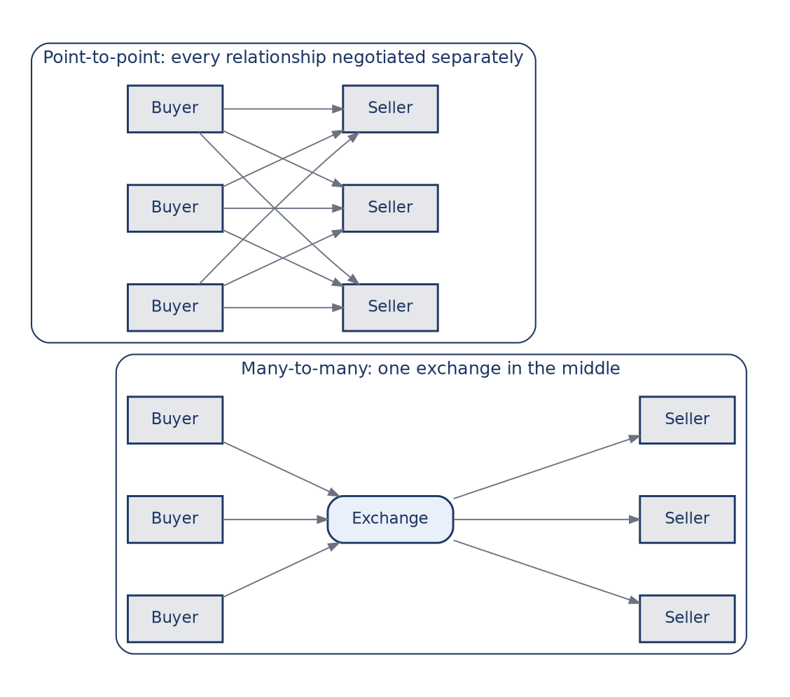
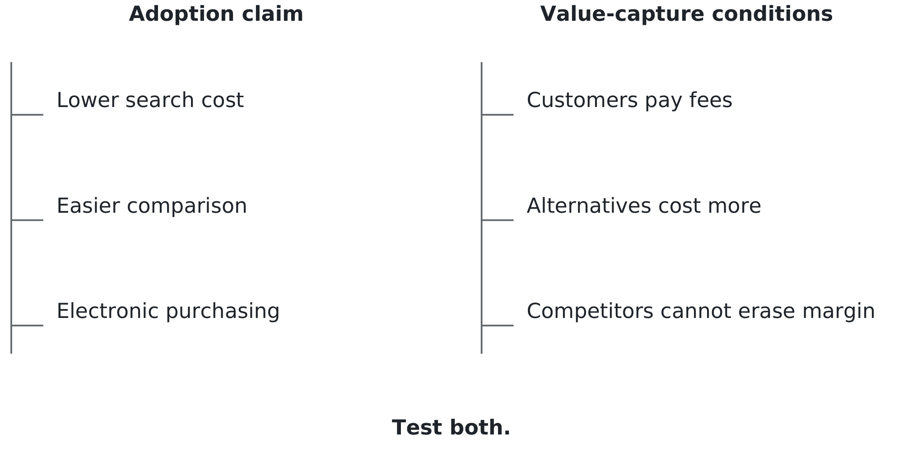

# Chapter 3. When the change isn't yours to schedule

## A question from a three-year-old

In 1943, on holiday in Santa Fe, Edwin Land took a photograph of his daughter
Jennifer, who was three. She asked why she couldn't see the picture straight
away. In Land's account, a walk to think about the question helped him imagine
an answer. Turning the idea into a product took years of work. Polaroid's first
instant camera went on sale in 1948. [American Chemical Society history](https://www.acs.org/education/whatischemistry/landmarks/land-instant-photography.html).

For decades Polaroid sold the elimination of waiting. Then digital photography
offered another way to see a picture immediately, without developing a piece of
film. The customer could want the same benefit while needing a different
product to obtain it.

The original Polaroid Corporation filed for bankruptcy in October 2001.
[Contemporary report](https://www.cbsnews.com/news/polaroid-files-for-chapter-11/).
It would be too tidy to say the company simply failed to notice digital
photography. Contemporary reporting describes its work on digital and hybrid
products. Seeing a technology and building a viable business around it are not
the same achievement. [Reporting on Polaroid's product development](https://www.wired.com/2001/01/polaroid/).

Hold that next to the last chapter for a moment. Ford went looking for a
different arrangement inside its business. Polaroid also had choices to make,
but it could not choose when competing ways of taking and viewing photographs
became attractive to customers. Its internal timetable was not the market's
timetable.

Both kinds of change are real and you will meet both. This chapter is about
the second one: how to assess a change coming from outside your organisation,
when neither waiting nor moving early guarantees safety.

## The mechanism, and where you have seen it before

Here is the connection to the last chapter. When information becomes easier to
obtain and use, some work loses its purpose. Ford's case concerned a document
inside a company. Across companies, the question becomes whether a buyer and
seller still need the organisation standing between them.

Consider booking a straightforward flight. If you can see schedules, compare
fares and make a reservation yourself, you may not need someone to perform
those steps for you. That does not make every travel service redundant. A
complicated itinerary, an unfamiliar destination or a cancelled connection may
still make informed assistance worth paying for. The work that matters has
changed; it has not necessarily disappeared.

An **intermediary** is an organisation that helps other parties transact. It
may find buyers, screen suppliers, arrange payment or help resolve a dispute.
Before predicting its disappearance, identify which of those jobs it performs.
Cheaper search does not automatically make every other job cheaper too.

Now imagine making the search easier on a much larger scale: companies buying
materials, components and services from other companies. That is
business-to-business commerce, usually shortened to B2B. The attraction of
moving it online is easy to see. The question is who gets paid for making it
happen.

## A company built around the opportunity

FreeMarkets, founded in 1995, made online sourcing part of its business.
Sourcing means finding and selecting suppliers. One instrument was the reverse
auction: suppliers compete for a buyer's order, potentially bidding the price
down rather than buyers bidding it up.

Its 2003 annual report describes a service that helped customers screen
suppliers and prepare clear requests for quotations. It also describes software
through which customers could run sourcing projects themselves. The offering
included people and purchasing knowledge as well as a place to submit bids.
FreeMarkets had gone public in December 1999. [FreeMarkets' annual report](https://www.sec.gov/Archives/edgar/data/949968/000095015204001520/j0499401e10vk.htm).

The appeal of an exchange is Figure 3.1. If every buyer must connect separately
with every seller, three buyers and three sellers require nine direct links.
Put one exchange in the middle and each participant needs one connection to
it: six links altogether. With more participants, the difference grows.

*Figure 3.1 — Fewer connections. Three buyers and three sellers can connect through nine direct relationships or six exchange links. Connection counts alone do not establish profit.*

The arithmetic is sound. The drawing is also deliberately incomplete. It
assumes everyone needs to reach everyone else and treats each connection as
equally demanding. It does not tell you whether the suppliers are qualified,
whether their quotations describe the same thing or who pays when an order
goes wrong. Even through an exchange, a buyer may still need to negotiate
separately with a seller. Fewer links are a possible source of efficiency, not
a completed business model.

In January 2004, Ariba announced a deal to acquire FreeMarkets valued at about
$493 million in cash and shares. Completion was announced on July 1, 2004.
[Announcement reporting](https://www.marketwatch.com/story/ariba-to-buy-freemarkets-for-493-million)
and [Ariba's completion announcement](https://www.sec.gov/Archives/edgar/data/1084755/000119312504118896/dex991.htm).

That is an outcome, but not yet a verdict. A sale does not tell us that the
capability failed, that every investor did well or that an industry forecast
was wrong. To assess a prediction, we first need to know exactly what it
predicted.

## A forecast is several claims joined together

Imagine a presentation proposing an independent marketplace for business
purchasing. The following numbers are hypothetical, not a recovered forecast
from the internet boom.

Suppose the relevant companies buy $1 billion of goods each year. The presenter
expects half of that purchasing to move online, one-fifth of the online volume
to pass through the proposed marketplace, and the marketplace to collect a
2 percent fee on every transaction. All of this is supposed to happen within
three years.

The arithmetic gives $500 million purchased online, $100 million passing
through the marketplace and $2 million in annual fee revenue.

Before you read on, decide which number you would challenge first.

Every multiplication joins another claim to the forecast. The relevant market
must really be $1 billion. Customers must move half their purchasing online
within the stated time. This particular marketplace must win one-fifth of that
volume. Participants must accept the fee, and the company must collect it.
Correct multiplication does not make any of those assumptions true.

Even “move online” needs a definition. Does an order count because a buyer
emails it, because bids are compared on a website, or only when the whole
purchase is handled through an electronic system? A company could count the
same purchase as online while still relying on phone calls, spreadsheets and
manual approval behind the screen. Those arrangements could support very
different claims about efficiency and fees.

Ask whether the forecast measures the number of orders or their dollar value.
Half the orders need not represent half the spending. A small number of large
purchases could dominate the total while remaining outside the proposed
marketplace. Ask also whether the $1 billion includes purchases the service
cannot realistically handle. A large market is not the same as a large
reachable market.

These questions are not attempts to defeat the proposal with technicalities.
They tell a manager what must be counted. If the presenter cannot define the
activity, population and period, nobody can later distinguish a successful
forecast from a convenient change in its meaning.

There are also three different quantities to keep apart. **Transaction value**
is the value of the goods and services being bought. **Revenue** is what the
marketplace earns from its customers. A **company valuation** is an estimate or
agreed price for the business at a point in time. Profit is different again:
revenue must cover the costs of supplying the service.

In this example, the marketplace handles $100 million of purchasing but earns
only $2 million in fees before costs. It does not receive $100 million as its
own revenue merely because those purchases pass through it. Nor could we
compare the price someone pays to buy the company with a forecast of annual
revenue and call the difference a forecasting error.

That is why FreeMarkets' acquisition price cannot grade a prediction about
annual revenue across an entire marketplace industry. We would need the
original forecast's scope, date and time horizon, followed by a comparable
measure of what actually happened. The company's history can prompt a useful
question. It cannot substitute for the missing comparison.

## Your second instrument

In the last chapter you got the Hammer test: is this making a step faster, or
removing the reason the step exists? Here is the second instrument. Call it the
FreeMarkets test: separate the **direction** from the **destination**.

Direction means the capability people adopt and the behaviour it changes.
Destination means who captures the resulting value, through what arrangement
and for how long. Neither half gets a free pass.

In the hypothetical forecast, the direction claim is that half the relevant
purchasing will move online within three years. The destination claim is that
this marketplace will handle a fifth of that online purchasing while collecting
a 2 percent fee. The first could be right and the second wrong. Both could be
wrong. Figure 3.2 separates the questions.

*Figure 3.2 — Two forecasts inside one. A useful capability can spread while the predicted seller earns little from it.*

Start with direction. Can the goods be described clearly enough for suppliers
to bid on comparable terms? Can customers connect the service to their
purchasing records? Will staff actually use it? A demonstration in which three
suppliers bid on identical items does not answer those questions for a business
buying customised equipment.

Then test destination. Why would customers use this marketplace instead of
buying directly or using software they already have? What makes the fee worth
paying repeatedly? Could another provider offer the same service more cheaply?
If the first auction identifies a suitable supplier, what brings the buyer
back for the next purchase?

Finally, test timing. An idea can be useful and still arrive too early for a
particular investment. Connecting records, changing contracts and training
people take time. A company that needs paying customers this year cannot pay
its bills with evidence that adoption will probably happen eventually.

The test will not tell you who must win. It will show you which assumptions
you are being asked to accept, and where to look for evidence before committing
money or changing a working process.

## Work through the decision

Suppose you manage purchasing for a manufacturer considering that hypothetical
marketplace. A supplier offers to run a trial auction for packaging. The
demonstration works. Several bids arrive quickly and the lowest is below your
current price. Have you established that the service saves money?

Not yet. Someone must specify the packaging, check that bidders can meet the
requirements, compare delivery terms and decide whether a cheaper offer is
acceptable. The bid data needs to identify the same quantity, quality and
delivery period. A buyer must have authority to select the supplier, and the
result must reach the ordering and payment systems correctly.

This is an information-system decision, not just an auction-screen decision.
People define the purchase; a process qualifies suppliers and approves the
order; data makes bids comparable; technology helps the parties exchange it.
If the records are inconsistent, faster bidding may produce a faster mistake.

A reasonable next step is a limited test with an order whose requirements are
well understood. Compare the full cost with a suitable recent purchase,
including the marketplace fee, staff preparation, delivery and any follow-up
work. A lower quoted price is promising. Receipt of acceptable goods at a lower
total cost is stronger evidence.

Now change chairs. Suppose you manage the marketplace itself. A successful
trial supports the claim that the service can help this customer with this
purchase. It does not yet support the three-year revenue forecast. You need
evidence of repeat purchases at a fee customers will continue to pay, along
with the cost of serving them.

Return to the arithmetic. If the marketplace wins only half the expected
transaction volume, $50 million, and competition pushes its fee to 1 percent,
annual revenue becomes $500,000. Online purchasing could still reach the
forecast $500 million. The direction would be right while this company's
revenue would be one-quarter of the original estimate.

That is not a prediction that the lower outcome will happen. It is a way to
find which uncertainties matter. If the business cannot survive that outcome,
the manager should investigate participation and pricing before building a
large organisation around the original number.

One more question changes the decision: what can you learn without making an
expensive commitment? A customer might test one purchase category rather than
replace its whole purchasing system. A marketplace might secure a small number
of repeat customers before expanding into more industries. These steps do not
remove uncertainty. They make the next decision depend on better evidence.

## The middleman changes shape

It is tempting to describe the internet as a machine for removing the middleman.
The same cheap-information force can also make a new middleman useful.

Imagine a small seller who can create a website and accept direct orders.
One intermediary may no longer be necessary. But the seller still needs
customers to find the site, trust it and return if something goes wrong.
A marketplace might offer discovery, payment handling and dispute resolution
in return for a fee. The direct route exists; the mediated route may still be
worth using.

We can name these now, having watched them. **Disintermediation** means
removing an intermediary from a transaction. **Reintermediation** means a new
intermediary enters, or an existing one takes on a different role. The
vocabulary is less important than noticing that the same capability can
support both.

The new intermediary may become more useful as participation grows. Buyers
value access to more suitable sellers; sellers value access to more potential
buyers. This is a **network effect**: participation can increase the value of
the service to other participants. It helps explain why connecting parties
can be a valuable business even when information itself travels cheaply.

But “more participants” is not the same as “more value” in every case. Buyers
need relevant, reliable sellers, not an unlimited list of unsuitable offers.
Sellers may prefer a smaller audience that purchases to a large one that only
browses. Participants may use several marketplaces or move transactions outside
them. Rules, trust and the work of maintaining quality matter alongside size.

This makes a more useful destination question than “Will middlemen disappear?”
Ask what the intermediary contributes that the direct relationship lacks,
whether customers will pay for it and how easily they can obtain it elsewhere.
The answer may differ for a simple repeat order and an unfamiliar, risky
purchase. One forecast for every transaction is likely to conceal that
difference.

## The version you may meet next

Consider a possible extension of the same pattern: software that helps a
customer choose what to buy. Treat this as a scenario, not a claim that every
customer is about to delegate shopping.

Suppose a business lets an assistant compare suppliers against a list of
requirements. The assistant can reduce search work without being authorised to
place an order. Letting it spend money adds questions about limits, records,
mistakes and who can reverse a decision. Advice and delegated action are
different capabilities, even if a demonstration moves smoothly between them.

The direction claim might be that purchasing staff will delegate more
comparison work. Reasons it might fail include unreliable product information,
unacceptable errors and staff needing to redo the comparison. Even if the
direction holds, the destination remains open. The benefit could go to buyers
through lower costs, existing software providers through an added feature or
a new intermediary through a fee.

Nobody can settle that by showing that the assistant completes one task. Ask
what it needs to know, what it is allowed to decide, who checks the result and
who will pay for continued use. Those are familiar managerial questions in a
new setting.

## Your turn

Begin with the hypothetical marketplace forecast in this chapter. Write two
sentences: one stating its direction claim and one stating its destination
claim. Keep the three-year horizon and distinguish transaction value from
revenue. Then name one observation that would weaken each claim. “The software
works” is not enough evidence for either.

Now find a dated, public forecast about a field that interests you: accounting,
marketing, finance, supply chain or human resources. Save the source and the
exact claim. Identify its population and deadline. If either is missing, say
so. A claim with no deadline is difficult to grade fairly.

Separate direction from destination again. If the source predicts adoption but
says nothing about who earns money, do not invent that part on the forecaster's
behalf. State your own destination hypothesis separately. Ask whether the person
making the forecast benefits if you believe it; an interest does not make the
claim false, but it tells you why independent evidence matters.

Finish with a short managerial response: one decision you would make now, one
commitment you would defer and the evidence that would change your position.
Include a way the direction could be right while your expected winner loses.
Keep the response and choose a date to revisit it.

The habit to retain is simple: a useful capability does not come with a label
saying who will profit from it. Separate those claims and test both. In the
next chapter we apply that habit to claims of advantage from artificial
intelligence, where an impressive result and a better business are easily
mistaken for the same thing.

## Sources and example notes

Historical accounts are distinguished from forecasts and illustrative economics. The exchange calculations are hypothetical. A technology’s direction and the destination of its profits both require evidence; this chapter does not claim to have validated a historical market forecast.

