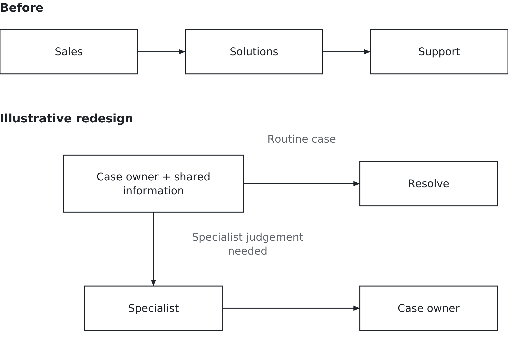
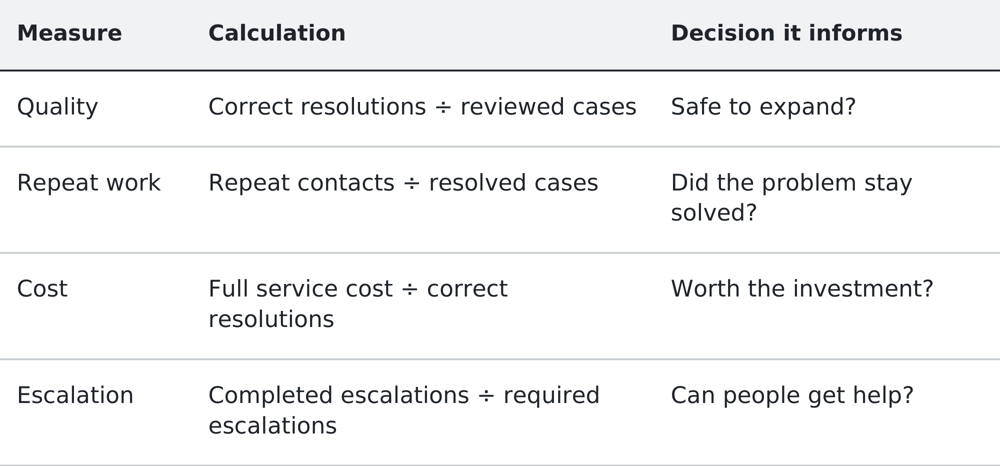

# Chapter 4. Is anyone actually getting an advantage from this?

## A very good month

On 27 February 2024, Klarna, the payments company, reported the first month's
results from its AI customer-service assistant. It had handled 2.3 million
conversations. The company described that as work equivalent to roughly 700
full-time agents. It reported resolution times below two minutes, compared
with eleven previously, and projected a $40 million improvement in profit for
2024. The announcement said the assistant had already been live for a month.
[Klarna's announcement](https://www.klarna.com/international/press/klarna-ai-assistant-handles-two-thirds-of-customer-service-chats-in-its-first-month/).

Sit with those numbers for a second, because they are not small and they are
not vague. If you had been running customer service and someone put those
figures in front of you, what would you have done?

This is the chapter where we ask what an impressive result establishes. In the
last chapter you separated a useful capability from a forecast about who would
profit from it. Keep that habit switched on. Here the question is whether a
company has improved its service and economics, and whether that improvement
gives it an edge competitors cannot readily reproduce.

Those are different claims. One announcement can offer evidence relevant to
all of them without proving all of them.

## Fifteen months later

On 8 May 2025, Bloomberg reported that chief executive Sebastian
Siemiatkowski was reconsidering the emphasis on cost and recruiting human
support through a remote-work pilot. [Bloomberg’s reporting](https://www.bloomberg.com/news/articles/2025-05-08/klarna-turns-from-ai-to-real-person-customer-service).

But “AI replaced the humans, then the humans returned” is too simple a reading
of the original announcement. That release explicitly said customers could
still choose a live agent. A system can handle many conversations while people
remain essential to the service. Adding human capacity does not, by itself,
establish that every claimed AI benefit has disappeared.

Now stop and notice what you are holding. There is a company claim about
capacity, a reported concern about quality and an interpretation of a change
in staffing. They concern the same business, but they do not measure the same
thing. We need not choose a hero or a villain before asking what happened.

The phrase “work equivalent to 700 agents” describes an equivalence. It is not
automatically a count of people dismissed, salaries eliminated or positions
left unfilled. Those outcomes need their own evidence. Nor should we invent
the company's calculation because one method seems obvious.

For illustration, suppose software completes 1,000 hours of work that people
previously performed. Dividing by 100 productive hours per employee gives ten
employee-equivalents. That calculation says nothing about whether ten whole
jobs disappear. The saved time could be spread across fifty people, used to
handle growth or offset by new checking work. These numbers are hypothetical,
not Klarna's method.

You will face this problem on your own slides. Somebody will ask for a number,
you will construct one that is defensible, and it may be quoted back as
something you did not say. Write the definition next to the number. Include
what it leaves out.

## What kind of claim is it?

Begin with the source. A company announcement tells us what the company
reported. It may be accurate and informative. It is still different from an
independent evaluation with access to underlying records.

Then distinguish the claim. Conversation volume describes activity. A shorter
resolution time describes a measured service result, provided we know when
the clock starts and stops. A projected profit improvement is an expectation
about the future. Saying that AI caused an improvement is a further claim
about why the result occurred.

The difference matters because other things can change at the same time. A
business may simplify its policies, alter staffing or receive easier enquiries.
If service improves after introducing an assistant, the assistant may deserve
credit. A before-and-after total alone cannot tell us how much.

Klarna's first-month release also reported satisfaction comparable to human
agents and fewer repeat enquiries. Those are relevant quality claims, not just
speed claims. To assess them, we would still want the definitions, comparison
groups and observation period. An enquiry counted as resolved today might
return as a complaint next week.

The right response to an attractive number is a precise next question. What
was counted? Compared with what? Over which period? What changed alongside it?
The purpose is to make a decision, not to dismiss evidence because it is
imperfect.

## The other number

In July 2025, Project NANDA's preliminary report *The GenAI Divide* presented a
striking 95 percent headline about organisations getting no return and a
5 percent claim about integrated pilots producing value. These formulations
use different units; they should not become a universal probability that an
AI project will fail.

The report drew on more than 300 public initiatives, interviews involving
52 organisations and surveys of 153 leaders. It acknowledged selection and
measurement limitations, varying success definitions and a short observation
period. It was a preliminary report, not a peer-reviewed result. It also
allowed for value without major organisational restructuring.
[Report, pp. 2–4, 6–7 and 24](https://cloudelligent.com/wp-content/uploads/2026/02/v0.1_State_of_AI_in_Business_2025_Report.pdf).

One company reporting benefits and a study reporting widespread difficulty can
both be describing something real. That logical possibility does not verify
either account. Neither tells the manager whether a particular proposed
deployment will work. That requires a test close enough to the actual work to
include its costs, failures and exceptions.

## Hammer walks back in

Return to the question from Chapter 2. Why were those contacts necessary?

A conversation is not necessarily a different customer, and a customer contact
is not necessarily a failure. Someone may need to report a fraudulent purchase,
explain hardship or question a decision. Making that contact possible is part
of a good service. A business that discourages appeals can report fewer
conversations while treating customers worse.

Other contacts reveal avoidable work. A payment status is missing. Two screens
show different amounts. Instructions leave out the next step. In those cases,
an assistant might answer the question faster while the process continues to
manufacture the question.

We cannot infer from an announcement that Klarna never investigated those
causes. We can use the case to ask what any manager should investigate. Group
contacts by reason. Examine a sample. Distinguish confusion the organisation
could prevent from a request that deserves human judgement or a real choice.

Imagine a retailer receiving repeated questions about whether a return has
arrived. An assistant could retrieve the warehouse receipt and answer them.
Updating the customer's return status when the warehouse records receipt might
prevent some questions. If the warehouse never records receipt reliably, both
approaches inherit the same problem.

This is the Hammer test doing useful work. It asks whether to improve the
response, change what creates the contact, or do both. It does not declare a
faster answer worthless. For someone whose problem cannot be prevented, a
prompt, correct response may be exactly the improvement that matters.

## What the system is being asked to do

Stay with the retailer. Several different capabilities can sit behind a screen
labelled “AI assistant.” Students do not need to build the model to distinguish
what the business is asking it to do.

A predictive model might estimate which return is likely to be delayed. A
generative model might draft an explanation for the customer. Prediction here
means estimating an outcome; generation means producing content. The terms
describe the business task, even though a generative model also uses prediction
as part of how it works.

A fluent explanation can be wrong. It might invent a refund deadline or use
an outdated policy. Giving the system access to the correct record helps,
but the organisation must still check whether its answer agrees with that
record. The ability to write confidently is not authority to promise a refund.

If a person checks and sends the draft, the system is **augmenting** that
person's work. If it sends an approved type of response without a person doing
that task, it is **automating** it. A service may combine both. The important
question is which work remains with people, including correction and oversight.

An **AI agent**, as the term is used here, can use tools to act in other
systems. It might check an order, create a return request or initiate an
authorised refund. Acting changes a record or a commitment, so the manager
must specify limits: what it may do, when approval is required and where a
failed or uncertain action goes.

The whole information system is visible here. Staff and customers supply
information; records describe the purchase; policy defines permitted action;
technology retrieves, generates or executes; a named person owns exceptions.
Buying a capable model does not settle any of those arrangements.

## Change the handoff deliberately

Think about a moderately complex sale. A salesperson understands what the
client wants. A solutions person works out what the company can deliver.
Support handles problems after the contract is signed. Three roles, several
sets of notes and time spent transferring context from one person to another.

A shared system could retrieve the configuration history, draft a proposal
and surface previous support tickets. That might let a case owner handle
routine questions without passing the customer around. Figure 4.1 shows this
as an illustrative redesign, with specialist help preserved.

*Figure 4.1 — Change the handoff deliberately. Shared information may reduce coordination work; expertise and escalation still need an owner.*

The roles do not exist only because information is expensive to transfer.
They may reflect different expertise, workloads or authority. A salesperson
should not promise a difficult configuration merely because software can
summarise an engineer's notes. A specialist may need to examine the facts and
reject the proposal.

The useful redesign question is which cases can safely remain with the owner,
what evidence that person needs and which cases require another decision-maker.
Then consider workload, training and incentives. If the owner is rewarded
only for closing cases quickly, access to better information may not produce
better decisions.

AI may change job boundaries. It may also improve work within existing
boundaries. Neither a new organisation chart nor an unchanged one proves the
business has improved. The result must show up in service, cost, quality or
another purpose worth pursuing.

## Put a number on a complete outcome

Suppose you manage the retailer's returns service. The following pilot and all
its figures are hypothetical. The proposal is to let an assistant handle
routine status enquiries while people retain disputed and unusual cases.

First specify success. A correct resolution must use the right order record,
give accurate information or perform an authorised action, and leave no
required follow-up unfinished. A case passed correctly to a person counts as
a necessary escalation, not an automatic failure. A reply sent is not yet a
resolution.

Agree on the comparison before deployment. Assign eligible cases to the
current service or the proposed service using a fair method, such as random
assignment where appropriate. Include all assigned cases, even when the
assistant hands them to a person. Otherwise the proposed service gets credit
for easy work and its difficult cases disappear from the calculation.

Keep policy, case eligibility and the observation window comparable. For this
illustration, each group contains 100 cases, all reviewed against the same
standard, with seven days allowed to observe repeat contact. The current
service correctly resolves 90 cases at a total cost of $900. The proposed
service correctly resolves 80 at a total cost of $800.

Cost per case appears to improve: $9 becomes $8. Cost per correct resolution
does not improve: $900 divided by 90 and $800 divided by 80 both equal $10.
The proposed service costs less in total but leaves more cases incorrectly
resolved or unfinished. The manager should not declare success from the
cheaper contact alone.

What would you do with that result? First examine the twenty cases the
proposed service did not resolve correctly. If most concern a policy exception
the assistant should have passed to a person, revise the routing and test it
again. If errors also occur on ordinary status requests, narrowing the scope
may not be enough. The record retrieval or answer generation may need repair.
The same headline result can lead to different actions once the failures are
understood.

Use reviewers who can judge the outcome against the order and policy, rather
than accepting the assistant's own claim that it succeeded. Give them the same
criteria for both groups. Where practical, avoid telling reviewers which
system produced an answer until they have assessed it. A polished response
should not receive a better quality score merely because it reads well.

Count abandoned exchanges as unresolved evidence, not successful resolutions. Investigate a sample; Chapter 6 examines how a measure can reward the wrong result.

Check results by case type. Success on simple returns does not establish readiness for complex orders, especially if the rollout changes the mix of work.

For the proposed service, the $800 must include the work and resources used
by the whole arrangement: model and software charges, staff checking,
escalation, correction and an appropriate share of setup, training and
maintenance. It is an assumed total for this example, not a claim about
typical AI costs. Recording setup costs separately also shows what must be
recovered if the service continues.

Figure 4.2 collects the measures needed to judge such a test. None should
silently substitute for the others.

*Figure 4.2 — What would count as success? Fix the definitions and comparison period before judging a pilot.*

The example deliberately supplies only enough evidence for a provisional
decision. One hundred cases cannot represent every type of return, season or
customer. Seven days may miss a later dispute. A manager should inspect the
mistakes, compare their severity and ask whether the cases resemble those
the full service will receive.

A mistaken delivery estimate and an unauthorised refund are both errors, but
they do not have the same consequences. Set limits for serious errors and
required escalation before the pilot. A favourable average must not hide a
failure the organisation has decided it cannot accept.

## Decide what the saved time becomes

Suppose a revised pilot later improves quality as well as speed. The next
question is what the organisation can do with the released capacity.

If employees save a few minutes on each case, the business may handle more
work without additional hiring. It may reduce overtime or an outsourced
service bill. It may give people time to investigate difficult cases. Those
are different benefits and need different evidence. Minutes saved are not
automatically cash saved.

Nor is a benefit free of transition costs. Staff must learn the system, old
queues must be cleared and someone must keep the information current. A
deployment that looks economical at high volume may cost more per correct
resolution when demand falls. Model fees and supplier terms can also change.
State which costs are estimates and which are already incurred.

Give the pilot a decision owner. That person should be able to expand it,
change its scope or pause it when the evidence warrants. A reasonable outcome
may be to automate status enquiries, keep disputed returns with people and
fix the warehouse recording problem before attempting more.

After expansion, keep checking. New products, new policies and different
customer questions can make yesterday's successful configuration unreliable.
The purpose of monitoring is to catch that change while somebody still has
time and authority to act.

## Both instruments, on one case

The Hammer test asks what work becomes faster and what work might cease to
be necessary. In the returns example, the assistant improves an answer while
better status information may prevent some questions. A disputed return still
needs a path to resolution. None of these choices is settled by the label AI.

The FreeMarkets test asks about direction and destination, and tests both.
For this service, will customers use it and will it resolve their problems
reliably? If it does, who keeps the benefit: the retailer, customers, employees
or the software supplier? A provider's fees might absorb much of the saving.
Rivals might reproduce the same capability quickly.

That would not make the improvement pointless. Reliable, affordable service
may be necessary to remain competitive. But a claim of lasting advantage needs
something more: an arrangement rivals cannot readily match, supported by
evidence that the organisation creates and captures value through it.

The honest answer to the chapter's question is therefore conditional. AI can
contribute to a better business. Whether this proposal does so depends on the
work, the evidence and the decisions around it. You should be suspicious of
the confident version that skips those parts.

## Your turn

Pick an organisation you have contacted recently: a university office, a
retailer, an airline, a landlord or an employer. Describe what you needed and
what made contact necessary. Mark any explanation of an internal cause as an
inference; you may not know what happened behind the screen.

Then distinguish an avoidable contact from one the organisation should make
easy. If a changed process could prevent your question, name the change and
the role responsible. If judgement, choice or an appeal was needed, explain
why a route to a person should remain.

Propose one use of AI and state what it would do: predict, generate content or
act. Decide whether a person reviews the result and what authority is required.
Name the record it needs, one way that record could be wrong and the path for
an uncertain case.

Finally, write a short pilot recommendation. Specify the comparison, a measure
of quality, a measure of full cost and one condition that would make you stop
or narrow the proposal. Say how you would detect repeat contact. Do not invent
an organisation-wide contact reduction from your single experience.

Keep the distinction that started the chapter: an impressive activity count
is a reason to investigate, not a complete business case. Next we examine the
systems and accumulated knowledge a company already depends on. Any proposed
change has to work with what it inherits.

## Sources and example notes

Klarna’s first-month figures are company-reported, published on 27 February 2024; the profit figure is a projection and workload equivalence is not a layoff count. The May 2025 account is a cautious paraphrase of [Charles Daly’s Bloomberg report](https://www.bloomberg.com/news/articles/2025-05-08/klarna-turns-from-ai-to-real-person-customer-service), not an authenticated interview quotation. Project NANDA’s preliminary findings do not establish a universal AI failure rate. The retailer comparison is fictional.

