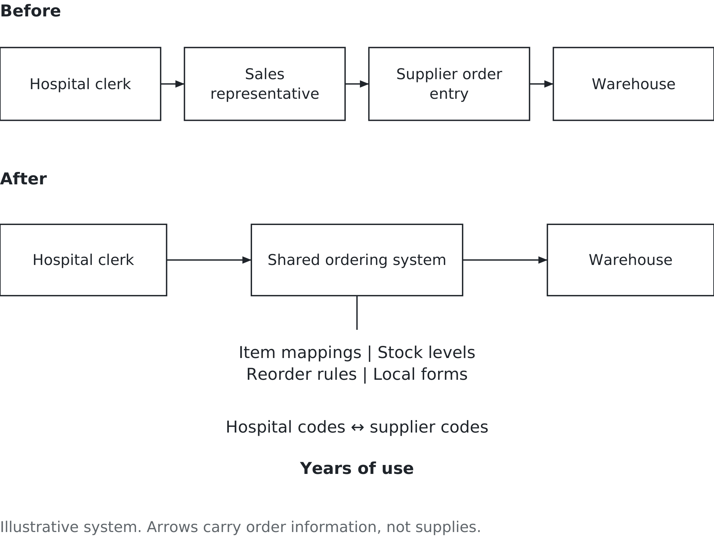

# Chapter 5. What did you inherit?

## A clerk, a catalogue and a telephone

Picture a purchasing clerk buying supplies for an American hospital before electronic ordering. This is a simplified scene, not a record of one hospital. The clerk keeps a shelf of paper catalogues. When a ward runs low on sutures or syringes or examination gloves, the clerk looks up the item, writes out a requisition, and either telephones the order in or waits for the sales representative to call round. The representative writes the order on a pad, takes it back to a branch office, and somebody there types it into the supplier's system. Then everybody waits.

Nothing about that was stupid. The representative was a valuable part of the arrangement: someone who knew the hospital, knew what it used, and could catch mistakes.

American Hospital Supply Corporation's ASAP system changed that arrangement by allowing hospitals to place orders electronically. The case is useful because the interesting part is not simply that orders travelled faster. It is what could accumulate around the ordering relationship. The ordering relationship is documented in [Venkatraman and Short’s study of electronic integration](https://www.researchgate.net/profile/N-Venkatraman/publication/38009213_Strategies_for_electronic_integration_from_order-entry_to_value-added_partnerships_at_Baxter/links/558431a608ae71f6ba8c38f2/Strategies-for-electronic-integration-from-order-entry-to-value-added-partnerships-at-Baxter.pdf).

A terminal lets the clerk enter an order directly. That removes a handoff and some retyping. But once the supplier and hospital share an ordering routine, there is somewhere to put the knowledge that used to travel with the representative: which item the hospital means, how much it normally needs, and what to do when an ordinary order is not ordinary.

The question for this chapter is what happens when that arrangement becomes something the hospital cannot easily do without.

## The boring thing becomes the business

Think through a purchasing system of this kind. It can connect the hospital's internal item numbers to the supplier's catalogue, hold stock records and reorder rules, and produce forms that fit local work. These are illustrative features of an integrated purchasing system; they should not be read as a claim that every version of ASAP contained all of them.

Somewhere in that sequence something quietly changes. The supplier's ordering system becomes part of the hospital's purchasing system.

*Figure 5.1 — An order system becomes a capability. The terminal is replaceable; the mappings, routines and trust take longer to rebuild.*

Take one small example. In an imaginary hospital, the ward requests item G17. The supplier calls it 4826. The hospital counts boxes; the supplier sells cases containing ten boxes. Somebody must establish that these are the same gloves and that the quantities mean different things. Somebody must also keep that relationship correct when the supplier changes its packaging.

That relationship is an item mapping. It is not glamorous. Get it wrong and an order can arrive ten times larger than intended. Get thousands of such relationships right, keep them current, and let people build dependable routines around them, and you have something valuable.

This is integration in practical terms: connecting records and work so that one part of the organisation can use what another part already knows. The connection includes people who resolve exceptions, a process for approving changes, shared data definitions, and technology that carries the order. A working connection between computers is only part of it.

One way to carry that order is through an application programming interface, usually called an API: a defined way for one piece of software to request data or an action from another. The hospital's software might submit an order and receive an order reference without a clerk retyping it into the supplier's screen. Not every integration uses an API.

The connection still needs agreed meanings. If G17 means a box in one system and 4826 means a case in the other, successful delivery of the message can produce the wrong order. The people responsible must agree on quantities and maintain the mapping. They must also decide who may submit orders, what happens when a request fails, and how a repeated request avoids creating a second purchase. An API supplies a connection; the business must specify what a correct exchange means.

Now imagine a competitor offering gloves at eight percent less. That is an illustrative offer, not a documented ASAP transaction. The hospital should consider it. But a price comparison is not yet a switching decision. Can it buy those gloves while keeping the rest of its arrangements? Can it transfer the mappings? Who will check quantities, train staff and handle orders during the change?

Switching costs are the costs and disruption of moving from one arrangement to another. They can make a cheaper offer expensive. They do not make leaving impossible, and no particular discount is automatically too small to justify it.

Notice the two sides. The supplier gains a more durable customer relationship. The hospital gains useful coordination but may lose freedom to change suppliers. A system can create value and dependence at the same time. The manager's job is to understand both.

Suppose the imaginary hospital spends $1 million a year on the items covered by the offer. Eight percent is $80,000 a year, assuming the same quantities and quality. If changing suppliers requires $120,000 of one-time work and adds $20,000 a year in coordination costs, the annual saving falls to $60,000. It takes two years of those savings to cover the initial work, before allowing for timing, uncertainty or other effects.

That calculation does not settle the decision. It tells you what to investigate. Will the hospital still buy the same volume? Does the lower price last? Can the change proceed without interrupting supply? A manager who rejects the offer because switching is painful is missing an opportunity; a manager who accepts it because eight percent sounds substantial is missing the same information.

## The reversal, and how to reconcile it

Earlier chapters asked you to examine steps that appear necessary only because of an old arrangement. That was an argument for questioning work, not for deleting everything expensive or familiar.

Now here is the other possibility: a dull piece of plumbing that someone keeps funding becomes a capability the business depends on. Cutting it can remove more than a line in the budget.

These lessons are not in conflict. The question is still what the step is for. Retyping an order may contribute nothing once the same information is available directly. Checking an unfamiliar substitution may prevent a serious mistake. The two activities might once have belonged to the same representative. Removing one does not prove that the other has become unnecessary.

Ask what would disappear if the system disappeared. Is it duplicate entry? A useful record? A control over mistakes? The only person who understands a difficult customer? You cannot answer by looking at the equipment list.

Nor does usefulness prove that the whole arrangement should survive. A hospital might preserve its item mappings while replacing its ordering software. It might keep the supplier but insist on a usable copy of its records. It might discover that a once-helpful local form now creates avoidable work.

Preserve the capability you need. Then question the machinery and routines that currently provide it.

This also changes how you judge an old system. The money spent building it is already spent. That alone is no reason to keep it. What matters now is the future value of its services, the future cost of supporting it, and the cost and risk of the alternatives. Years of accumulated knowledge may be valuable. Years of accumulated spending are not the same thing.

## Nobody can buy this in the year they need it

Suppose you run a competitor and finally understand why customers find the established ordering arrangement hard to leave. You can buy terminals. You can commission software. You cannot assume that the staff's knowledge, the checked records and the customer's confidence will arrive with the equipment.

Some capability takes repeated use to build. People learn which exceptions matter. Errors expose missing definitions. A supplier earns trust by handling difficult orders properly. Better tools can speed that work, but buying the tools does not mean the work has happened.

That is why infrastructure is hard to think about. Here, infrastructure means the underlying services and arrangements that other work relies on: computing capacity, connections, shared records, support and the routines that keep them usable. Much of its value is invisible in an ordinary budget year because ordinary work keeps happening.

The decision that determines whether you have a capability may be made years before the moment that reveals whether you need it, by someone who thought they were making a boring technical choice.

This is not a licence to fund every promise of future value. Ask for a small piece of evidence. Can a second employee handle the exceptions that only one person understands? Can a sample of records be transferred and checked? Can the organisation recover its ordering service after a failure? Those are things a manager can observe before committing to a large replacement.

An inherited system may be an asset, an obstacle, or both. Its age does not settle the question. Neither does its owner's confidence that it has always worked.

## What a business graduate actually needs to know about infrastructure

You may never configure a server. You may still approve spending, promise a delivery date or run a department that depends on one. Three terms help you ask better questions.

Availability concerns whether people can access and use the service when needed. A supplier's promise of 99.9 percent availability sounds nearly perfect. Across a thirty-day month measured continuously, the remaining 0.1 percent is 43.2 minutes. At 99.99 percent, it is 4.32 minutes. Read the measurement rules: the contract may exclude planned maintenance or count only certain hours. A percentage is not a guarantee that an interruption will occur at a convenient time.

For a purchasing manager, the useful question is what happens during those minutes. Can staff queue orders? Is there another way to order urgent supplies? Does the interruption happen before the dispatch deadline? The same duration can have very different consequences.

Reliability concerns whether a system performs its intended function without failure over a stated period under stated conditions. It is related to availability, but the terms are not interchangeable. A service that repeatedly fails and restarts quickly can have high overall availability while still interrupting work. Wrong item mappings raise a further question about data accuracy; a system can consistently process the wrong information. These distinctions follow the [NIST reliability](https://csrc.nist.gov/glossary/term/reliability) and [availability](https://csrc.nist.gov/glossary/term/availability) definitions.

Scalability concerns whether the arrangement can handle more work while maintaining an acceptable level of service. More computing capacity may help, but it will not fix an approval process in which one person must inspect every order. Ask where the next constraint will appear if demand doubles.

Some capacity can be rented as needed. Cloud computing makes shared computing resources available on demand, with capacity that can be provisioned and released as required. Consider two different purchases. A distributor might rent computing resources and run its own ordering application on them. Or it might subscribe to an ordering application that the provider operates. The second is software as a service, or SaaS. Both can involve cloud computing, but they leave different work with the customer.

Renting resources may leave the distributor responsible for maintaining its application. With SaaS, the provider operates the application, within the agreed service. In either arrangement, the distributor must decide which employees need access, what data belongs there and how the service fits its order process. It also needs arrangements for interruptions and a usable way to leave.

Responsibility depends on the service and agreement. Ask the supplier to distinguish its work from yours. Moving computing elsewhere does not move every business decision with it. Cleaner records, staff preparation and a workable fallback still need owners.

All three terms lead back to the business. What must keep working, for whom, under what conditions, and with what consequence if it stops?

## The budget you actually inherit

A technology budget is not a pile of money waiting for new ideas. Existing services already need licences, support, staff time and upkeep. How much is committed varies; an old system does not automatically become more expensive every year. But you need to identify those commitments before promising a new capability.

For planning, distinguish running today's service, maintaining its ability to keep working, and changing what it can do. The boundaries overlap. A replacement may improve service and reduce maintenance at once. These categories are questions about purpose, not accounting rules.

Consider an imaginary distributor with an annual technology budget of $200,000. Running its existing ordering service takes $140,000. For this exercise, treat that commitment as fixed for the year. The manager has $60,000 left and three proposed projects, each paid for within the year.

Testing and improving recovery would cost $20,000. Nobody has recently demonstrated that the business can restore its order records after a serious failure. Cleaning and documenting item mappings would cost $30,000. At present, one experienced employee resolves most mapping problems. A new sales dashboard would cost $40,000 and help supervisors see sales results sooner.

All three proposals sound reasonable. Together they cost $90,000. The manager cannot approve them all.

One defensible choice is recovery work plus mapping work: $50,000, leaving $10,000 for unexpected needs. That choice maintains the service and reduces dependence on one employee, while postponing the dashboard. It is defensible because the stated problems threaten the ordering capability on which sales already depend. It is not automatically correct for every distributor.

Ask what evidence could change the decision: a recent recovery test, or a measurable loss from delayed sales information. Calling a proposal essential is not enough.

After approval, ask for an observable result. Recovery work should produce a demonstrated restoration and a usable procedure. Mapping work should leave checked definitions that someone besides the experienced employee can apply. Paying the invoice proves that money was spent. It does not prove that capability was built.

There is also a time question hidden in the proposals. The $60,000 is this year's money. A dashboard may need support next year. Clean mappings will become dirty again if nobody maintains them when products change. A recovery procedure can become useless after the ordering system is modified. Before approving a project, ask who will own the resulting work and where its continuing cost will appear. Otherwise this year's improvement becomes next year's unexplained commitment.

Set a condition for reconsidering postponed work. Review the dashboard after measuring how often late sales information delays a decision. “Later” on its own is neither a plan nor a reason.

## How much protection is enough?

Protecting against failure costs money, and failure costs money. The useful comparison is the combined cost, subject to what the business must be able to withstand. There is no general rule that the right answer is where two cost curves cross.

Figure 5.2 gives three hypothetical annual protection choices. Expected loss means a probability-weighted estimate of loss, not a prediction of the bill next year. For a simple example, a ten percent annual chance of a $400,000 loss gives an expected annual loss of $40,000. An actual year could be much better or much worse.

*Figure 5.2 — Pay for the right protection. Among these feasible choices, the middle option has the lowest estimated total cost.*

| Option | Annual protection cost ($000) | Expected annual loss ($000) | Total ($000) |
|---|---:|---:|---:|
| Basic | 10 | 40 | 50 |
| Intermediate | 20 | 15 | 35 |
| Extensive | 40 | 8 | 48 |

*Illustrative estimates; minimum service requirements also apply.*

The intermediate option spends an extra $10,000 compared with basic protection and reduces expected loss by $25,000. Moving from intermediate to extensive protection costs another $20,000 but reduces expected loss by only $7,000. On these estimates, and assuming all three meet minimum requirements, intermediate has the lowest total.

But an average can hide a loss the organisation could not survive. A hospital may require an emergency ordering route regardless of the cheapest estimated average. Before comparing prices, establish the minimum service that must remain available and the consequences that are unacceptable. Then compare feasible choices and test how the answer changes if the loss estimates are wrong.

Nor does a year without failure prove the protection was wasted. You made the decision before knowing what would happen. Judge it using the evidence available then, the protection actually delivered, and what you have learned since. Otherwise every successful precaution starts looking unnecessary just before someone removes it.

## Your turn

Return to the distributor's $60,000 decision. Choose the projects you would fund, state what you would postpone, and identify one piece of evidence that could reverse your choice. If you choose the $40,000 dashboard and the $20,000 recovery work, explain how you will manage the undocumented mappings during the year. If you choose recovery and mappings, explain what supervisors will use while the dashboard waits.

For your chosen projects, name one result you would inspect at year-end and one recurring responsibility that next year's budget must cover.

Now pick an organisation you know from the inside: an employer, your university, a club you help run. Find the thing that would be painful to switch away from. Not necessarily the thing people complain about most; the thing that, if you proposed replacing it, would produce a long silence and then a list of reasons.

Separate that list into useful capabilities and avoidable dependencies. Name one piece of knowledge worth preserving, one routine worth questioning and one small action that would make a future change easier. Explain who would do the work. A copy of a file is not much help if nobody understands what its fields mean.

Then ask the harder question. If the organisation needed a capability that takes years to accumulate, what could it begin learning now? You cannot know every future need. You can notice repeated exceptions, reliance on particular people and records that cannot travel beyond their original system.

Every organisation you join will hand you systems somebody else chose. Your task is to understand what those systems make possible, what they prevent, and which capabilities deserve continued investment. In the next chapter, we turn to the records themselves: what they mean, and whether they support the decision someone wants to make.

## Sources and example notes

Hospital electronic ordering is documented by [Venkatraman and Short’s MIT working paper](https://www.researchgate.net/profile/N-Venkatraman/publication/38009213_Strategies_for_electronic_integration_from_order-entry_to_value-added_partnerships_at_Baxter/links/558431a608ae71f6ba8c38f2/Strategies-for-electronic-integration-from-order-entry-to-value-added-partnerships-at-Baxter.pdf) (revised February 1991, printed p. 8). The purchasing-system features, glove mapping, switching costs and budget choices remain illustrative. API terminology follows [IBM’s explanation](https://www.ibm.com/think/topics/api); cloud and SaaS terminology follows [NIST](https://csrc.nist.gov/pubs/sp/800/145/final). Responsibilities depend on the service and agreement, as illustrated by [AWS](https://aws.amazon.com/compliance/shared-responsibility-model/).

