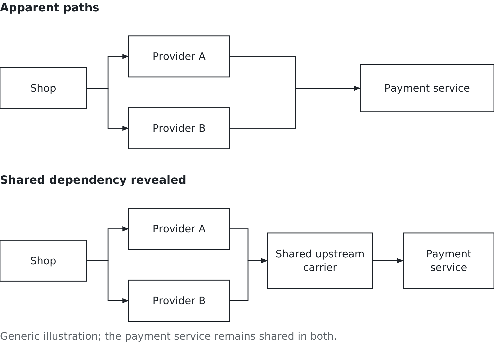
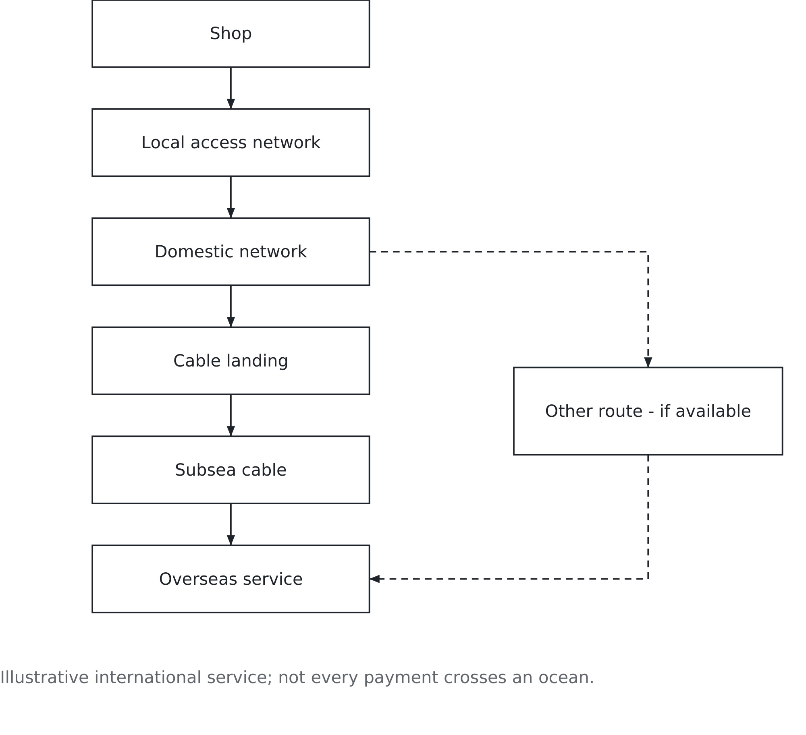

# Chapter 7. The internet is a physical thing

## A country goes dark

On 15 January 2022 an underwater volcano erupted near Tonga in the South Pacific and generated a tsunami. Among the consequences was damage to the country's connection with the rest of the internet. An app could not repair it. Neither could restarting a laptop. [NOAA's eruption account](https://www.ncei.noaa.gov/news/january-15-2022-tonga-volcanic-eruption-and-tsunami).

Tonga depended on a single international undersea cable. When that cable broke, ordinary connectivity was severely disrupted. Repair meant reaching damaged infrastructure at sea, not changing a setting on a screen. A country was on the far side of a broken physical connection.

There is an important qualification. Satellite communication helped support the emergency response. The International Telecommunication Union describes receiving a request for assistance by satellite phone and helping arrange temporary satellite connectivity for essential services. The main cable connection was lost; that does not mean every possible means of communication disappeared. [ITU's account of restoring connectivity](https://www.itu.int/hub/2022/02/restoring-connectivity-tonga-internet/).

Before you read further, answer a question with the honest first thing that comes into your head. When you send a message to another continent, how does it physically get there?

Satellites are part of the answer. Undersea cables are a much larger part than the wireless device in your hand suggests. The internet feels weightless because most of its physical work happens out of sight.

The question for a manager is not whether that infrastructure exists. It is which parts the business depends on, and what happens when one of them stops working.

## What the internet is made of

The internet connects networks that move data between devices and services. A message can begin over Wi-Fi or a mobile connection and then travel through cables, switching equipment and buildings full of computers. Wireless describes a link in that journey. It does not describe the whole journey.

Undersea cables carry the overwhelming majority of intercontinental data traffic. The ITU describes them as essential infrastructure for communication, finance and cloud services, and identifies fishing and anchoring among the sources of damage. [ITU's submarine-cable overview](https://www.itu.int/digital-resilience/submarine-cables/). You do not need to remember a global cable count to understand the consequence: a digital service depends on equipment someone must install, power, protect and repair.

Optical fibre carries information as light. The fibre sits inside a protective cable; it is not itself a garden-hose-sized strand of glass. At the coast, a cable landing connects the undersea route to networks on land. From there, data still has to reach the computers providing the service.

Some faults can be bypassed using another route. That requires an alternative that is working, has enough capacity and can actually carry the affected traffic. The existence of other cables somewhere in the ocean does not establish an alternative for a particular business.

That is what makes Tonga instructive. A route can be essential because of where it goes, not because the organisation using it knows its name.

Nor does “in the cloud” remove the physical dependency. Chapter 5 distinguished rented resources from provider-operated software. Someone still operates the computers, the building, the power and the connections. The business may have transferred those responsibilities to a supplier. It has not made them disappear.

For this chapter, distinguish the network provider that carries data from the service provider that does something with it. One gets a shop's request to its destination; another may process the payment. A single company can perform several roles, but the roles remain different. That distinction will matter when someone offers you a backup connection.

## The dependency you never agreed to

On 8 July 2022 the Canadian carrier Rogers suffered a major network outage. A later assessment published by Canada's telecommunications regulator reported that more than twelve million customers lost wireless and wireline services, with restoration continuing into the next morning. The failure affected a shared core network supporting both kinds of service. [CRTC outage assessment](https://crtc.gc.ca/eng/publications/reports/xona2024.htm).

That much is an outage story. What makes it a business story is what else stopped.

Interac reported that the Rogers outage made its services unavailable. A business could therefore have working internet access and still be unable to complete an Interac payment. Its own connection was only one dependency in the transaction. [Interac's account of the outage](https://www.interac.ca/en/content/news/interac-statement-on-rogers-outage/).

Picture a shop with customers ready to pay and a terminal that cannot complete the transaction. This is an illustrative shop, not an account of a particular owner's experience. The stock is there. The employee is there. The customer is willing. The business cannot finish the sale because something outside the shop is unavailable.

The owner may never have chosen that upstream network. Choosing a payment supplier also brings dependencies on the supplier's suppliers. A contract with one company does not mean the service relies on only one company.

Figure 7.1 illustrates that problem. It is a generic dependency map, not a reconstruction of Interac's network during the Rogers incident.

*Figure 7.1 — Two providers, one dependency. Check what the backup shares with the primary path.*

In the first panel, the shop appears to have two separate routes to its payment service. The second panel reveals that both network providers use a shared upstream carrier. If that carrier fails, switching providers at the shop does not avoid the failure. The payment service is also shared in both panels: two working connections cannot repair an unavailable service.

Two words are worth separating. Redundancy means having an additional component or path available. Diversity means arranging alternatives that do not share the particular failure you want to survive. Two connections can protect against one local equipment fault while remaining exposed to the same upstream outage.

Redundancy without diversity is an expensive way to feel safe. But diversity is a question about a particular risk, not a certificate that nothing can go wrong.

## Follow one payment

Take an imaginary shop whose payment application communicates with a service hosted overseas. This is deliberately a simplified international example. Not every payment crosses an ocean, and a complete payment system involves more participants than this route shows.

The request begins at the shop, crosses its local access network, enters a domestic network, reaches a cable landing, travels through a subsea cable and reaches the overseas service. Figure 7.2 makes that physical dependency visible. An alternative beyond the domestic network is useful only if it avoids the damaged section and can still reach the service.

*Figure 7.2 — What has to keep working? Trace dependencies to a physical route before claiming an alternative exists.*

Start at the shop. The terminal needs power and a working connection to the local equipment. If the shop's own equipment fails, a different upstream carrier may be irrelevant: the request cannot leave the building. A spare device or a different local connection might address that problem.

Move outward. If the local access line is cut, another connection using the same duct can fail with it. Two different supplier names do not tell you where the cables run. A mobile connection might avoid that cut, but you still need to establish which network carries it and whether the shop has usable coverage.

Move farther. If a cable landing becomes unavailable, another route that reaches the same landing may provide no protection against that event. If the overseas payment service itself is down, a different cable route still leads to the unavailable destination.

Now follow the reply. The shop needs confirmation that the transaction succeeded. If the connection drops after a request was sent but before confirmation arrives, staff need a way to check its status. Repeating the request without knowing what happened can create another problem. The payment supplier's procedures should explain how to handle that uncertainty.

The purpose of tracing is not to turn a business student into a network engineer. It is to locate the business decision. Which failure are we covering? What remains shared? Who can establish whether the alternative works?

## Buying a backup that answers the question

Suppose the imaginary shop already has a fixed internet connection through Provider A. The owner can afford one backup arrangement and some staff training. The immediate concern is losing sales during a local line failure, while recognising that a wider service outage is also possible.

One proposal offers a second connection from Provider B. It sounds reassuring, but both lines enter through the same duct and both providers use the same upstream carrier. This may help with some provider-specific faults. It does not protect against a severed shared duct or the failure of that carrier.

A second proposal uses a mobile network operated separately from Provider A's fixed network. For this fictional comparison, assume the supplier confirms a different upstream route and a test shows sufficient coverage and capacity in the shop. It avoids the stated fixed-line failure more effectively. It still depends on power, the mobile network and the same payment service.

The second proposal fits the stated problem better because of the evidence about its route and performance. “Mobile” by itself is not the reason. If both proposals shared the failed carrier, or the shop had no usable signal, the conclusion would change.

Ask the supplier to identify the relevant shared dependencies and explain how switchover works. Does it happen automatically? Must an employee change a setting? Who has access to do that on a busy Saturday? A backup that works only when the absent owner remembers a password is not the capability the shop thought it bought.

Then test the intended action under controlled conditions. Simulate loss of the primary connection with the supplier's help, confirm that the approved test transaction completes, and record how long switching takes. Test returning to normal as well. Avoid disrupting live sales merely to prove a point.

A successful test establishes something specific: the arrangement worked under those conditions. It does not demonstrate that every regional outage has been covered. Record the remaining dependencies so the next manager does not mistake a narrow test for a universal guarantee.

Also decide what gets priority on the backup. A connection that handles a test payment in an empty shop may struggle when staff devices, stock updates and customer Wi-Fi all try to use it. The owner might reserve the backup for payment traffic and essential communication, postponing large updates until the main line returns. That is a business choice about which work matters most during an interruption.

Have authorised staff test whether essential work can continue at an acceptable pace, including which activities must wait. A web page opening does not establish that the payment service works.

## Keep some business moving

A network alternative is only one part of continuity. The owner also needs to decide what staff should do when the payment service remains unavailable through every connection.

For this shop, one option is to accept cash where the till and cash-handling arrangements permit it. Another is to reserve goods and complete the sale later. Neither preserves every sale. Both can keep some work moving without pretending that an unconfirmed card transaction has been authorised.

Some payment arrangements support specific offline functions, but the shop should use only those its provider explicitly supports and that it has agreed to operate. Recording transactions for later processing can shift risk to the business. An outage is a poor time to invent a procedure for collecting card details.

Keep the fallback simple enough for the person serving the customer. State who declares the service unavailable, which transactions may continue, what gets recorded and when staff should stop. The employee needs an action, not a folder full of equipment descriptions.

For reserved goods, record the item, quantity and reference. Assign someone to reconcile purchases and stock when service returns. Chapter 10 examines that return to valid business records.

This is where the information system becomes visible as a whole. Technology provides routes and terminals. People notice failure and explain choices to customers. Process governs the fallback. Data records what happened so the business can return to normal without losing or duplicating work.

Chapter 5 asked how much protection deserves funding. Here the owner can compare the backup with the cost of interrupted work and the value of a limited fallback. Paying to protect every imaginable failure is not the objective. Preserving the right work through plausible failures is.

## The satellites, and what they change

Satellites belong in this discussion because they can provide another physical path. Tonga's emergency response showed their usefulness. They do not turn the internet into something without infrastructure.

Iridium's original satellite-phone venture entered bankruptcy in 1999. Its system was subsequently rescued and service relaunched under new ownership. The company's museum records that history. [Iridium Museum](https://www.iridiummuseum.com/). A technically useful network and a commercially sustainable venture are different achievements.

The useful lesson is narrower than saying the idea was simply twenty-five years early. Price, financing, customers, equipment and operating arrangements all matter. Buying assets cheaply after a bankruptcy also does not prove that building them at the original cost was a sound investment.

Starlink supplies broadband through satellites in low Earth orbit. That puts satellites closer to Earth than traditional geostationary systems, but it does not make Starlink a direct replay of the original Iridium phone business. The service, equipment and intended uses differ. [Starlink's technology description](https://starlink.com/technology).

For the shop owner, the relevant question remains whether a satellite service avoids a dependency that matters. What equipment must be installed? What view of the sky does it need? How will it be powered? Can it reach the required application with enough capacity? Which provider controls it, and what happens if that provider's service fails?

A satellite route might avoid a local cable cut while leaving the payment service unchanged. It might be useful at a remote site where a second terrestrial route is impractical. Neither conclusion requires a claim that satellites will replace cables or that one falling input cost explains an industry's success.

The alternative earns its place by the business work it can preserve, not by how new it sounds.

## Who owns the middle, again

Ownership matters because the business is relying on someone else's decisions about investment, repair, capacity and access. Those decisions do not stop mattering when several suppliers package the same underlying service under different names.

A large provider may offer expertise and resources the shop could never maintain itself. Concentration can also mean that several apparent alternatives are exposed to one organisation's outage or commercial decision. The advantage and the risk can coexist.

Ask who controls the scarce part of the arrangement and what practical choice remains if its terms change. Can the shop move to another network without replacing its payment system? Can the supplier explain where its backup differs? If the answer is confidential or unavailable, mark the dependency as unknown. Do not draw an independent route merely because nobody has told you it is shared.

The contract may provide support commitments or credits after an outage. Those matter, but a credit does not complete a missed sale. The owner must still decide how much interruption the business can tolerate and what employees can do during it.

You cannot investigate every supplier's entire supply chain. Start with the services whose loss would stop important work, and trace far enough to test the backup claim. A short, accurate map with an honest question mark is more useful than a detailed diagram built from guesses.

## Your turn

Start with the shop. Explain which of its two proposed backup connections you would choose for a local line failure, what evidence supports the choice and one failure it would not solve. Then describe what an employee should do if the payment service remains unavailable through both connections.

Now take one thing you did before reading this: a payment, a message, a stream or a ride booking. Trace what had to be working underneath the app. Name the device, local connection, network and service that you can establish. Mark what you do not know rather than supplying plausible company names.

Choose one point on your map and imagine it fails. Propose an alternative. Follow that alternative until you can explain what it shares with the original route. State whose confirmation or which test you would need before relying on it.

Finish with the people. Who notices the failure? Who makes the switch? What work can continue? What records must be checked when normal service returns? If those answers are missing, you have drawn a network but not yet planned how the business will use it.

The internet is a physical thing. Your organisation's dependency on it is a managerial choice, even when the choice was made by somebody upstream. Before accepting that there is a backup, ask the question this chapter has been building toward: a backup against what?

## Sources and example notes

Tonga’s cable disruption did not eliminate emergency satellite communication. The Rogers and Interac accounts are sourced separately; the shop and dependency diagrams are illustrative. Iridium and Starlink differ in market and service, so their histories do not isolate the effect of one cost change. Any operating tests described belong to authorised staff.

