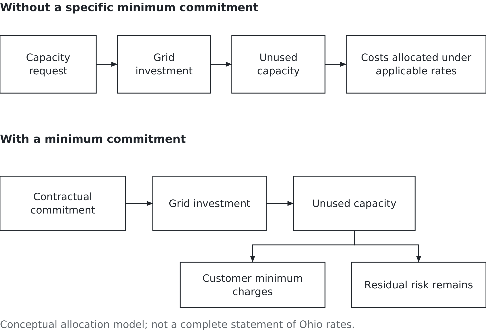

# Chapter 8. What the machine eats

## A utility says no

AEP Ohio had customers asking for more electricity, and it had paused new data-center connections while the terms for serving them were being worked out.

Consider the business problem. An electric utility sells electricity. A prospective customer wants to buy a great deal of it. But accepting the order may require infrastructure that takes years to build and lasts much longer than the customer's current business plan.

On 9 July 2025, the Public Utilities Commission of Ohio approved a settlement establishing terms specifically for data centres and directed AEP Ohio to lift its moratorium as soon as possible. The commission identified the risk of other customers paying for investments that proved underused. [PUCO's announcement](https://content.govdelivery.com/accounts/OHPUC/bulletins/3e8bb79).

That is the question behind this chapter. Who pays when the electricity system is built for demand that does not arrive?

The previous chapter established that the internet is a physical thing. This chapter is about another physical fact: the machines eat electricity, and somebody has to pay for the equipment that supplies it. A company's technology decision can become another company's construction project and, depending on the rules, someone else's bill.

The Ohio case gives us a concrete dispute to examine. We will use the 2025 decision and positions published by March 2026 as a historical case, rather than assume that every term or legal question remains unchanged when you read this.

## What a data centre is, for business purposes

A data centre houses computing equipment and the systems that keep it operating: power supply, cooling, connections and support. Some organisations own and operate their own facilities. Others rent space or buy computing services from a provider. Moving to the cloud changes who supplies and manages the resources. It does not eliminate the building or its electricity needs.

Nor does every data centre run at full capacity all the time. Its electricity demand depends on the equipment installed, the work being done and the supporting systems. A facility designed for a large future workload may initially use much less than its eventual capacity.

That difference matters to the utility. The customer may want the ability to expand quickly. The utility may have to build equipment before the expansion happens. Neither a planning presentation nor an empty computer hall creates the electricity infrastructure on demand.

Keep three parts of that infrastructure separate. Generation produces electricity. Transmission moves large amounts over the high-voltage network. Distribution delivers it through local networks to customers. A substation helps connect parts of the system and change voltage. Different institutions and rules can govern these activities; “the utility” is a useful starting point, not a complete map of responsibility.

The constraint might be a transmission upgrade, local equipment, generation availability, permits or another part of the project. A building can be ready before the power connection is ready. Equally, a connection can be planned before the customer's building or financing is secure.

For a business manager, those are dependencies to coordinate. A promised launch date needs more than an equipment delivery date. It needs evidence that the supporting services will be available when the work begins.

## Read the unit before the headline

The numbers in this debate are easy to repeat and easy to misunderstand.

A megawatt, or MW, measures power: the rate at which electricity is being supplied or used. A megawatt-hour, or MWh, measures energy over time. One MW used steadily for one hour is one MWh. One thousand MW equals one gigawatt, or GW. These are different scales and different questions, not alternative spellings of the same quantity. [EIA's explanation of electricity measurement](https://www.eia.gov/energyexplained/electricity/measuring-electricity.php).

Imagine a facility drawing 10 MW steadily for a day. It uses 240 MWh: ten multiplied by twenty-four. If it draws 5 MW over that same day, it uses 120 MWh. A connection capable of serving 10 MW does not establish that either amount was actually consumed.

Now add a third quantity: contracted capacity. This is the capacity covered by an agreement under its stated terms. A request for 10 MW, an agreement for 10 MW and actual demand of 10 MW may all appear in a company's documents. They describe different stages of the business.

You need each one for a different decision. Engineers need to understand the demand the equipment must serve. The finance team needs to understand the payment obligation. Operations needs to know what is available and what is being used. Reporting all three as “demand” can conceal the distinction just when a manager needs it most.

Capacity also has a location. Spare capacity somewhere else on a large network does not necessarily mean it can be delivered to the proposed site without additional work. Before treating an impressive total as usable supply, ask where it is and what must connect it to the customer.

## Interest is not commitment

Suppose a developer asks about three possible sites. The utility receives three requests. The developer may intend to build only one facility. Another developer may have a specific site but no confirmed financing. A third may be ready to sign an agreement. This is an illustrative situation, not a claim about particular Ohio applicants.

All three can represent serious interest. They do not represent the same certainty of future load.

A list of projects seeking service is therefore useful, but its meaning depends on the entry rules. Has the applicant identified a site? Paid for a study? Signed an agreement? Accepted a financial obligation? Has the facility actually been connected and begun using electricity?

The steps are not interchangeable. A load study investigates how a proposed customer could be served. A signed agreement can create obligations. Energisation means the connection has been made live. None of these alone proves that the customer will use its full planned capacity for the next decade.

Chapter 6 taught you to examine what a number counts. Here the consequence of skipping that step can be a decision to build infrastructure. If an early request total is larger than a later contracted total, that does not by itself tell you how much genuine demand disappeared or why.

Some projects might withdraw because of the terms. Others might consolidate sites, change their timing or fail to secure financing. Some might remain in a different stage. To explain the change, follow comparable projects through the process and identify what happened to them. Subtracting two totals cannot do that work for you.

The managerial habit is simple: put the stage and date beside the number. A forecast becomes more useful when readers can see the evidence and obligations behind it.

## Who pays for the wire?

When infrastructure is built, someone provides the money initially and someone is expected to repay it through charges or other arrangements. Those may be different parties. The ultimate allocation depends on applicable rates, contracts and regulatory decisions.

Spreading costs across a broad group is sometimes called cost socialisation. It can be justified when infrastructure serves shared needs. It can also expose customers to costs generated by another customer's project. Neither “everyone benefits” nor “households always pay” is a sufficient description of a particular investment.

Imagine a network upgrade built mainly to serve a proposed facility. If the facility arrives and uses the service, it contributes revenue under its agreement. If the project shrinks or disappears, the equipment may still need to be paid for. Whether it can serve another customer, and who remains responsible for the cost, becomes important.

An asset can become stranded when it no longer earns enough through its intended use to recover the investment. Demand that never arrives is one way that can happen. The asset need not be physically broken. It may work perfectly and still be an expensive answer to a question nobody is asking.

Figure 8.1 shows how a contractual commitment can change part of that allocation. It does not show that every cost or risk has been transferred.

*Figure 8.1 — Who carries the forecast risk? Contract terms can shift part of the cost of unused capacity; they do not remove every risk.*

The distinction is between expressing a need and accepting an obligation connected to that need. A customer that must pay a minimum charge has a reason to examine its forecast carefully. The utility has a stronger basis for planning than an expression of interest alone.

But the customer might default. Construction might cost more than expected. The completed equipment might have limited alternative uses. Contracts allocate responsibilities; they do not abolish uncertainty.

## What the Ohio terms actually teach

A tariff is a published schedule of rates and service conditions. In this case, it is an electricity-service document, not an import tax.

AEP Ohio's published explanation describes size-dependent minimum demand charges, an initial term comprising a ramp period of no more than four years plus eight years, and provisions concerning collateral and exit. The minimum is not uniformly “85 percent of whatever the customer requested.” The detailed formula and conditions matter. [AEP Ohio's tariff explanation and source documents](https://www.aepohio.com/company/about/rates/data-center-tariff/).

That is enough detail to understand the mechanism without pretending this chapter is a billing manual. A minimum demand charge is not the same as charging for electricity the customer has physically consumed. Nor does a financial commitment guarantee that a connection will be ready on the desired date.

The broad idea resembles a take-or-pay arrangement: the buyer accepts an obligation to pay for an agreed minimum even if its actual use is lower. The exact service, minimum and exceptions depend on the agreement. You cannot replace those terms with “you asked for a gigawatt, so you pay for a gigawatt.”

Here is a deliberately simpler, hypothetical contract. It is not AEP Ohio's tariff. A facility reserves 10 MW, and the agreement sets a billing-demand floor of 8 MW. For this example, billable demand is the greater of that floor and the month's measured peak demand. The demand charge is $10 per kW per month. Energy is billed separately at $50 per MWh. Ignore taxes and other charges.

Suppose the facility uses 5 MW steadily throughout a thirty-day month. Its measured peak is 5 MW, but billable demand is 8 MW, or 8,000 kW. The demand charge is therefore $80,000. Its energy use is 5 × 24 × 30 = 3,600 MWh, costing $180,000. Together, the two charges are $260,000.

If it instead uses 4 MW steadily, its energy charge falls to $144,000. The demand charge remains $80,000 because the floor still applies. Total charges fall to $224,000. Using less electricity saves money, but it does not remove the capacity-related obligation.

That is the decision a manager needs to see before signing. How much flexibility does the business want, and how much is it willing to commit to obtain it?

The finance team should ask operations for more than one forecast. What if the facility opens late, grows slowly or loses a major customer? Apply the same contract to each situation. Then separate costs that fall with use from obligations that remain. A smaller electricity bill can coexist with a serious cash-flow problem if the expected revenue disappears faster than the charges do.

The utility needs a corresponding check. How much construction is required before the customer starts paying? Which costs could be avoided if the project changes early? Does financial security cover the exposure? The two parties are negotiating over the timing and allocation of uncertainty, not merely the price of a unit of electricity.

## Three positions, and the evidence each needs

The Ohio dispute produced competing arguments about that tradeoff. Treat the following as positions in the case, not as findings that all have been proved.

The commission's July 2025 explanation emphasised protecting other customers against the cost of underused investment. To judge that position, ask how much investment would otherwise be exposed, whether the minimum charges cover the relevant costs, and what happens if the customer cannot pay.

The Ohio Manufacturers' Association Energy Group challenged the tariff. Its court filing sought reversal of the commission's orders, arguing that the different treatment of data centres lacked adequate justification and evidentiary support. [Appellant's merits brief, case 2025-1458](https://www.supremecourt.ohio.gov/pdf_viewer/pdf_viewer.aspx?pdf=997940.pdf&source=DL_Clerk&subdirectory=2025-1458%5CDocketItems). The managerial question behind that challenge is whether customers creating comparable costs and risks are treated consistently. Answering it requires evidence about those costs and risks, not just industry labels.

In March 2026, the Buckeye Institute argued that the terms could push investment away and leave fewer customers contributing toward infrastructure costs. That is a claim about how investors respond and which costs remain. It requires evidence about viable projects lost, credible alternative locations and the investment the utility could avoid if those projects departed. [Buckeye Institute's March 16 statement](https://www.buckeyeinstitute.org/research/detail/the-buckeye-institute-data-center-tariff-undermines-ohios-competitive-edge).

Notice what makes this a business question. Stricter commitments may screen out speculative requests and also discourage some projects that would have succeeded. More permissive terms may attract valuable customers and also expose others to failed forecasts. The argument is about the size and likelihood of those effects.

Coherence is not proof. A persuasive account of what could happen still needs evidence that it is likely to happen under these conditions. Ask what each party would have to be wrong about for another to be right.

## Read a bill without inventing its cause

This becomes personal when a charge arrives, but you do not need to disclose a household bill to understand it. Consider this fictional monthly bill. The categories are simplified for teaching and do not reproduce an AEP bill or its rates.

| Line item | Amount |
|---|---:|
| Electricity supply: 800 kWh at $0.10 | $80 |
| Distribution service | $30 |
| Transmission-related charge | $15 |
| Fixed customer charge | $5 |
| Total | $130 |

The supply line is $80. The remaining lines total $50, about 38.5 percent of the bill. That does not mean the other charges are unnecessary. Delivering electricity requires infrastructure and service as well as generation.

It also does not mean $50 was caused by data centres. A line item tells you what is being charged under the billing arrangement. Establishing why it rose requires the applicable rate explanation and underlying cost evidence. Transmission spending can serve several purposes, including replacing equipment and supporting different kinds of load.

Suppose the fictional transmission charge rises from $15 to $20 while everything else remains unchanged. The total becomes $135. You can calculate the increase. You still cannot attribute it to a particular customer's project from the bill alone.

A real bill's categories, supplier and rates may differ. Start with the document's definitions. Then ask which decision or approved charge explains the change. The same discipline that prevented three customer counts from being confused in Chapter 6 prevents a household bill from becoming evidence for a claim it cannot establish.

## The question Chapter 4 left open

Chapter 4 asked whether organisations obtain useful results from AI. This chapter asks who commits resources before those results are known. They are connected questions, but one does not answer the other automatically.

Disappointing results from some business pilots do not establish that all computing demand will disappear. Data centers serve many kinds of work, and efficiency improvements can change how much electricity each task requires. Equally, enthusiasm for AI does not establish that every proposed facility will find enough paying customers.

Follow the chain. A business expects useful work. A computing provider expects customers. A facility developer requests power. Infrastructure planners consider investment. Contracts and regulatory decisions determine obligations along the way. Each participant may have different information and a different planning horizon.

The MIS connection is the quality of the information moving through that chain. A request should not silently become a commitment in the next organisation's spreadsheet. A financial commitment should not silently become actual consumption in a public argument. Someone must keep the categories intact as plans become decisions.

The practical response is to test several plausible levels of use, identify who pays in each, and ask which commitments can change if the evidence changes. That does not produce a perfect forecast. It makes the consequences of being wrong visible before the wire is built.

## Your turn

Use the hypothetical contract. If demand remains at 6 MW throughout a thirty-day month, calculate the demand charge, energy charge and combined charge. Explain why the reserved 10 MW, billed 8 MW and actual 6 MW are all legitimate numbers describing different things.

Now suppose the developer can commit to a smaller first phase and expand later, but later capacity is not guaranteed. What does it gain? What business opportunity could it lose? State the evidence you would want before choosing between flexibility now and capacity reserved for later.

Choose one position in the Ohio argument and write the strongest case against it. Then name one observation that would make you revise your own position. Do not invent a new fact to win the argument.

Finally, use the sample bill to explain the difference between calculating a charge and explaining its cause. Both matter, but they require different evidence.

The machine eats electricity. The managerial question is who has promised to pay for its appetite, and who remains exposed if that appetite was only a forecast.

## Sources and example notes

The Ohio discussion uses [AEP Ohio’s published summary](https://www.aepohio.com/company/about/rates/data-center-tariff/) and the [OMAEG appellant brief of 2 February 2026](https://www.supremecourt.ohio.gov/pdf_viewer/pdf_viewer.aspx?pdf=997940.pdf&source=DL_Clerk&subdirectory=2025-1458%5CDocketItems). The latter states arguments, not court findings; no current case outcome is asserted. Full filed-tariff terms are not independently verified here. Bill calculations are hypothetical. The proposed demand-total comparison remains withheld because definitions and sources have not been established.

