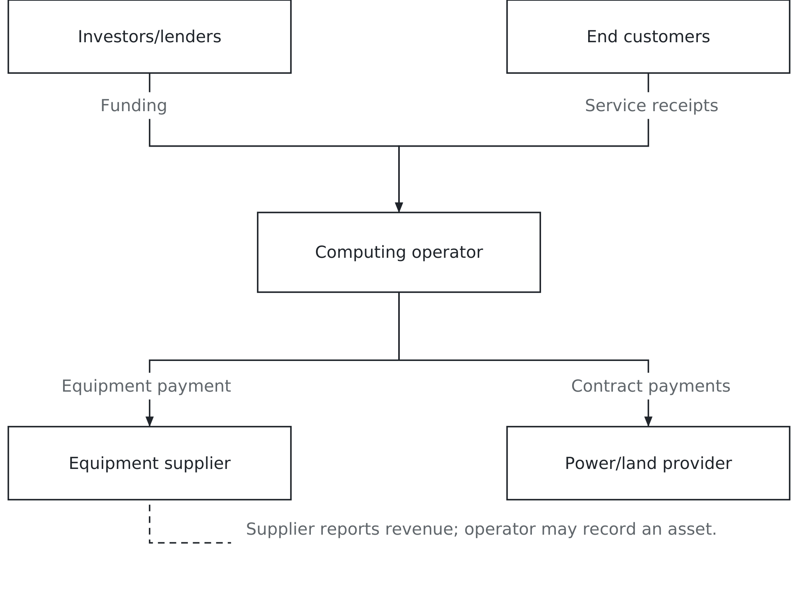

# Chapter 9. Reading the money

## A number that doubled every hundred days

In the late 1990s, a striking claim circulated through the telecommunications industry: internet traffic was doubling every hundred days.

Work out what that implies. Continue that rate for three 365-day years and the increase is nearly two thousandfold. A network carrying one unit at the beginning would need to carry nearly two thousand at the end. If you accepted that forecast, building more capacity could feel less like a risk than failing to build it.

The claim was not a dependable description of growth throughout the boom. Research published by the Federal Reserve Bank of Richmond describes its persistence, the difficulty of measuring traffic and the existence of contrary forecasts. A rapid growth rate observed for a short period was not a sound basis for assuming the same pace indefinitely. [Couper, Hejkal and Wolman, *Boom and Bust in Telecommunications*](https://www.richmondfed.org/~/media/richmondfedorg/publications/research/economic_quarterly/2003/fall/pdf/wolman.pdf).

Apply the questions from Chapter 6. What was counted: traffic on which networks, measured how, over what period? Who produced the number, and what were they selling? What was it constructed to do: describe the world, or persuade someone to finance a network?

Then add the question this chapter is about. Even if usage grows, who collects enough money to recover the investment?

A forecast about the quantity of data is not yet a forecast about revenue. Neither is a forecast about revenue a forecast about profit. The distinctions sound obvious when you separate them. During an investment boom, they can disappear inside one exciting story.

## What the money built

Companies including Global Crossing and Level 3 built long-distance fibre networks. The sector's investment surge was followed by a sharp contraction and numerous bankruptcies. Changing technology, competition, regulation and uncertain forecasts all formed part of the story. The Richmond Fed researchers do not treat one misleading traffic claim as a complete explanation, and neither should we.

Imagine the decision facing a network builder. Customers want more capacity. Equipment is improving. Competitors are announcing routes. Waiting might leave your company behind. Building might leave it with more capacity than customers will buy at the price your financing assumes.

The second risk does not disappear because the first one is real. Nor does a competitor's announcement establish that the competitor has better information. Several firms can independently commit to serving much of the same expected market.

The result can be useful infrastructure and disappointing returns at the same time. Some assets may remain valuable after their original owner fails. A later buyer who pays much less faces a different financial problem from the company that paid to build them.

That does not mean all the assets are fine, all investors lose, or every failed project was merely early. Location, maintenance, technical suitability and the price paid still matter. The lesson is narrower and more useful: society's adoption of a technology does not guarantee a return to the companies financing it.

Chapter 7 showed why physical networks matter. Chapter 8 showed how a commitment can survive a disappointing forecast. Now follow the money far enough to see which business has made which promise.

## More use, less revenue

Consider a fictional service provider selling a standard unit of network capacity. In one period it sells 1,000 units for $10 each. Revenue is $10,000. In the next period it sells 2,000 units, but competition has pushed the price down to $4. Revenue is $8,000.

Use doubled. Revenue fell by one-fifth.

Nobody needs to stop using the technology for this to happen. The provider can acquire more customers and carry more work while receiving less money in total. Being right about adoption and wrong about revenue is a specific business failure, not a contradiction.

Whether profit falls depends on costs as well. Suppose cash operating costs are $7,000 in each period. The amount remaining before equipment spending, depreciation, financing and tax falls from $3,000 to $1,000. If costs fell sufficiently, the provider could still improve its result. The price decline alone does not settle the question.

Now suppose the company borrowed to build capacity and has payments due. More traffic will not satisfy the lender unless it produces enough cash at the right time. A forecast can be correct about the eventual market and wrong about the date on which the business can afford its obligations.

Those are the relationships worth carrying into the next technology boom: volume, price, costs, investment and timing. An impressive chart of one does not stand in for the other four.

## Follow the payment

The same structure applies to computing equipment, data centres, power and land. Figure 9.1 separates funding the business from buying its output.

*Figure 9.1 — Follow the payment. Supplier sales do not establish that the buyer will earn a return.*

Investors or lenders supply funds to a computing operator. The operator pays equipment suppliers and makes payments for power and premises. End customers pay for computing services. Those customer receipts are what must eventually support the operation and justify the investment.

The equipment supplier can complete a successful sale before the operator has established a successful service business. One company's revenue can therefore rise while its customer's future return remains uncertain. That is not necessarily suspicious. It is how building a business often works. It becomes a problem when evidence of equipment sales is treated as proof that demand for the finished service is already sufficient.

Keep investment valuation separate from these payments. A rise in a supplier's share price does not automatically put new cash into the operator's bank account. New funding requires an actual financing transaction. Reported earnings also are not a cash payment to investors unless some payment, such as a dividend, occurs.

This is why the arrows matter. A diagram that labels everything “growth” hides the question we need it to answer. Who paid whom, for what, and what still has to happen for the next payment to be made?

The picture is simplified. Some operators generate their own funding from existing businesses. Some rent equipment or premises. Some suppliers help finance purchases. You can add those relationships when they matter, but each arrow should still identify a real transaction rather than an optimistic interpretation.

## One purchase, two sets of accounts

Here is a small fictional computing operator. It buys equipment for $100,000 in cash at the start of the year and puts it into service immediately. Assume a straightforward completed sale: the supplier has delivered what it promised and recognises $100,000 of revenue. The supplier's profit is a different number because it also incurred costs.

For the operator, the equipment is an asset expected to support work over several years. The $100,000 purchase is capital expenditure, often shortened to capex. The cash leaves now, while the equipment's cost is allocated to expense over its expected useful life through depreciation.

During the year, the operator provides services and collects $50,000 from customers. It pays $30,000 in cash operating costs. For this example, all service revenue is collected in the same year, all operating expenses are paid, and there are no taxes, financing costs or other transactions. The equipment has no expected value at the end of its useful life.

Before considering the equipment purchase, the operator has generated $20,000 in cash: $50,000 received minus $30,000 paid. Including the $100,000 purchase, it has a first-year cash shortfall of $80,000. It needed financing or existing cash to cover that gap.

Now calculate accounting profit. If the equipment's cost is spread evenly across five years, annual depreciation is $20,000. Revenue of $50,000 minus $30,000 of operating expense minus $20,000 of depreciation gives zero profit.

There is no contradiction between zero accounting profit, $20,000 of cash generated before capital spending and an $80,000 cash shortfall after buying equipment. Each number answers a different question. The supplier's $100,000 revenue answers another one again.

You can find those questions in three financial statements. The income statement reports revenue and expenses over a period. The cash-flow statement reports cash movements. The balance sheet records assets, obligations and owners' equity at a date. The notes explain important accounting policies and estimates. [SEC's guide to financial statements](https://www.sec.gov/investor/pubs/begfinstmtguide.htm).

For this operator, start with the customer receipts, equipment payment and depreciation assumption. You do not need to master an entire annual report before following this one purchase through the business.

One assumption deserves a second look before you open a real report: customers paid during the year. Suppose the operator earned the same $50,000 of service revenue but collected only $40,000. The remaining $10,000 is still owed by customers. Assume it is collectible and nothing else changes. Under the five-year equipment life, accounting profit remains zero, while cash generated before capital spending falls to $10,000.

The unpaid amount is a receivable, an asset representing what customers owe. It is not cash available to pay a supplier today. The manager should ask when it is due and whether customers are paying as agreed. Growing revenue accompanied by slower collection creates a different problem from falling sales, even if both leave the bank account short. Linking the sales record to the collection record makes that distinction visible.

## An assumption changes profit

Suppose the same equipment were expected to remain useful for ten years instead of five. Using straight-line depreciation, which allocates equal amounts each year, the annual expense would be $10,000. Figure 9.2 compares those assumptions from the equipment's first year of use.

*Figure 9.2 — An assumption changes profit. Changing estimated life changes depreciation, not the receipts or cash operating costs in this example.*

| Assumed life | Annual straight-line depreciation | Annual accounting profit | Cash before capital spending |
|---|---:|---:|---:|
| 5 years | $20,000 | $0 | $20,000 |
| 10 years | $10,000 | $10,000 | $20,000 |

The equipment cost is $100,000 in both rows. Annual receipts are $50,000 and cash operating costs are $30,000. No tax, financing cost or residual value is included. These are hypothetical alternatives, not reports from a real company.

Under the longer assumed life, annual accounting profit is higher. The cash generated before capital spending is unchanged. So is the original equipment payment. An accounting estimate changes when the cost appears as an expense; it does not send a new customer through the door.

That does not make a longer estimate dishonest. Equipment may remain useful longer than originally expected. A shorter estimate may also become necessary. The question is what operating evidence supports the estimate and whether the accounts explain its effect. A later revision to an existing estimate requires its own accounting treatment; this table compares two initial assumptions, not a midlife change.

WorldCom belongs here as a warning about a different problem. Its investigation documented operating line costs improperly recorded as assets, inflating reported income. That is not equivalent to every defensible revision of an asset's useful life. [WorldCom investigation report filed with the SEC](https://www.sec.gov/Archives/edgar/data/723527/000093176303001862/dex991.htm).

Keep the distinction. A financial statement contains estimates that deserve examination. Evidence of an estimate is not, by itself, evidence of fraud. Equally, calling something an accounting choice does not make an unsupported treatment acceptable.

## Buying equipment is not renting a service

The original operator bought and owns equipment. Another business might pay a provider for computing as it uses it. That service payment is not automatically the customer's purchase of a physical asset. The provider may own the equipment and record the investment in its own accounts.

Suppose an otherwise comparable operator pays $24,000 for a year's computing service instead of buying the $100,000 equipment. Assume the service meets the same needs for that year and is an expense as consumed. With $50,000 in receipts and $30,000 of other operating costs, it has a $4,000 loss and a $4,000 cash shortfall for the year, under the same simplified timing assumptions.

Renting requires less initial cash in this example but leaves no owned equipment at year-end. That does not make it inherently better or worse. The manager must compare the useful years expected, service terms, flexibility and future charges. Real leases and mixed contracts may receive different accounting treatment; read the agreement and the company's policy rather than categorising by a sales label.

This distinction also matters when comparing companies. A customer shifting from owned equipment to rented services could reduce its capex while still using more computing. The provider might increase its own equipment spending to supply it. Looking only at the customer's capex would miss the work moving between organisations.

The information system has not become free. Its costs, responsibilities and commitments have been rearranged.

## Cash is patient. Debt has dates.

Financing changes how long a business can wait for demand. A loan normally brings payment obligations; investment by owners does not normally carry the same scheduled repayments. Existing cash gives a company room to act, but that room has a limit and other uses.

Return to the operator generating $20,000 a year before capital spending. If it must repay $25,000 of loan principal during the year, those receipts alone do not cover the repayment, even before interest or new equipment. Principal repayment uses cash but is not the same as an operating expense. The schedule matters as much as the total debt.

A company can also use cash from another profitable business to fund expansion. That may allow it to wait longer than a borrower with little income. It does not establish that the new investment earns an acceptable return. The existing business could weaken, and the money could have been used elsewhere.

Vendor financing adds another relationship: the equipment supplier helps fund the customer's purchase. That can support a useful sale, but it leaves the supplier exposed to the buyer's ability to pay. Ask whether customer receipts eventually support the transaction or whether continued sales depend on further financing.

A manager should therefore ask two questions separately. Does the proposed service appear economically worthwhile? Can the company meet its commitments while finding out? A promising project can fail the second test. A well-funded project can continue for years while failing the first.

The answer can change the size or timing of the purchase. The operator might add equipment in stages, tying the next order to paid demand rather than enquiries. That preserves cash but risks being unable to serve a sudden increase in customers. Ask operations how quickly capacity can be added and sales which commitments customers will actually make. The financial calculation becomes useful when it changes a decision about the work.

## What can wait for demand?

The fibre analogy is useful, but only if you inspect the asset. A route, a building, a power connection and a processor do not have identical working lives or alternative uses.

A processor can keep functioning while becoming expensive to operate relative to newer equipment. That is economic obsolescence, not necessarily physical failure. The older equipment may still serve less demanding work, but someone must be willing to pay enough for that work.

A building may last much longer and still be unsuitable for a different customer without costly changes. A power connection may be valuable, but its location and contractual conditions matter. Do not assume that a long physical life guarantees a recoverable investment.

Ask what happens if customer demand arrives later or in a different form. Can the asset be reused, sold or adapted? What additional spending would that require? Which commitments remain while it waits? Those questions make the telecom comparison useful without assuming that computing hardware behaves like buried glass.

They also connect the forecast to the depreciation estimate. If the investment case assumes that equipment will earn revenue for a decade, operations should be able to explain what work it expects that equipment to perform during the later years. A spreadsheet's useful life should have a business explanation behind it.

## Your instrument panel

Start with three relationships, not a page of ratios.

First, compare use with receipts. Are more customers paying, or are existing customers doing more work at lower prices? Does increased activity require more support and electricity? The fictional volume example showed why adoption alone does not settle revenue or profit.

Second, compare cash generated with spending and obligations. Equipment purchases, loan repayments and long-term commitments can require cash that current operations do not provide. Identify what funds the gap and how long that source is expected to remain available.

Third, compare the asset's expected earning life with its accounting life. Look for the evidence behind depreciation assumptions and the cost of replacement. A favourable change in reported profit deserves an explanation, not automatic celebration or suspicion.

Supplier sales and buyer spending are useful cross-checks, but their published growth rates need not match. Reporting periods, customer groups, products, intermediaries and the timing of delivery differ. A supplier's data-center revenue is not necessarily the same set of transactions as several buyers' announced total capital budgets.

These are information-management questions as well as accounting questions. Sales records describe orders and receipts; operations records describe use; purchasing records describe equipment and commitments; finance combines them under reporting rules. Somebody must reconcile the definitions and dates before the numbers can support a decision.

The purpose is not to declare an entire industry a success or a bubble from one quarter. It is to identify which part of an investment story is supported, which part remains a forecast and what evidence would change the decision.

## Your turn

Begin with the fictional operator, so the method does not depend on finding a convenient annual report. Assume the five-year equipment life. Next year's collected service revenue falls from $50,000 to $40,000, operating cash costs remain $30,000, and there is no new equipment purchase, tax or financing cost. Calculate accounting profit and cash generated before capital spending. Explain why those numbers differ.

Now assess a proposal to buy another $100,000 of equipment. The sales team points to rising usage and the supplier's strong sales. State what additional evidence you need about paying customers, prices, operating costs and financing before approving the purchase. Neither claim is irrelevant, but neither completes the case.

Include customer payment timing in your explanation.

Then, if assigned, choose one listed company at a point on Figure 9.1. Use its own annual report. Find revenue in the income statement, cash from operations and equipment purchases in the cash-flow statement, and useful-life assumptions in the notes. Record the reporting period and exact labels. If a figure is not separately disclosed, say so rather than inventing it.

Write two short paragraphs. In the first, describe what you would expect to observe if customer receipts increasingly support the investment. In the second, describe what you would expect if use grows but prices, costs or commitments prevent satisfactory returns. Be specific about which reported line or operating measure you would examine, and say what would change your mind.

Revisit those paragraphs later. You may not get a verdict in a semester; these investments take time to unfold. What you can get is evidence about your reasoning from a version of yourself who did not yet know the result.

The habit is worth more than memorising the next spectacular spending announcement. Follow the payment, distinguish the measure, and ask whether the customer pays enough, for long enough, to justify what was built.

## Sources and example notes

The operator calculations are hypothetical, with their assumptions stated. Profit, cash flow and investment are different measures. The WorldCom discussion concerns improper accounting; it is not equated with a legitimate revision of an asset’s estimated life.

