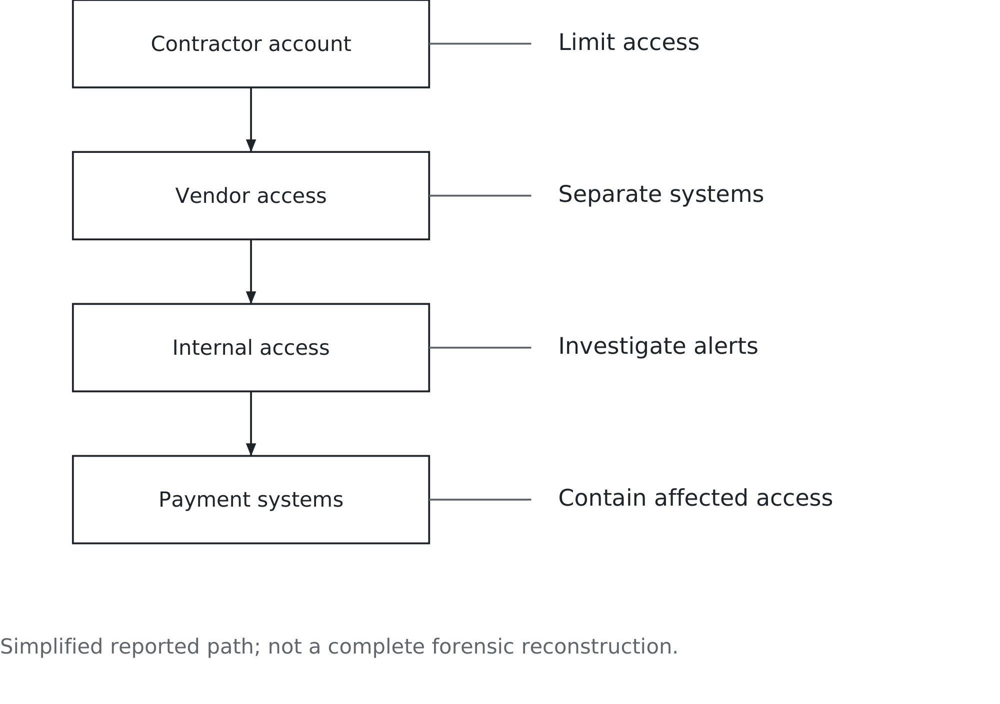

# Chapter 10. What happens when someone attacks it

## A contractor's account in Pennsylvania

Fazio Mechanical Services was a Pennsylvania heating and air-conditioning contractor. Its connection to Target was ordinary business: a supplier needed access to work with its customer.

The reported path into Target in 2013 began with credentials stolen from that contractor. A Senate staff analysis described a suspected phishing compromise, movement into more sensitive systems and malware on payment terminals. The report drew on public reporting and explicitly acknowledged that the forensic picture was incomplete. It also identified apparently missed warnings. [Senate staff analysis of the Target breach](https://www.commerce.senate.gov/wp-content/uploads/media/doc/2014%200325%20Target%20Kill%20Chain%20Analysis.pdf).

Phishing uses a deceptive message to persuade someone to reveal information or take a harmful action. Imagine an apparently familiar supplier asking you to change its payment details or sign in through a supplied link. This is a separate illustration, not an additional claim about Target. Verify the request through an independently known contact route, rather than the details in the message. Report suspicious messages promptly through the organisation's normal channel. The business needs a workable reporting process as well as employees who recognise the risk.

Target disclosed exposure of approximately 40 million payment-card accounts and, separately, personal information concerning up to 70 million customers. Those are different populations that may overlap; adding them does not establish a count of unique people.

The business connection is the thing to notice. The contractor needed access for a purpose. That did not justify access to everything valuable inside the retailer. A valid account can be used by the wrong person, and a legitimate business relationship can become a route for an attacker.

Figure 10.1 simplifies the reported path. It marks several places where controls matter, rather than pretending that one decision explains the whole incident.

*Figure 10.1 — Where access can spread. Several controls can interrupt a path; valid credentials do not justify unrestricted access.*

You do not need to know how to write malicious software to recognise the managerial question. What can this account reach, why does it need to reach it, and who checks that the answer remains true?

## The detail that should bother you most

The Target report suggests that warnings were available before the attack was stopped. That is different from proving that every warning was clear, every security tool worked perfectly or one employee could certainly have prevented the breach.

It is still an uncomfortable finding. Buying detection technology does not establish that the organisation can respond to what it detects. Detection without response is an expense, not a defence.

An alert has to enter a process. Someone reviews it, assesses its significance, asks for help if necessary and reaches a person who can authorise action. If that chain breaks, the existence of the alert is poor comfort afterwards.

Technical design and organisational design belong together here. The tool must produce useful information. The team needs enough context to interpret it. Managers must decide who can interrupt a service and how urgent cases get past ordinary queues. None of those pieces substitutes for the others.

Imagine an overnight analyst seeing a suspicious supplier login. The analyst may need to know whether work was scheduled, which systems the supplier can reach and whom to call. If those answers live in an unavailable manager's memory, the response problem began before the alert arrived.

The question is not how to guarantee perfect judgement from every employee. It is how to make a sensible action possible when information is incomplete and time matters.

## What access are you approving?

Take a fictional distributor hiring a contractor to maintain warehouse refrigeration. The contractor needs to view equipment status and submit service reports. It does not need customer payment records or permission to change dispatch orders.

Give the account the access required for that work and no more. This is least privilege. It concerns what the account can do after login, not simply whether the password is difficult to guess.

Use named accounts so activity can be connected to a person, and an additional sign-in check where appropriate. Multifactor authentication uses more than one kind of evidence to establish identity. It can reduce some account-compromise risks, but it does not correct excessive permissions after a successful login.

Keep the maintenance systems separated from unrelated business systems. Segmentation creates boundaries that limit which systems can communicate or be reached. Its value depends on the actual permissions and connections across those boundaries, not the fact that someone drew separate boxes.

Set an end date and name a business owner for the access. When the maintenance agreement ends or a contractor's employee changes roles, somebody must tell the administrator what to remove. An account that was appropriate in January can become unnecessary in June without changing its password or software.

Suppose a repair needs extra access on Friday evening. An exception may be justified. Record what is added, who approved it, when it expires and who confirms its removal. A temporary exception should not quietly become next year's normal arrangement.

The business owner defines the work. Technical staff configure and verify the controls. Purchasing ensures the supplier's obligations are clear. The contractor tells the distributor when its authorised people change. Security is part of how the relationship operates, not a certificate filed once at onboarding.

This is third-party risk: exposure arising through another organisation. The useful question is what access and dependence the relationship creates, and how the organisation manages them throughout its life.

## What a breach costs the business

A breach can create investigation and recovery work, customer support, legal claims and lost trading time. Some costs appear quickly in invoices. Others appear in diverted staff effort, delayed projects or the work needed to regain confidence.

Do not add every published settlement, estimate and insurance figure into one impressive total. They may overlap or cover different periods. Chapter 9's distinction between measures applies here too: an expense, a cash payment, lost revenue and a reputational judgement are different things.

The consequences also reach outside the organisation. A customer may need to replace a card or monitor an account. A supplier may lose access it needs to provide service. Staff may spend days answering questions while trying to keep ordinary work moving.

Keep three kinds of harm separate. Confidentiality concerns who can see information. Integrity concerns whether information remains accurate and protected against unauthorised change. Availability concerns whether people can use the service when they need it. An incident can affect one, several or all three.

For the distributor, stolen customer details, altered delivery addresses and an unavailable dispatch application require different checks. Restoring the application addresses availability; it does not prove that nobody copied information or changed an order. This is why the business should describe the work and records it needs to trust, rather than report only that the computers are running again. The response team needs to know which kind of harm it is trying to limit.

If you approve vendors, grant access, manage customer information or decide which service can stop, you are already part of this. The security team brings essential expertise. It cannot make every business priority or operational tradeoff on everyone else's behalf.

That is why the incident needs clear authority. Someone must coordinate the technical response with operations, customer communication and the organisation's obligations. A room full of advisers is not the same as a decision process.

## Now the version with no attacker

On 19 July 2024, a CrowdStrike content update caused failures on affected Windows systems. The company described a defect in the update process, not a cyberattack. [CrowdStrike's preliminary incident report](https://www.crowdstrike.com/en-us/blog/falcon-content-update-preliminary-post-incident-report/). Microsoft estimated that approximately 8.5 million Windows devices were affected. [Microsoft's July 20 account](https://blogs.microsoft.com/blog/2024/07/20/helping-our-customers-through-the-crowdstrike-outage/).

The distinction matters. Target's case concerned hostile access and theft. CrowdStrike's outage showed that software intended to protect systems could itself interrupt them. A security product is still software, with its own dependencies and failure modes.

The lesson from Chapter 7 returns without needing to repeat its stories. A shared component can affect many services at once. The number of systems depending on it, and how widely a failure can spread, determine the consequences.

That reach is sometimes called the blast radius. It is useful language if it leads to a concrete question: which business functions can fail together, and which alternatives remain available?

Ask how changes are tested, how deployment is controlled and what recovery requires if machines cannot start normally. A fallback that uses the same affected software may fail alongside the primary system. The same applies to the tools staff need to investigate the incident.

These questions do not imply that every organisation can independently control every supplier update. They establish what it can control, what it must confirm with a supplier and what recovery arrangements it needs for the remaining dependency.

## Two in the morning

It is two in the morning. Systems are failing, one after another. You have fragments: a monitoring alert, a message from a technician, a customer complaint. It might be a bad update, a configuration error, failed equipment or someone who got in.

You need to restore useful work and avoid making the incident worse. Those aims can pull against each other, but they do not create a universal choice between restoring service and containing an attack. The response team may isolate affected systems while continuing critical work elsewhere.

An indiscriminate restart can remove useful evidence or return a compromised system to service. An indiscriminate shutdown can create unnecessary operational harm. The right intervention depends on what is affected, what is known and what can safely continue.

Incident response is the coordinated work of preparing for, investigating, containing and recovering from incidents, while learning from them. Current NIST guidance places that work within broader risk management, rather than treating it as a plan opened only after a crisis begins. [NIST SP 800-61 Revision 3](https://csrc.nist.gov/pubs/sp/800/61/r3/final).

Preparation should settle who leads, who can authorise disruptive actions and how people communicate if normal channels are unavailable. It should also establish how technical specialists preserve relevant evidence and how operational owners decide whether a recovered service is usable.

Legal and communications staff have work to do before every fact is known. Applicable reporting obligations depend on the organisation, incident and jurisdiction; there is no single clock for every case. They should establish the relevant duties and communicate verified facts without inventing a cause or claiming the problem is over prematurely.

Waiting for certainty is itself a decision with a cost. So is acting on a confident explanation that has not been tested.

## The first hour: a decision you can practise

Return to the fictional distributor. It is 2:00 a.m., and you are the manager responsible for overnight operations. This is a tabletop exercise: a discussion of decisions, not an instruction to change a real system.

Two dispatch computers cannot open the order application. A monitoring alert reports unusual activity involving a contractor account. A software update was installed earlier that evening. The team does not yet know whether those events are connected.

Orders continue arriving through a separate service. The next dispatch begins at 3:00 a.m. Pausing it for an hour is estimated to cost $6,000 in additional handling and delivery charges. That figure is a fictional planning estimate, not a complete measure of potential harm.

A printed dispatch list exists from midnight. It lacks subsequent changes. A recovery copy of the application data is available, but nobody has yet established whether it predates the incident or whether restoring it would remove useful evidence. The security lead and operations supervisor can join a call now.

Your first decision is what to protect and what to permit while they investigate. You do not yet know whether customer information has been exposed, whether orders were altered, or whether other systems are affected. Write those as unknowns. The absence of confirmation is not confirmation of safety.

One defensible response is to have the technical team contain the suspicious access and affected computers, preserve relevant records, and hold dispatch while operations checks whether the printed list can be safely reconciled. Another may allow a limited, verified subset of orders to proceed through an independent fallback. Each requires evidence that its scope and dependencies fit the situation.

Figure 10.2 helps organise the choices. Several can happen together. Restoration is a later step in some circumstances; the table is not an instruction to restore immediately.

*Figure 10.2 — Decisions before certainty. Coordinate containment and continuity; a single diagnosis is not a prerequisite for every protective action.*

| Choice | Business benefit | Risk to check |
|---|---|---|
| Isolate affected systems | Limit spread | Service interruption |
| Use approved fallback | Continue critical work | Shared dependencies |
| Restore from known-good state | Recover service | Reinfection and evidence loss |
| Preserve evidence and escalate | Support investigation | Time and resource needs |

The point is not to choose the row that sounds most cautious. It is to explain which action fits the evidence, who will carry it out and what new information would change it.

For example, record: “2:10 a.m.: hold dispatch pending validation of the order list; operations supervisor to report at 2:25; security lead checking scope and suspicious access.” This is an illustrative entry, not a prescribed timeline. It identifies a decision, an owner and a review point. Add the reason, expected operational cost and unresolved question.

Now introduce a new fact. At 2:20, the supplier confirms a faulty update can cause the observed application failure. Does that explain the contractor alert? Not necessarily. You have better evidence about one symptom, not proof that every event has the same cause. Decide what can change and what still needs investigation.

## Recovery is a business test

Suppose technical staff restore the application in an isolated environment and complete their agreed checks. The login screen appears. Is the distributor ready to resume dispatch?

Operations still needs to confirm that the records support the work. Does the restored data contain the latest valid orders? Were any orders handled during the interruption? Could the same shipment now be sent twice? Technical recovery and business recovery meet at those questions.

The midnight printout in the exercise is not automatically a safe fallback because it is on paper. Its age matters. So does the process for checking changes and recording any work completed manually. A fallback can preserve availability while introducing errors into the data.

Before normal operations resume, assign responsibility for reconciling that work. Record what was recovered, what remains incomplete and what staff should watch for. The technical team should also establish how renewed suspicious activity will be detected and escalated.

Apply Chapter 7's continuity test to recovery: authorised staff must demonstrate that people can use the restored records, with the necessary permissions.

Afterwards, review the decisions using what people knew at the time. If the contractor alert proves unrelated, that does not automatically make temporary containment a mistake. Ask whether the action was proportionate to the evidence and consequences, and what would improve the next decision.

The best lesson may be a small change: a clearer access owner, an independent contact list, a tested restoration step or a rule for escalating an alert that nobody can explain. A report that names a lesson without assigning the work has not finished the job.

## You are part of the surface

Attack surface means the accounts, devices, connections and services through which an attacker may try to reach the organisation. It includes technical weaknesses and access created for ordinary business work. Not every connection is dangerous, but every connection deserves a purpose and an owner.

Lateral movement means moving from an initial foothold to other systems or accounts. The Target example shows why limiting that movement matters. The business may need a supplier relationship without needing unrestricted connections between the supplier's work and sensitive operations.

You are unlikely to configure every control yourself. You may decide what a supplier needs, approve an exception, notify someone that an employee has left or choose which customer service must continue during an incident. Those are security decisions expressed in business language.

The question is not whether this belongs to IT or management. It is how their decisions fit together, before a valid account reaches the wrong place or a familiar service stops working.

## Your turn

Use the distributor exercise to write a short first-hour decision log. Separate known facts from assumptions. Choose an initial action, identify its business cost, name the responsible role and state when or on what evidence you would reconsider it. Explain how the supplier's update message changes your decision without resolving unrelated questions.

Then map access you legitimately hold for an employer, university or club, using system names and purposes only. Do not include passwords or attempt to use old accounts to test them. For one account, identify its owner, the work it supports and how removal should be triggered when the work ends. Report uncertainty through the organisation's normal channel.

Finally, revisit Target or CrowdStrike. Identify two interventions that could have reduced the harm, the roles needed to make them work and the limits of what the public account lets you conclude. Avoid inventing a single perfect moment when someone certainly could have prevented everything.

The person deciding what a supplier can reach, what an alert is worth interrupting work for, or when a recovered service is ready may have a business degree. The job is to make the next defensible decision, and to build an organisation in which that decision can be carried out.

## Sources and example notes

The Target account follows a Senate staff analysis that acknowledged an incomplete forensic picture. Card accounts and affected people may overlap. The CrowdStrike device count is an attributed estimate. The distributor incident and phishing message are fictional. The practical message-verification guidance follows [NIST’s phishing guidance](https://www.nist.gov/itl/smallbusinesscyber/guidance-topic/phishing); coursework does not require testing systems.

