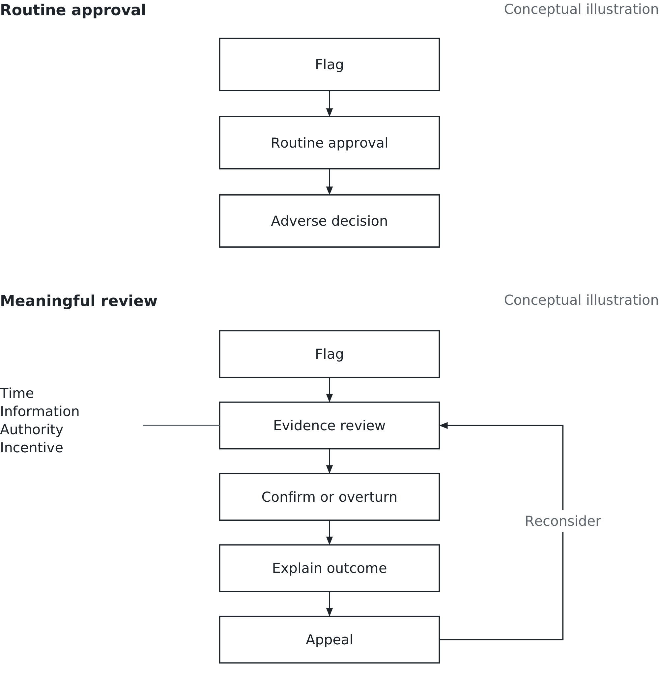

# Chapter 12. Who decides?

## A government takes responsibility

Imagine being told to repay childcare support your family has already spent. You believe you followed the rules. The organisation says you did not. You submit an explanation, but the demand remains. How do you challenge a decision when the institution making it will not properly reconsider?

That opening situation is illustrative. The Dutch childcare benefits scandal was real. Thousands of parents were wrongly labelled as fraudsters and subjected to disproportionate sanctions. The consequences included financial hardship and emotional distress. The December 2020 parliamentary report was titled *Unprecedented Injustice* (*Ongekend onrecht*). On 15 January 2021, Prime Minister Mark Rutte offered the cabinet’s resignation. [Parliamentary account](https://www.tweedekamer.nl/nieuws/kamernieuws/eindverslag-onderzoek-kinderopvangtoeslag-overhandigd); [Royal House announcement](https://www.koninklijkhuis.nl/actueel/nieuws/2021/01/15/minister-president-biedt-koning-ontslag-kabinet-aan).

It is tempting to make this a story about an algorithm that brought down a government. That explanation is too small. The scandal involved discriminatory treatment, harsh administration and failures of oversight. The role of scoring systems needs to be examined within that larger institutional failure, not made to explain every decision and every harm.

For a business student, the central question is direct. What happens when an organisation becomes better at identifying people for scrutiny than at listening to evidence that it is wrong?

Chapter 11 asked what a company should be allowed to infer. This chapter asks who decides what happens to a person after an inference has been made.

## The human in the loop

A model flags a case. A person reviews it. The organisation makes a decision.

That description sounds reassuring. It leaves out almost everything we need to know about the review.

Can the reviewer see the evidence behind the flag? Can the person affected supply missing information? Can the reviewer change the result, or only recommend that somebody else consider changing it? Is there time to investigate, or does the daily target assume every case takes a minute?

Consider two possible arrangements. In the first, the reviewer sees a score, clicks approval and sends the case onward. In the second, the reviewer examines relevant evidence, can confirm or overturn the proposed action, explains the outcome and provides a route to appeal. Both arrangements contain a human step. Only the second describes an opportunity for meaningful judgement.

*Figure 12.1 — A reviewer who can disagree. A human step protects people only when it permits an informed, consequential challenge.*

Here is the rule worth carrying. A human in the loop is only a safeguard if that human has the time, the information, the authority and the incentive to disagree. Remove one and you risk automating the decision while keeping a person available to blame.

Time means enough room to examine a disputed case. Information means relevant records, reasons and limitations, not just a coloured warning. Authority means the ability to change or pause an outcome. Incentive means that a justified disagreement counts as good work rather than a failure to process the queue quickly.

These are operating conditions, not four words to add to a policy. A manager can inspect each one. Ask a reviewer to describe a recent disagreement, what evidence changed the conclusion and what happened next. An organisation that cannot find an example should investigate why.

This comparison is a general design lesson, not a reconstruction of every Dutch benefits case. We do not need to assume that every official rubber-stamped a score to recognise why a safeguard must work in practice.

## An accurate system can still flag the wrong people

Consider a fictional online retailer reviewing 1,000 refund requests. A model flags requests for possible fraud. For this teaching example, assume a later, independent investigation establishes which requests actually involved fraud. Real organisations may find that much harder to establish.

The results are below. These are invented numbers, not data from the Dutch case.

| Model result | Actual fraud | No fraud |
|---|---:|---:|
| Flagged | 20 | 80 |
| Not flagged | 30 | 870 |

*Figure 12.2 — An accurate system can still flag the wrong people. Inspect who bears the errors, not only the overall accuracy. Fictional data, not the Dutch case.*

The model makes 890 correct classifications: 20 fraud cases flagged and 870 legitimate requests left unflagged. Its overall accuracy is 89%.

Now read the first row. Of the 100 flagged requests, only 20 involve fraud. If the company automatically refuses every flagged refund, 80 legitimate customers are refused. The 89% headline does not tell a customer what a flag means. In this example, only 20% of flags are correct.

A false positive is a legitimate request flagged as fraud. There are 80. A false negative is fraud that the model fails to flag. There are 30. Both matter, but they create different consequences for different people.

There is another useful comparison. A rule that never flagged anybody would classify 950 of these 1,000 requests correctly, an accuracy of 95%. It would also miss every fraud case. That does not make doing nothing a good policy. It shows why accuracy alone is a poor way to choose the policy.

The model finds 20 of the 50 fraud cases while concentrating review on 100 requests. That could be useful. Whether it is useful enough depends on the review cost, the losses it helps prevent, the mistakes it introduces and the alternatives available. The question is what decision the score improves.

Suppose each flagged request takes 15 minutes to review. Reviewing all 100 takes 25 staff hours. Suppose the manager provides only 10 hours. At that pace, the team can examine 40 requests, leaving 60 waiting. These are hypothetical workload assumptions, but the management problem is concrete: the staffing plan does not support the promised review.

The manager could provide more capacity, change how cases are prioritised or reconsider which actions require a hold. Each choice changes cost or risk. Quietly instructing reviewers to click faster changes the safeguard while leaving its name intact.

There is no single error rate that makes every use acceptable. A flag that asks for one missing detail differs from a flag that freezes money for weeks. Evaluate the action attached to the score, including how long its consequences last.

If the model produces a risk score, the organisation also chooses a threshold: the point above which a case is flagged. Lowering that threshold generally sends more cases to review. Among them may be fraud previously missed and legitimate requests previously left alone. Raising it reduces the queue but can leave more fraud unexamined. This table shows only one threshold; it cannot tell us the results at another.

That threshold is therefore a business choice informed by evidence, not merely a setting for the technical team. Ask for comparisons showing errors and workloads at plausible alternatives. A higher threshold that fits the staff budget may still expose the company to unacceptable losses. A lower one that catches more fraud may overwhelm review and turn a temporary hold into a prolonged refusal.

The organisation must also decide what counts as a successful review. Closing 100 cases is an activity measure. Resolving legitimate refunds promptly while identifying evidenced fraud is closer to the intended outcome. Counting activity is easier, which is precisely why the distinction needs a manager's attention.

## A reviewer who can change the outcome

Stay with the fictional retailer. A customer, Maya, requests a refund for an undelivered order. The system flags her request because it resembles a repeat claim. Company policy routes flagged cases to review before refusing them.

The reviewer can see the order history, delivery evidence and the reason for the flag. The records show two entries for one shipment after a replacement order was created. What looked like two claims may concern one unresolved delivery. The reviewer asks for the missing delivery confirmation and checks the entries together.

Suppose the evidence establishes that the order was not delivered. The reviewer authorises the refund, records the reason for overturning the proposed refusal and sends the duplicate-record issue to the team responsible for order data. The customer receives an explanation of the outcome.

The safeguard is the entire arrangement. The reviewer had evidence, time to examine it, permission to approve the refund and a way to report the underlying problem. Merely assigning a person to the case would not have supplied any of those things.

Now change one condition. Suppose only a supervisor can overturn the proposed refusal, and the supervisor checks the queue once a week. The reviewer can disagree, but cannot provide timely relief. Authority exists somewhere in the organisation; it is not available where the decision needs it.

Or suppose reviewers are measured only by requests closed per hour. A quick refusal looks productive. A careful correction looks slow. The organisation is paying for the behaviour it later says it regrets.

The manager should measure both completed work and its quality. Sample decisions for evidence, track waiting time, examine successful challenges and ask whether particular kinds of cases repeatedly go wrong. Do not impose a target number of overrides. A reviewer who changes results merely to meet a target is no more independent than one who never changes them.

This is also why “keep a human involved” is not a complete answer. People can make mistakes, act inconsistently or bring their own prejudices. Review needs clear criteria, appropriate training and examination of its results. Human judgement is something to support and evaluate, not a guarantee to announce.

What if the evidence remains inconclusive? The reviewer needs an option other than declaring either fraud or innocence without support. The case could require further evidence or escalation under an agreed policy. Record what is known, what remains uncertain and when somebody will revisit it. Otherwise “pending” can become a permanent decision without anyone choosing it explicitly.

This uncertainty also belongs in the data. A customer who abandons a difficult refund process has not thereby admitted fraud. If the company records every abandoned request as a successful fraud detection, it can improve its reported results by making the process harder to complete. The resulting number would reward the obstruction and could mislead the next model trained on it.

## What the historical record really records

It is tempting to say a model is biased and leave it there, as though bias were a defect somebody could always locate in a line of code. The more useful question is what the model was taught to recognise.

Suppose a fictional investigation team historically concentrated on one group of claims. It found more confirmed problems there because it looked there more often. In other groups, many cases were never examined. If a new model treats uninvestigated cases as proven clean, the training record mixes evidence of behaviour with evidence of where the organisation chose to look.

That is one possible mechanism of bias. It is not a claim that this exact training process explains the Dutch implementation. Establishing that would require evidence about its data, model and workflow.

The Chapter 6 problem sits underneath. Somebody must define fraud as a variable a model can learn. “Confirmed after investigation,” “suspected by a reviewer” and “missing documentation” are different labels. Combining them can make a model good at predicting administrative trouble while presenting its output as a prediction of dishonesty.

A target variable is the outcome the model is trained to predict. Before approving its use, ask what counts as that outcome and how the label was established. The name on the dashboard may be simpler than the reality in the records.

The feedback can make matters worse. If flagged cases receive more investigation, the organisation learns more about those cases. It may then treat the resulting findings as fresh confirmation that the same kinds of cases deserve attention. The pattern becomes harder to challenge because the system keeps generating the evidence used to justify it.

The answer is not to pretend every unexamined case can be known. It is to preserve the distinction between known, suspected and unknown, and design evaluation that does not look only at the cases the model selected. An appropriately designed sample of unflagged cases can help reveal missed problems; its cost and method belong in the plan.

Finally, an overall result can conceal unequal errors. If one group of legitimate customers is flagged much more often than another, the average does not settle whether the system is acceptable. Ask who bears the false positives, who bears the missed cases and whether the evidence supports the proposed explanation. Any use of personal data for that evaluation also needs the privacy consideration established in Chapter 11.

## A challenge that reaches someone

Contestability means that a person can challenge a decision and obtain real reconsideration. It is more demanding than placing a contact link beneath a refusal.

In the fictional retailer, a refusal notice should explain the relevant reason clearly enough for the customer to respond. “The system declined your request” describes the machinery, not the reason. Where fraud prevention limits disclosure, the organisation still needs a usable way to correct a mistaken decision without publishing instructions for evading its controls.

The customer needs a case reference, an accessible contact route and an indication of when to expect a response. The case must reach somebody who can examine new evidence and change the outcome. An appeal sent through the same unchanged rule is another run of the original decision.

Suppose Maya supplies delivery information after an initial refusal. A second reviewer should be able to see the original reason, the new evidence and the action already taken. If the refund is approved, somebody must ensure the payment is actually made and any relevant customer restriction is removed. An overturned decision that leaves its consequences in place is unfinished work.

The manager also needs a rule for what happens while a challenge is pending. Does the account remain restricted? Can an unaffected service continue? What makes a case urgent? The answer depends on the possible harm and applicable obligations. Leaving the question unanswered lets the default setting decide.

An appeal path must be usable by people who are unfamiliar with the company. If the only way to upload evidence requires access to the account the company has suspended, the process defeats itself. Ask whether the channel, language and requested documents make reconsideration practically possible.

Do not assume that few appeals mean few errors. People may not understand the decision, may not know they can challenge it or may decide the effort is too great. Equally, a high appeal rate does not prove every original decision was wrong. Read the evidence behind the numbers.

This is a feedback loop: information about outcomes returns to the people who can change the system. Correcting Maya's refund fixes one case. Investigating the duplicate-order pattern may fix a recurring cause. Both need owners, and neither should disappear because the complaint has been marked closed.

## Accountability, and the person who signs

When a model contributes to a wrong decision, responsibility does not disappear into the software.

The executive approving the use, the managers operating it, the people developing it and the vendor supplying it may each have responsibilities. Their legal liabilities depend on the circumstances, contracts and applicable law. A business should not assume that a supplier's contract removes its own obligations, or that using a supplier absolves the supplier of everything.

Organisational accountability starts with naming who owns the decision. In the retailer, someone must own refund policy, someone must maintain the data and someone must be able to pause a failing process. Those roles may involve several people. Their boundaries must not leave the customer travelling between departments while each says the problem belongs elsewhere.

You do not need to understand every calculation to ask useful approval questions. What decision does this support, and what happens to a person when it is wrong? What evidence supports the proposed use? How will we discover mistakes? Who can overturn an outcome, and how long might that take? What does the thing being predicted really measure?

Technical questions remain necessary, and specialists should examine them. The manager's task is to connect their answers to the business process. A model test does not demonstrate that the appeal channel works. A staffed contact centre does not demonstrate that the model is suitable.

Before launch, walk through a wrong flag and a successful challenge using fictional cases. Check that the reviewer has the evidence and authority to change the outcome. Chapter 13 carries this discipline into purchasing.

After launch, set conditions for intervention. A growing backlog, a repeated source of wrong refusals or an inability to explain decisions could justify restricting or pausing a use while it is investigated. The exact trigger belongs to the setting; the decision about who can act should already be made.

If nobody can explain how disagreement changes an outcome, the system is not ready and neither is the signature.

## Your turn

Use the fictional refund example. The manager has authorised the model to select requests for review, and the 100 flagged requests arrive in one working week. The review team has the 10 hours described earlier. Customers have been promised a decision within that week.

Write a short recommendation. Identify the capacity gap and choose how to address it. State what happens to a flagged refund while it waits, who may overturn a proposed refusal and what information that person needs. Explain one consequence your choice could create for the business and one for a legitimate customer.

Then describe the appeal route for a customer whose request was wrongly refused. Follow it far enough to show that the refund is paid, relevant restrictions are corrected and the cause of the mistake reaches an owner. Use only the fictional records; no testing of live systems or personal disclosure is required.

Finally, explain why “89% accurate” does not answer the approval question. Use the table rather than a general statement that models can be biased.

If you recommend changing the flagging threshold, identify the additional results you would need before approving that change. The existing table cannot supply them.

The thing to retain is simple: a flag is not a finding. A human safeguard is meaningful when disagreement can change what happens, and a manager is accountable for making that possible.

## Sources and example notes

The opening scene is illustrative. Official [parliamentary](https://www.tweedekamer.nl/nieuws/kamernieuws/eindverslag-onderzoek-kinderopvangtoeslag-overhandigd) and [Royal House](https://www.koninklijkhuis.nl/actueel/nieuws/2021/01/15/minister-president-biedt-koning-ontslag-kabinet-aan) accounts support the institutional history and resignation date. Model details, exact victim totals and specific severe-harm causal claims are not asserted. The refund records, Maya’s case and review-capacity calculations are fictional. Organisational accountability is distinguished from legal liability.

