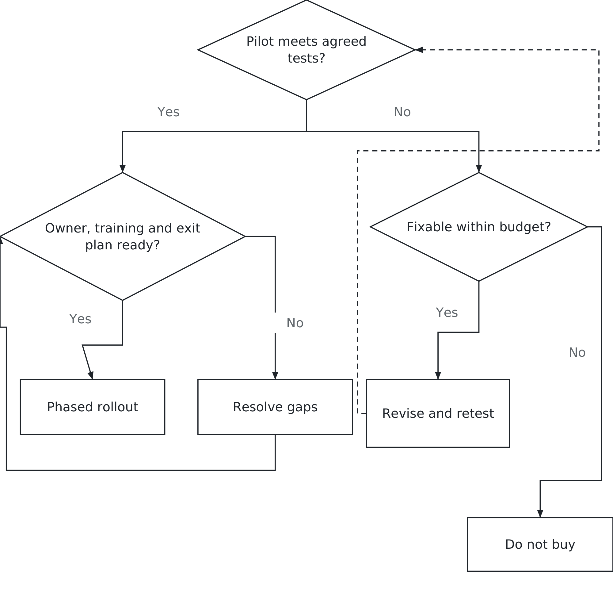

# Chapter 13. How do you buy something you don't understand?

## Halloween, 1999

For a confectionery company, trouble getting orders out before the holiday season is a business problem with a deadline. Hershey encountered that problem in 1999 while introducing new systems and business processes.

Its own report describes two implementation phases. The first began in January; the second began in July and included sales orders, billing, transportation and finished-goods inventory. The company linked reduced shipments to difficulties in customer service, warehousing and shipping after the new system started. Its seasonal sales were typically highest in the third and fourth quarters. The disruption therefore arrived at a commercially important time. [Hershey's 1999 financial report, pp. A-1–A-4](https://www.annualreports.com/HostedData/AnnualReportArchive/h/NYSE_HSY_1999.pdf).

The lesson is not that buying established software guarantees a working business process, or that one scheduling decision explains everything. A company must get orders, records, people and physical goods to move together. The purchase is only part of that job.

You will encounter several names for the systems involved in such work. Enterprise resource planning, or ERP, connects core activities such as purchasing, inventory and accounting through shared records and processes. Customer relationship management, or CRM, supports the work of managing customer relationships, including sales and service. Supply-chain planning helps coordinate expected demand with supply, production and distribution.

The names describe purposes. They do not demonstrate that the connections work in your organisation.

That is this chapter. You are going to buy, approve or depend on systems you cannot personally evaluate in every detail. How do you make a defensible decision without pretending to know everything?

## Why the demo works

Start with the thing you will actually sit through.

A vendor demonstration is a piece of theatre, and that is not an accusation. It is usually a prepared path through selected data, presented by someone who knows the product. It can show you what is possible. It cannot, by itself, establish what will happen with your records, your process, your people and your volume.

So ask for the unscripted version. Show me a record with a required field missing. Show me what the employee sees after entering the wrong quantity. Show me a cancelled order, a partial delivery and a customer with two account numbers. Who notices the problem, and who fixes it?

These questions are more useful when they come from actual work. Before the demonstration, ask the people doing the job where it becomes difficult. Select a few representative cases and explain what an acceptable outcome would look like. Give the vendor enough context to respond meaningfully. An obscure surprise designed to embarrass the presenter proves little.

Consider a fictional distributor, Alder Supply. Orders arrive by email and are entered into a spreadsheet before being copied into billing. Employees sometimes miss an amendment or promise stock another employee has already allocated. Alder is considering an order-management service.

The purchasing question is not “Which product has the most features?” It is whether a new arrangement can reduce re-entry and order mistakes without disrupting deliveries. That purpose gives the demo a direction. Follow an order from receipt through stock allocation to invoice, then change it midway and see what happens.

Ask to speak with customers whose size and work resemble yours. Ask how they implemented, what took longer than expected and what they still do outside the product. Seek independent references where possible, including a former customer willing to speak. A vendor-selected success story is useful evidence, but it is selected evidence.

## The quote is the first item

Alder receives a subscription quote of $10,000 a year. The operations manager builds the following five-year estimate. All amounts are fictional, in thousands of dollars, at constant prices. Categories are separate: no task or fee is counted twice.

| Cost | Five-year calculation | Total, $000 |
|---|---|---:|
| Subscription | 10 × 5 years | 50 |
| Setup | One-time | 20 |
| Data preparation | One-time | 15 |
| Integration | One-time | 15 |
| Training and adoption | Planned allowance | 10 |
| Additional support | 5 × 5 years | 25 |
| Exit | End-of-period allowance | 10 |
| **Total** | | **145** |

*Figure 13.1 — Beyond the annual quote. A $10,000 annual subscription can accompany a much larger five-year commitment. Fictional estimates; constant prices, separate costs and no discounting.*

The subscription contributes $50,000 to a $145,000 commitment. The rest buys work the subscription does not cover in this example. Setup configures the service. Data preparation resolves incomplete or conflicting records. Integration connects orders to billing. Training and adoption include staff time learning the process and resolving early difficulties. Additional support is work beyond the support already included in the subscription.

Total cost of ownership is the cost of obtaining, using, supporting and leaving a system over a chosen period. Five years is Alder's comparison horizon, not part of the definition. A shorter-lived service may need a different horizon. Use the same scope and period when comparing alternatives.

This estimate is a starting point, not a claim that every risk has been priced. Ask what could change: transaction volume, user numbers, renewal prices, data quality or the amount of integration work. Check what the quote includes before adding a support allowance. Identify staff time even when it does not generate a new supplier invoice; those employees cannot spend the same hours on another project.

Keep timing visible too. A five-year total does not show whether the company can afford the early work. Nor does this simple sum account for the timing of money through discounting. For a material investment, finance should examine cash flows and assumptions using the organisation's investment method.

## Compare the work, not just the subscriptions

Suppose a second vendor offers Alder a subscription of $14,000 a year. Its five-year subscription is $70,000, which looks worse beside $50,000. But assume its standard billing connection reduces integration from $15,000 to $5,000, and its included support removes the separate $25,000 support allowance. All other costs remain the same for this illustration.

The second estimate is $145,000 plus $20,000 in subscription cost, minus $10,000 in integration and minus $25,000 in additional support: $130,000. The higher annual quote accompanies the lower five-year total.

That does not make the second product the winner. The comparison depends on whether the standard connection handles Alder's billing cases and whether the included support supplies the work Alder needs. If both assumptions fail, the apparent saving may disappear. Those are questions for evidence, not optimism.

Make the uncertainty visible with one simple change. If the second vendor still requires Alder to buy $5,000 of extra support each year, its five-year total rises from $130,000 to $155,000. It becomes $10,000 more expensive than the first proposal under the remaining assumptions. A vague answer about support can therefore reverse the ranking.

Ask what “support included” means in the work itself. Does it cover restoring an interrupted billing connection, or only answering questions about the vendor's application? Who investigates when each supplier says the fault belongs to the other? A promised response time is not necessarily a promised repair time. Identify the service Alder needs before deciding whether the offers are comparable.

This is sensitivity analysis in plain language: change an uncertain assumption and see whether the decision changes. You do not need dozens of scenarios. Start with the assumptions that could reverse the choice, then spend effort obtaining better evidence about them.

There is a third alternative: improve the current process. Alder might standardise order amendments, assign responsibility for stock allocation and reduce spreadsheet errors without buying immediately. Estimate that option's costs and limitations as seriously as the vendor proposals. The current system is not free merely because its costs are familiar.

Benefits need the same discipline. Suppose Alder expects to release 10 staff hours a week, valued at $30 an hour, over 50 working weeks. That is $15,000 of annual staff capacity. It is not automatically a $15,000 reduction in payroll. If the same employees stay, the business must decide what useful work will fill the time.

Avoid counting that capacity twice: once as a staffing saving and again as the value of extra work performed by those same people. Likewise, increased sales are not all profit. Ask what additional contribution remains after the costs of serving those orders.

The manager's case should connect a purchase to an outcome, an owner and a way to observe the improvement. “The software will make us efficient” has none of those.

## Buy evidence before buying the rollout

A pilot is a bounded trial designed to answer specific questions before a wider commitment. It should reduce uncertainty about the work, not merely repeat the sales demonstration with your logo on the screen.

For Alder, the proposed pilot uses 100 fictional orders representing normal orders, amendments, partial shipments, cancellations and duplicate customer records. Trained representatives from sales, warehouse operations and accounts carry out their own steps. The test uses an isolated billing environment, with no live payments or customer messages.

Before starting, the operations manager and vendor agree on the expected outcome for every case. Every order must reach the correct final status, and every invoice must match the expected customer, items and amount. No cancelled order may be dispatched in the test workflow. Any discrepancy blocks approval until its cause is understood and the affected cases pass again.

For the 80 routine cases in the set, at least 76 must be completed without vendor assistance. The remaining 20 are deliberate exceptions; employees must be able to recognise them, route them to the named owner and complete the resolution. A vendor employee silently repairing a record does not count as Alder successfully handling it.

Include people with disabilities when checking whether essential work is usable. Can an employee enter an order, understand an error and complete a correction using relevant assistive technology, such as a screen reader, or keyboard navigation? Accessibility belongs in the acceptance conditions and the work budget. Discovering after purchase that a colleague cannot complete a routine task is an operating failure, even when the totals are correct.

These are fictional acceptance conditions, not universal standards. Passing 100 prepared cases cannot establish that every future order will work. The technical team must separately examine security, access, realistic peak loads, recovery and the interfaces involved. Privacy and decision safeguards from Chapters 10–12 remain relevant where the proposed service uses personal information or makes consequential decisions.

The pilot also asks whether Alder can leave. Export the test orders, customers and status history in an agreed usable format. Have the receiving team check identifiers, relationships and totals. A file that opens is not necessarily a file from which the business can reconstruct its work.

Suppose the pilot processes the routine orders well but loses a cancellation before it reaches billing. That is a failed condition. A promise to fix it after launch does not convert the result into a pass. Ask whether a bounded correction can be made within the agreed budget, then retest the affected workflow and connected cases.

The decision can be shown simply: proceed only when the evidence and the operating arrangements are ready.

*Figure 13.2 — What would justify proceeding? Define the evidence and responsibilities before committing to rollout.*

Agree on the pilot's price, responsibilities and stopping point before it starts. Separate permission to conduct the pilot from permission for wider rollout. Otherwise a small trial can quietly become the purchase because nobody wants to discard the work already done.

## Go-live is the middle, not the end

Turning on the service makes it available. Adoption means the intended work actually happens through it, with reliable records and workable responsibilities.

Here is a failure mode you should recognise. A new system is awkward during the first weeks. Employees have deadlines. Somebody keeps a spreadsheet to get through the day. The spreadsheet becomes the working record; entries are copied into the new system later. The project can look delivered while the organisation is paying for two processes.

These shadow systems are unofficial tools used alongside the formal system. Their existence is a reason to investigate, not proof that every spreadsheet is harmful. A temporary fallback may be authorised and necessary. The question is what it does, who owns it and how its records are reconciled.

Alder plans a phased rollout: one branch begins, then other branches follow only after the first meets agreed conditions. The operations manager owns order completion. Accounts checks invoice accuracy. The project lead coordinates fixes, but cannot declare business success simply because the service is running.

For the first branch, the proposed expansion check is two consecutive weeks with every dispatched order matched to the correct invoice, no unresolved duplicate allocations and no unowned exception waiting beyond the next working day. These are fictional management conditions. A problem may require more time to resolve, but it must reach an owner promptly.

Compare re-entry before and after for the same kinds of orders, including work outside the system. Chapter 6's warning about the mix of work applies here too.

Training should follow those same jobs. A warehouse employee needs to handle a partial shipment; an accounts employee needs to resolve a billing mismatch. Completing a presentation does not establish either capability. Give employees relevant practice, a clear route for help and time to use it. Include cover for their ordinary work in the adoption plan.

After launch, ask employees to show where they still re-enter information. Suppose the order is entered once in the new service but copied into a separate delivery schedule. The promised reduction has not yet been achieved. Find out whether a missing connection, an unsuitable screen or an unresolved responsibility explains the extra work. Another training session may help, but it should answer the problem actually observed.

If the branch cannot meet the conditions, hold the next phase and resolve the cause. Phasing limits the reach of a problem; it does not eliminate the extra work of operating old and new arrangements together. Specify which system controls stock and which record is authoritative during the transition.

Before the first live order, the technical and operating teams need an agreed fallback and a way to reconcile transactions after interruption. “Switch back” is not a complete plan if orders have already changed in two places. The readiness decision must include the people who will carry out recovery.

## Listen to the person who objects

Adoption involves training, but also the design of the work, available support and the incentives around it. If the new system makes an employee's day harder, find out why before assuming the employee is the problem.

An experienced employee who objects may be holding information about a step nobody documented. Chapter 2's lesson has a mirror image: some steps no longer serve a purpose, and some serve a purpose nobody has written down. Ask the person doing the work to explain the difference.

Suppose an Alder employee says a customer sometimes changes a delivery address after dispatch planning. The proposed workflow locks the address too early. That objection supplies a test case. The answer might be a controlled amendment process, not an unrestricted ability to change every record.

Not every objection should prevail. A familiar shortcut may bypass a necessary control. Explain the business reason for the control, examine the actual burden and find a workable method. Listening means treating the objection as evidence to investigate, not giving every employee a veto.

The same discipline applies to scope creep: the gradual growth of what the project covers. Each extra request may be reasonable. Together they can change the cost, training and schedule beyond recognition. Ask what problem the request solves, whether it is necessary for the first release and what commitment must change if it is included.

Configuration uses options the product already supports. Customisation changes or extends its behaviour beyond those options. Custom work may be justified, but it can introduce additional maintenance and compatibility work when the product changes. Ask who owns the extension and how it will be tested through upgrades. Do not assume every customisation is permanent trouble, or that every existing process deserves to be preserved in code.

## The cost of leaving starts before arrival

An exit allowance in the cost table is not an exit plan.

Before signing, Alder needs to know which records it can obtain, their format and the work required to use them elsewhere. Include attachments, relationships and transaction history where needed, not just a list of customer names. Ask what assistance costs, how long access continues and what happens to information held by the supplier after the relationship ends.

The business owner, technical team and appropriate advisers should examine the actual agreement. A salesperson's reassuring answer should become a clear commitment where it matters. Requirements for retention, deletion and transition depend on the business and applicable obligations; the chapter's $10,000 is an allowance, not a legal entitlement or market price.

Exit may also require rebuilding a connection and teaching staff a different process. These are reasons to plan, not reasons never to buy. A purchase can be worthwhile while still creating dependence. The question is whether that dependence is understood and acceptable.

Revisit the estimate at renewal. The number of users may have changed. An optional feature may have become essential. A product that once fit the business may no longer fit. Deciding to stay should be another decision, not the absence of one.

## Ask the adviser for a recommendation—and its limits

Ask experts what they recommend. Then ask what the recommendation depends on.

A vendor, consultant or internal specialist sees the problem from a particular position. Their incentives and experience matter. That does not make their advice dishonest or useless. It means the manager needs to understand its scope.

What would make this fail? What have you seen go wrong at companies like ours? What does the product do badly? Which alternative did you reject, and why? Who at our end needs to change how they work? What evidence would cause you to change your recommendation?

Ask for uncertainty as well as confidence. If integration has not yet been tested, label its cost an estimate. If the business case assumes employees will stop maintaining a separate spreadsheet, name who will check. An assumption concealed in a confident presentation is still an assumption.

Good advice helps you understand a choice. It does not remove the need for an owner who can decide, fund the work and respond when the evidence changes.

## Your turn

You are recommending Alder's next step. Begin with the two five-year estimates: $145,000 and $130,000. Identify the two assumptions that create the second vendor's cost advantage and the evidence needed to support them.

Now suppose its pilot passes the order and invoice cases, but its export leaves out links between amended orders and their original versions. The vendor estimates an additional $8,000 to provide that export, with delivery after the proposed launch date. Treat this as a fictional offer, not a guaranteed fix.

Write a short recommendation: continue evaluating, revise and retest, proceed under justified conditions or decline the proposal. Update the cost comparison if you include the $8,000, but do not let arithmetic settle whether the missing history matters. Explain its business use, who must validate the correction and what would stop rollout.

Finish with one adoption check and its owner. Your recommendation should say what the company is buying, what remains uncertain and what evidence would justify the next commitment.

Identify one reason to delay even if the price is attractive, and explain what would resolve that concern.

The thing to retain is that you are buying a way of working. The quote, demonstration and contract matter because of what they enable people to do. The purchase succeeds when that work produces the intended result—and the organisation can recognise when it does not.

## Sources and example notes

Hershey’s own reporting supports the implementation and fulfilment discussion without establishing that software alone caused the outcome. Alder, the vendor estimates and acceptance conditions are fictional. Accessibility is treated as the usability of essential work, consistent with [W3C’s introduction](https://www.w3.org/WAI/fundamentals/accessibility-intro/), rather than as a statement of universal legal requirements.

